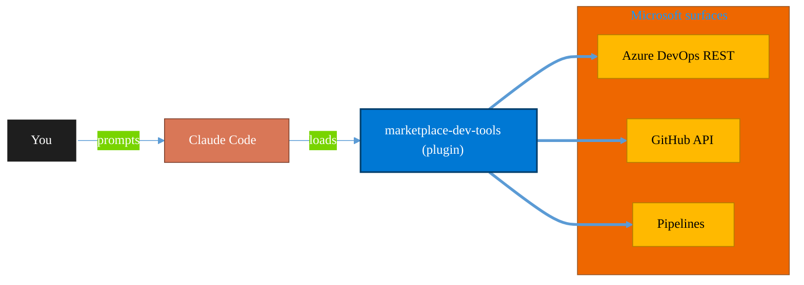

<!-- claude-m:premium-header:start -->
<div align="center">

<a id="top"></a>

# marketplace-dev-tools

### Research Microsoft APIs, scaffold new plugins, extend existing ones, and audit marketplace coverage

<sub>Ship reliably with first-class CI/CD and ALM.</sub>

<br />

<table align="center">
<tr>
<td align="center"><b>Category</b><br /><code>DevOps</code></td>
<td align="center"><b>Surfaces</b><br /><sub>Azure DevOps · GitHub · Pipelines · ALM · IaC</sub></td>
<td align="center"><b>Version</b><br /><code>1.0.0</code></td>
<td align="center"><b>Marketplace</b><br /><code>claude-m-microsoft-marketplace</code></td>
</tr>
</table>

<sub><code>microsoft</code> &nbsp;·&nbsp; <code>marketplace</code> &nbsp;·&nbsp; <code>scaffold</code> &nbsp;·&nbsp; <code>research</code> &nbsp;·&nbsp; <code>graph-api</code> &nbsp;·&nbsp; <code>plugin-dev</code></sub>

<a href="#install"><b>Install</b></a> &nbsp;·&nbsp;
<a href="#overview"><b>Overview</b></a> &nbsp;·&nbsp;
<a href="#architecture"><b>Architecture</b></a> &nbsp;·&nbsp;
<a href="#related-plugins"><b>Related plugins</b></a> &nbsp;·&nbsp;
<a href="../README.md"><b>Marketplace</b></a>

</div>

---

> [!TIP]
> **One-line install** — `/plugin install marketplace-dev-tools@claude-m-microsoft-marketplace`


## Overview

> Research Microsoft APIs, scaffold new plugins, extend existing ones, and audit marketplace coverage

<details>
<summary><b>What ships in this plugin</b> (commands, agents, skills)</summary>

| Component | Items |
|---|---|
| **Commands** | `/audit-coverage` · `/extend-plugin` · `/research-service` · `/scaffold-plugin` |
| **Agents** | `research-reviewer` |
| **Skills** | `marketplace-research` |

</details>


<details>
<summary><b>Quick example</b></summary>

```text
Use marketplace-dev-tools to ship work through pipelines with full ALM.
```

</details>

<a id="architecture"></a>

## Architecture



<a id="install"></a>

## Install

```bash
/plugin marketplace add markus41/Claude-m
/plugin install marketplace-dev-tools@claude-m-microsoft-marketplace
```

> [!IMPORTANT]
> This plugin operates against **Azure DevOps · GitHub · Pipelines · ALM · IaC**. Configure credentials via environment variables — never commit secrets.

[Back to top](#top)

---

<!-- claude-m:premium-header:end -->

A Claude Code plugin for researching Microsoft Graph APIs, scaffolding new plugins,
extending existing ones, and auditing marketplace coverage gaps.

## What This Plugin Provides

This is a **developer tools plugin** for the Claude-m marketplace itself. It gives Claude
the ability to systematically research Microsoft Learn documentation, extract API endpoints
and permissions, and generate complete plugin directory structures from that research.

It also includes a standalone Node.js script for batch-scraping Microsoft Learn pages.

## Commands

| Command | Description |
|---------|-------------|
| /research-service | Research a Microsoft service's Graph API — endpoints, permissions, schemas |
| /scaffold-plugin | Generate a complete Claude plugin from research output JSON |
| /extend-plugin | Discover uncovered endpoints and add commands to an existing plugin |
| /audit-coverage | Compare marketplace plugins against known M365 services and score gaps |

## Agent

| Agent | Description |
|-------|-------------|
| Research Reviewer | Validates research output for endpoint accuracy, permission correctness, and coverage |

## Workflow

```
# 1. Research a service
/research-service bookings

# 2. Review the research
#    (Research Reviewer agent is invoked automatically or via /research-reviewer)

# 3. Scaffold a plugin from the research
/scaffold-plugin research-output/bookings.json --plugin-name microsoft-bookings

# 4. Extend an existing plugin with new endpoints
/extend-plugin microsoft-bookings --api-version beta

# 5. Audit overall marketplace coverage
/audit-coverage
```

## Standalone Script

The `scripts/research-service.mjs` script can be run directly for batch research:

```bash
npm run research -- bookings
npm run research -- calendar
npm run research -- teams
```

Output is written to `research-output/{service}.json`.

## Plugin Structure

```
marketplace-dev-tools/
├── .claude-plugin/plugin.json
├── skills/marketplace-research/SKILL.md
├── commands/
│   ├── research-service.md
│   ├── scaffold-plugin.md
│   ├── extend-plugin.md
│   └── audit-coverage.md
├── agents/research-reviewer.md
├── scripts/research-service.mjs
├── research-output/.gitkeep
└── README.md
```

## Trigger Keywords

The skill activates automatically when conversations mention: research service,
scaffold plugin, extend plugin, audit coverage, marketplace dev, plugin scaffold,
graph api research, microsoft learn.

## Author

Markus Ahling
<!-- claude-m:premium-footer:start -->

---

<a id="related-plugins"></a>

## Related plugins

<table>
<tr><th>Plugin</th><th>What it does</th></tr>
<tr><td><a href="../azure-graph-dotnet/README.md"><code>azure-graph-dotnet</code></a></td><td>Scaffold and build Microsoft Graph C# / .NET solutions on Azure — Functions, Container Jobs, Azure Identity, Polly resilience, and SharePoint file intelligence implementations.</td></tr>
<tr><td><a href="../azure-devops/README.md"><code>azure-devops</code></a></td><td>Comprehensive Azure DevOps expertise — Git repos with passwordless auth (GCM, WIF, SSH), YAML and Classic pipelines, deployment environments, agent pools, work items, boards, sprints, test plans, security namespaces, dashboards, wikis, service hooks, Analytics OData, CLI, and extensions</td></tr>
<tr><td><a href="../azure-devops-orchestrator/README.md"><code>azure-devops-orchestrator</code></a></td><td>Intelligent orchestration for Azure DevOps — ship work items with Claude Code, triage backlogs, plan sprints, coordinate releases, monitor pipelines, and balance workloads across projects. Integrates with microsoft-teams-mcp and microsoft-outlook-mcp when installed.</td></tr>
<tr><td><a href="../azure-dotnet-webapp/README.md"><code>azure-dotnet-webapp</code></a></td><td>Scaffold and build ASP.NET Core Web API and Blazor apps on Azure — Minimal API, controllers, Microsoft.Identity.Web, EF Core, SignalR, OpenAPI, App Service deployment, and Graph API integration patterns.</td></tr>
<tr><td><a href="../fabric-developer-runtime/README.md"><code>fabric-developer-runtime</code></a></td><td>Microsoft Fabric developer runtime operations - GraphQL API, environments, user data functions, and variable library governance.</td></tr>
<tr><td><a href="../fabric-gitops-cicd/README.md"><code>fabric-gitops-cicd</code></a></td><td>Microsoft Fabric GitOps CI/CD — workspace Git integration, deployment pipelines, artifact promotion, branch strategy, and release validation</td></tr>
</table>


<details>
<summary><b>Composable stacks that include <code>marketplace-dev-tools</code></b></summary>

Combine with sibling plugins to build cross-surface runbooks. Browse the full [marketplace catalog](../README.md#plugin-catalog) for a tailored selection.

</details>

---

<div align="center">

<sub>Part of <a href="../README.md"><b>Claude-m</b></a> — the Microsoft plugin marketplace for Claude Code.</sub>

<sub>Licensed under <a href="../LICENSE">MIT</a>. Built for engineers, MSPs, SOC teams, and analytics leaders.</sub>

</div>

<!-- claude-m:premium-footer:end -->

