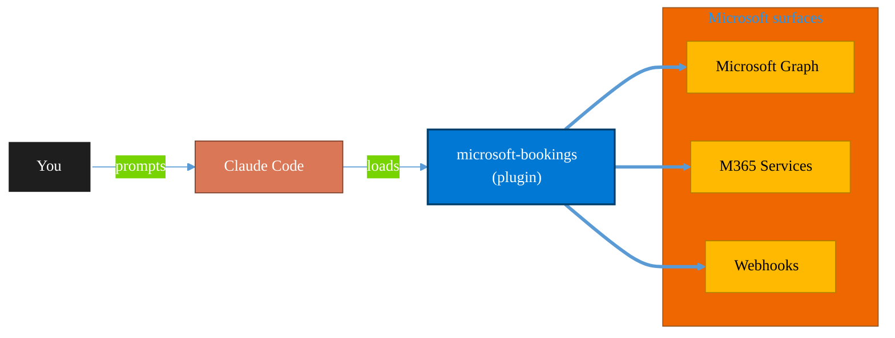

<!-- claude-m:premium-header:start -->
<div align="center">

<a id="top"></a>

# microsoft-bookings

### Microsoft Bookings — manage appointment calendars, services, staff availability, and customer bookings via Graph API

<sub>Automate everyday Microsoft 365 collaboration workflows.</sub>

<br />

<table align="center">
<tr>
<td align="center"><b>Category</b><br /><code>Productivity</code></td>
<td align="center"><b>Surfaces</b><br /><sub>Microsoft Graph · M365 · Teams · Outlook · SharePoint · Loop</sub></td>
<td align="center"><b>Version</b><br /><code>1.0.0</code></td>
<td align="center"><b>Marketplace</b><br /><code>claude-m-microsoft-marketplace</code></td>
</tr>
</table>

<sub><code>microsoft</code> &nbsp;·&nbsp; <code>bookings</code> &nbsp;·&nbsp; <code>appointments</code> &nbsp;·&nbsp; <code>scheduling</code> &nbsp;·&nbsp; <code>calendar</code> &nbsp;·&nbsp; <code>graph-api</code></sub>

<a href="#install"><b>Install</b></a> &nbsp;·&nbsp;
<a href="#overview"><b>Overview</b></a> &nbsp;·&nbsp;
<a href="#architecture"><b>Architecture</b></a> &nbsp;·&nbsp;
<a href="#related-plugins"><b>Related plugins</b></a> &nbsp;·&nbsp;
<a href="../README.md"><b>Marketplace</b></a>

</div>

---

> [!TIP]
> **One-line install** — `/plugin install microsoft-bookings@claude-m-microsoft-marketplace`


## Overview

> Microsoft Bookings — manage appointment calendars, services, staff availability, and customer bookings via Graph API

<details>
<summary><b>What ships in this plugin</b> (commands, agents, skills)</summary>

| Component | Items |
|---|---|
| **Commands** | `/bookings-availability` · `/bookings-coverage-audit` · `/bookings-create-service` · `/bookings-setup` · `/bookings-upcoming` |
| **Agents** | `bookings-reviewer` |
| **Skills** | `microsoft-bookings` |

</details>


<details>
<summary><b>Quick example</b></summary>

```text
Use microsoft-bookings to automate Microsoft 365 collaboration workflows.
```

</details>

<a id="architecture"></a>

## Architecture



<a id="install"></a>

## Install

```bash
/plugin marketplace add markus41/Claude-m
/plugin install microsoft-bookings@claude-m-microsoft-marketplace
```

> [!IMPORTANT]
> This plugin operates against **Microsoft Graph · M365 · Teams · Outlook · SharePoint · Loop**. Configure credentials via environment variables — never commit secrets.

[Back to top](#top)

---

<!-- claude-m:premium-header:end -->

Manage Microsoft Bookings calendars, services, staff availability, and customer appointments via the Microsoft Graph API. Designed for small companies (up to 20 people) that schedule client meetings, demos, or consultations.

## What this plugin helps with
- Create and manage bookable services (consultations, demos, onboarding calls)
- Check staff availability across date ranges
- List and filter upcoming customer appointments
- Review Bookings configurations for correctness and completeness

## Included commands
- `/setup` — Install dependencies, configure Azure Entra app registration, and verify Graph API access
- `/bookings-create-service` — Create a new bookable service in a Bookings calendar
- `/bookings-availability` — Check staff availability for a given date range
- `/bookings-upcoming` — List upcoming appointments with optional filtering
- `/bookings-coverage-audit` — Compare plugin coverage against Microsoft Learn + Graph endpoint families

## Skill
- `skills/microsoft-bookings/SKILL.md` — Comprehensive Microsoft Bookings Graph API reference

## Agent
- `agents/bookings-reviewer.md` — Reviews Bookings configurations for correctness and best practices

## Required Graph API Permissions
| Permission | Type | Purpose |
|---|---|---|
| `Bookings.Read.All` | Delegated | Read booking businesses, services, and appointments |
| `Bookings.ReadWrite.All` | Delegated | Create and update services, appointments, and staff |
| `Bookings.Manage.All` | Delegated | Full management including delete operations and business settings |


## Coverage against Microsoft documentation

| Feature domain | Coverage status | Evidence source |
|---|---|---|
| Businesses and scheduling policy | Covered | SKILL endpoint tables + `/bookings-coverage-audit` checks |
| Services and staffing availability | Covered | Existing commands + Graph v1.0 API verification |
| Appointment lifecycle and customer data | Partial | Documented in SKILL, limited command surface today |

Use `/bookings-coverage-audit <business-id>` before large automation changes to identify feature gaps and safe next command additions.
<!-- claude-m:premium-footer:start -->

---

<a id="related-plugins"></a>

## Related plugins

<table>
<tr><th>Plugin</th><th>What it does</th></tr>
<tr><td><a href="../dynamics-365-field-service/README.md"><code>dynamics-365-field-service</code></a></td><td>Dynamics 365 Field Service via Dataverse Web API — work orders, bookings, resource scheduling, service accounts, assets, and IoT-triggered service events</td></tr>
<tr><td><a href="../microsoft-forms-surveys/README.md"><code>microsoft-forms-surveys</code></a></td><td>Microsoft Forms — create surveys, add questions, collect responses, and summarize results via Graph API</td></tr>
<tr><td><a href="../microsoft-lists-tracker/README.md"><code>microsoft-lists-tracker</code></a></td><td>Microsoft Lists — create and manage lists for process tracking, issue logs, and project trackers via Graph API</td></tr>
<tr><td><a href="../microsoft-loop/README.md"><code>microsoft-loop</code></a></td><td>Microsoft Loop workspaces, pages, and components — create collaborative spaces, embed portable Loop components across M365 apps, manage via Graph API, and govern Loop at the tenant level.</td></tr>
<tr><td><a href="../onedrive/README.md"><code>onedrive</code></a></td><td>OneDrive file management via Microsoft Graph — upload, download, share, search, and manage files and folders</td></tr>
<tr><td><a href="../onenote-knowledge-base/README.md"><code>onenote-knowledge-base</code></a></td><td>OneNote Knowledge Base - headless-first Graph automation for advanced page architecture, styling, and task workflows</td></tr>
</table>


<details>
<summary><b>Composable stacks that include <code>microsoft-bookings</code></b></summary>

Combine with sibling plugins to build cross-surface runbooks. Browse the full [marketplace catalog](../README.md#plugin-catalog) for a tailored selection.

</details>

---

<div align="center">

<sub>Part of <a href="../README.md"><b>Claude-m</b></a> — the Microsoft plugin marketplace for Claude Code.</sub>

<sub>Licensed under <a href="../LICENSE">MIT</a>. Built for engineers, MSPs, SOC teams, and analytics leaders.</sub>

</div>

<!-- claude-m:premium-footer:end -->

