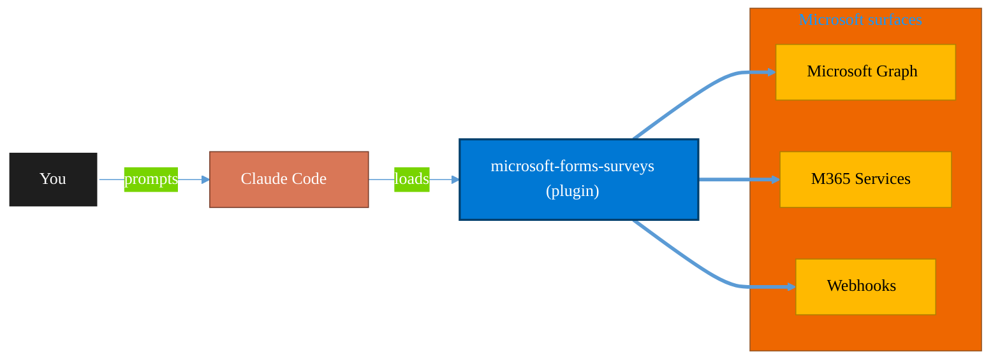

<!-- claude-m:premium-header:start -->
<div align="center">

<a id="top"></a>

# microsoft-forms-surveys

### Microsoft Forms — create surveys, add questions, collect responses, and summarize results via Graph API

<sub>Automate everyday Microsoft 365 collaboration workflows.</sub>

<br />

<table align="center">
<tr>
<td align="center"><b>Category</b><br /><code>Productivity</code></td>
<td align="center"><b>Surfaces</b><br /><sub>Microsoft Graph · M365 · Teams · Outlook · SharePoint · Loop</sub></td>
<td align="center"><b>Version</b><br /><code>1.0.0</code></td>
<td align="center"><b>Marketplace</b><br /><code>claude-m-microsoft-marketplace</code></td>
</tr>
</table>

<sub><code>microsoft</code> &nbsp;·&nbsp; <code>forms</code> &nbsp;·&nbsp; <code>surveys</code> &nbsp;·&nbsp; <code>polls</code> &nbsp;·&nbsp; <code>feedback</code> &nbsp;·&nbsp; <code>graph-api</code></sub>

<a href="#install"><b>Install</b></a> &nbsp;·&nbsp;
<a href="#overview"><b>Overview</b></a> &nbsp;·&nbsp;
<a href="#architecture"><b>Architecture</b></a> &nbsp;·&nbsp;
<a href="#related-plugins"><b>Related plugins</b></a> &nbsp;·&nbsp;
<a href="../README.md"><b>Marketplace</b></a>

</div>

---

> [!TIP]
> **One-line install** — `/plugin install microsoft-forms-surveys@claude-m-microsoft-marketplace`


## Overview

> Microsoft Forms — create surveys, add questions, collect responses, and summarize results via Graph API

<details>
<summary><b>What ships in this plugin</b> (commands, agents, skills)</summary>

| Component | Items |
|---|---|
| **Commands** | `/forms-add-questions` · `/forms-coverage-audit` · `/forms-create` · `/forms-results-summary` · `/forms-setup` |
| **Agents** | `forms-reviewer` |
| **Skills** | `microsoft-forms-surveys` |

</details>


<details>
<summary><b>Quick example</b></summary>

```text
Use microsoft-forms-surveys to automate Microsoft 365 collaboration workflows.
```

</details>

<a id="architecture"></a>

## Architecture



<a id="install"></a>

## Install

```bash
/plugin marketplace add markus41/Claude-m
/plugin install microsoft-forms-surveys@claude-m-microsoft-marketplace
```

> [!IMPORTANT]
> This plugin operates against **Microsoft Graph · M365 · Teams · Outlook · SharePoint · Loop**. Configure credentials via environment variables — never commit secrets.

[Back to top](#top)

---

<!-- claude-m:premium-header:end -->

A Claude Code knowledge plugin for Microsoft Forms via Graph API — create surveys, add questions (choice, text, rating, date, Likert), collect responses, and summarize results.

## What This Plugin Provides

This is a **knowledge plugin** -- it gives Claude deep expertise in the Microsoft Forms API so it can generate correct Graph API code for creating forms, adding question types, collecting responses, and producing result summaries. Ideal for quick team polls, customer feedback, onboarding checklists, or event RSVPs in small teams. It does not contain runtime code, MCP servers, or executable scripts.

## Setup

Run `/setup` to configure authentication and verify Graph API access:

```
/setup              # Full guided setup
/setup --minimal    # Node.js dependencies only
```

## Graph API Permissions Required

| Permission | Type | Purpose |
|------------|------|---------|
| `Forms.Read` | Delegated | Read forms and responses |
| `Forms.ReadWrite` | Delegated | Create and modify forms and questions |

> **Note**: The Forms API uses the Microsoft Graph **beta** endpoint. Endpoints may change without notice.

## Commands

| Command | Description |
|---------|-------------|
| `/forms-create` | Create a new Microsoft Form with title and description |
| `/forms-add-questions` | Add questions to a form (choice, text, rating, date, Likert) |
| `/forms-results-summary` | Summarize responses with aggregated stats |
| `/forms-coverage-audit` | Compare plugin coverage against Forms beta documentation and endpoints |
| `/setup` | Configure Azure auth and verify Graph API access |

## Agent

| Agent | Description |
|-------|-------------|
| **Forms Survey Reviewer** | Reviews form configurations for question types, required fields, branching logic, and validation |

## Trigger Keywords

The skill activates automatically when conversations mention: `forms`, `surveys`, `polls`, `questionnaire`, `feedback form`, `microsoft forms`, `form responses`, `quiz`.

## Author

Markus Ahling


## Coverage against Microsoft documentation

| Feature domain | Coverage status | Evidence source |
|---|---|---|
| Form lifecycle and question authoring | Covered | SKILL question model reference + command set |
| Response retrieval and aggregation | Covered | `/forms-results-summary` + pagination guidance |
| Group-owned forms and beta change handling | Partial | Documented in SKILL, explicit gap review via `/forms-coverage-audit` |

Run `/forms-coverage-audit <form-id>` before implementing new survey scenarios so generated workflows stay aligned with current Graph beta behavior.
<!-- claude-m:premium-footer:start -->

---

<a id="related-plugins"></a>

## Related plugins

<table>
<tr><th>Plugin</th><th>What it does</th></tr>
<tr><td><a href="../microsoft-bookings/README.md"><code>microsoft-bookings</code></a></td><td>Microsoft Bookings — manage appointment calendars, services, staff availability, and customer bookings via Graph API</td></tr>
<tr><td><a href="../microsoft-lists-tracker/README.md"><code>microsoft-lists-tracker</code></a></td><td>Microsoft Lists — create and manage lists for process tracking, issue logs, and project trackers via Graph API</td></tr>
<tr><td><a href="../microsoft-loop/README.md"><code>microsoft-loop</code></a></td><td>Microsoft Loop workspaces, pages, and components — create collaborative spaces, embed portable Loop components across M365 apps, manage via Graph API, and govern Loop at the tenant level.</td></tr>
<tr><td><a href="../onedrive/README.md"><code>onedrive</code></a></td><td>OneDrive file management via Microsoft Graph — upload, download, share, search, and manage files and folders</td></tr>
<tr><td><a href="../onenote-knowledge-base/README.md"><code>onenote-knowledge-base</code></a></td><td>OneNote Knowledge Base - headless-first Graph automation for advanced page architecture, styling, and task workflows</td></tr>
<tr><td><a href="../planner-orchestrator/README.md"><code>planner-orchestrator</code></a></td><td>Intelligent orchestration for Microsoft Planner — ship tasks with Claude Code, triage backlogs, plan sprint buckets, monitor deadlines, and balance workloads across plans. Integrates with microsoft-teams-mcp, microsoft-outlook-mcp, and powerbi-fabric when installed.</td></tr>
</table>


<details>
<summary><b>Composable stacks that include <code>microsoft-forms-surveys</code></b></summary>

Combine with sibling plugins to build cross-surface runbooks. Browse the full [marketplace catalog](../README.md#plugin-catalog) for a tailored selection.

</details>

---

<div align="center">

<sub>Part of <a href="../README.md"><b>Claude-m</b></a> — the Microsoft plugin marketplace for Claude Code.</sub>

<sub>Licensed under <a href="../LICENSE">MIT</a>. Built for engineers, MSPs, SOC teams, and analytics leaders.</sub>

</div>

<!-- claude-m:premium-footer:end -->

