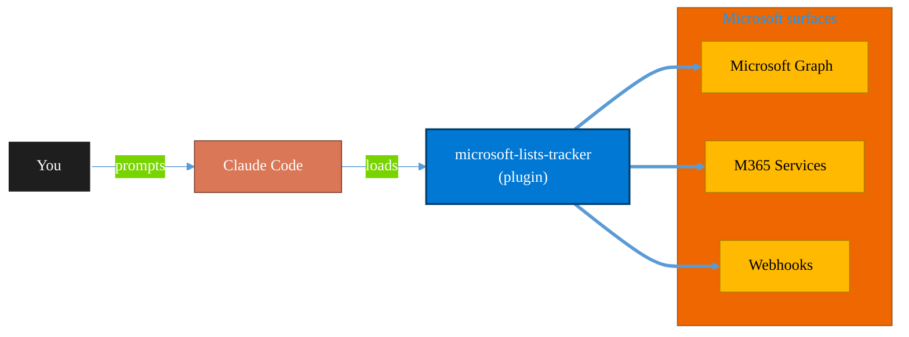

<!-- claude-m:premium-header:start -->
<div align="center">

<a id="top"></a>

# microsoft-lists-tracker

### Microsoft Lists — create and manage lists for process tracking, issue logs, and project trackers via Graph API

<sub>Automate everyday Microsoft 365 collaboration workflows.</sub>

<br />

<table align="center">
<tr>
<td align="center"><b>Category</b><br /><code>Productivity</code></td>
<td align="center"><b>Surfaces</b><br /><sub>Microsoft Graph · M365 · Teams · Outlook · SharePoint · Loop</sub></td>
<td align="center"><b>Version</b><br /><code>1.0.0</code></td>
<td align="center"><b>Marketplace</b><br /><code>claude-m-microsoft-marketplace</code></td>
</tr>
</table>

<sub><code>microsoft</code> &nbsp;·&nbsp; <code>lists</code> &nbsp;·&nbsp; <code>sharepoint</code> &nbsp;·&nbsp; <code>tracker</code> &nbsp;·&nbsp; <code>structured-data</code> &nbsp;·&nbsp; <code>process</code></sub>

<a href="#install"><b>Install</b></a> &nbsp;·&nbsp;
<a href="#overview"><b>Overview</b></a> &nbsp;·&nbsp;
<a href="#architecture"><b>Architecture</b></a> &nbsp;·&nbsp;
<a href="#related-plugins"><b>Related plugins</b></a> &nbsp;·&nbsp;
<a href="../README.md"><b>Marketplace</b></a>

</div>

---

> [!TIP]
> **One-line install** — `/plugin install microsoft-lists-tracker@claude-m-microsoft-marketplace`


## Overview

> Microsoft Lists — create and manage lists for process tracking, issue logs, and project trackers via Graph API

<details>
<summary><b>What ships in this plugin</b> (commands, agents, skills)</summary>

| Component | Items |
|---|---|
| **Commands** | `/lists-add-item` · `/lists-coverage-audit` · `/lists-create` · `/lists-setup` · `/lists-view-filter` |
| **Agents** | `lists-reviewer` |
| **Skills** | `microsoft-lists-tracker` |

</details>


<details>
<summary><b>Quick example</b></summary>

```text
Use microsoft-lists-tracker to automate Microsoft 365 collaboration workflows.
```

</details>

<a id="architecture"></a>

## Architecture



<a id="install"></a>

## Install

```bash
/plugin marketplace add markus41/Claude-m
/plugin install microsoft-lists-tracker@claude-m-microsoft-marketplace
```

> [!IMPORTANT]
> This plugin operates against **Microsoft Graph · M365 · Teams · Outlook · SharePoint · Loop**. Configure credentials via environment variables — never commit secrets.

[Back to top](#top)

---

<!-- claude-m:premium-header:end -->

A Claude Code knowledge plugin for creating and managing Microsoft Lists via Graph API -- structured data tracking for issue logs, hiring pipelines, inventory, and project trackers. Fills the gap between Planner (tasks) and SharePoint (documents) for small teams (20 people or fewer).

## What This Plugin Provides

This is a **knowledge plugin** -- it gives Claude deep expertise in Microsoft Lists (SharePoint Lists) APIs so it can generate correct Graph API code for list creation, column definitions, item management, views, and OData filtering. It does not contain runtime code, MCP servers, or executable scripts.

## Setup

Run `/setup` to configure authentication and verify SharePoint Lists access:

```
/setup              # Full guided setup
/setup --minimal    # Node.js dependencies only
```

## Graph API Permissions Required

| Permission | Type | Purpose |
|------------|------|---------|
| `Sites.Read.All` | Delegated | Read lists, items, and columns |
| `Sites.ReadWrite.All` | Delegated | Create and update lists and items |
| `Sites.Manage.All` | Delegated | Manage list schemas, columns, and content types |

## Commands

| Command | Description |
|---------|-------------|
| `/lists-create` | Create a new Microsoft List with custom columns and optional templates |
| `/lists-add-item` | Add an item to a Microsoft List with field mapping |
| `/lists-view-filter` | View and filter list items with OData queries |
| `/lists-coverage-audit` | Compare plugin coverage against Microsoft Lists and SharePoint REST docs |
| `/setup` | Configure Azure auth and verify SharePoint access |

## Agent

| Agent | Description |
|-------|-------------|
| **Lists Tracker Reviewer** | Reviews list configurations, column definitions, views, and field mappings |

## Trigger Keywords

The skill activates automatically when conversations mention: `lists`, `microsoft lists`, `sharepoint lists`, `tracker`, `issue log`, `project tracker`, `inventory list`, `list items`, `list columns`.

## Author

Markus Ahling


## Coverage against Microsoft documentation

| Feature domain | Coverage status | Evidence source |
|---|---|---|
| List lifecycle, columns, and items | Covered | SKILL endpoint tables + command set |
| OData filtering and tracker workflows | Covered | `/lists-view-filter` examples and deterministic checks |
| Advanced view management | Partial | Graph limitation documented; SharePoint REST fallback required |

Run `/lists-coverage-audit <site-id> <list-id>` to identify gaps before creating new list automation patterns.
<!-- claude-m:premium-footer:start -->

---

<a id="related-plugins"></a>

## Related plugins

<table>
<tr><th>Plugin</th><th>What it does</th></tr>
<tr><td><a href="../microsoft-bookings/README.md"><code>microsoft-bookings</code></a></td><td>Microsoft Bookings — manage appointment calendars, services, staff availability, and customer bookings via Graph API</td></tr>
<tr><td><a href="../microsoft-forms-surveys/README.md"><code>microsoft-forms-surveys</code></a></td><td>Microsoft Forms — create surveys, add questions, collect responses, and summarize results via Graph API</td></tr>
<tr><td><a href="../microsoft-loop/README.md"><code>microsoft-loop</code></a></td><td>Microsoft Loop workspaces, pages, and components — create collaborative spaces, embed portable Loop components across M365 apps, manage via Graph API, and govern Loop at the tenant level.</td></tr>
<tr><td><a href="../plugins/sharepoint/README.md"><code>microsoft-sharepoint-mcp</code></a></td><td>Browse and transfer SharePoint files through MCP tools.</td></tr>
<tr><td><a href="../onedrive/README.md"><code>onedrive</code></a></td><td>OneDrive file management via Microsoft Graph — upload, download, share, search, and manage files and folders</td></tr>
<tr><td><a href="../onenote-knowledge-base/README.md"><code>onenote-knowledge-base</code></a></td><td>OneNote Knowledge Base - headless-first Graph automation for advanced page architecture, styling, and task workflows</td></tr>
</table>


<details>
<summary><b>Composable stacks that include <code>microsoft-lists-tracker</code></b></summary>

Combine with sibling plugins to build cross-surface runbooks. Browse the full [marketplace catalog](../README.md#plugin-catalog) for a tailored selection.

</details>

---

<div align="center">

<sub>Part of <a href="../README.md"><b>Claude-m</b></a> — the Microsoft plugin marketplace for Claude Code.</sub>

<sub>Licensed under <a href="../LICENSE">MIT</a>. Built for engineers, MSPs, SOC teams, and analytics leaders.</sub>

</div>

<!-- claude-m:premium-footer:end -->

