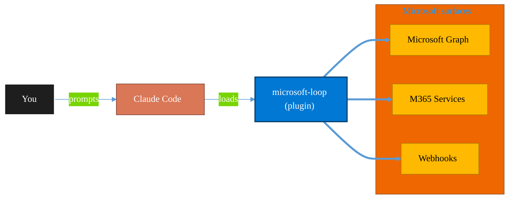

<!-- claude-m:premium-header:start -->
<div align="center">

<a id="top"></a>

# microsoft-loop

### Microsoft Loop workspaces, pages, and components — create collaborative spaces, embed portable Loop components across M365 apps, manage via Graph API, and govern Loop at the tenant level.

<sub>Automate everyday Microsoft 365 collaboration workflows.</sub>

<br />

<table align="center">
<tr>
<td align="center"><b>Category</b><br /><code>Productivity</code></td>
<td align="center"><b>Surfaces</b><br /><sub>Microsoft Graph · M365 · Teams · Outlook · SharePoint · Loop</sub></td>
<td align="center"><b>Version</b><br /><code>1.0.0</code></td>
<td align="center"><b>Marketplace</b><br /><code>claude-m-microsoft-marketplace</code></td>
</tr>
</table>

<sub><code>microsoft</code> &nbsp;·&nbsp; <code>loop</code> &nbsp;·&nbsp; <code>collaboration</code> &nbsp;·&nbsp; <code>workspace</code> &nbsp;·&nbsp; <code>components</code> &nbsp;·&nbsp; <code>graph-api</code></sub>

<a href="#install"><b>Install</b></a> &nbsp;·&nbsp;
<a href="#overview"><b>Overview</b></a> &nbsp;·&nbsp;
<a href="#architecture"><b>Architecture</b></a> &nbsp;·&nbsp;
<a href="#related-plugins"><b>Related plugins</b></a> &nbsp;·&nbsp;
<a href="../README.md"><b>Marketplace</b></a>

</div>

---

> [!TIP]
> **One-line install** — `/plugin install microsoft-loop@claude-m-microsoft-marketplace`


## Overview

> Microsoft Loop workspaces, pages, and components — create collaborative spaces, embed portable Loop components across M365 apps, manage via Graph API, and govern Loop at the tenant level.

<details>
<summary><b>What ships in this plugin</b> (commands, agents, skills)</summary>

| Component | Items |
|---|---|
| **Commands** | `/loop-page-structure` · `/loop-workspace-setup` |
| **Skills** | `microsoft-loop` |

</details>


<details>
<summary><b>Quick example</b></summary>

```text
Use microsoft-loop to automate Microsoft 365 collaboration workflows.
```

</details>

<a id="architecture"></a>

## Architecture



<a id="install"></a>

## Install

```bash
/plugin marketplace add markus41/Claude-m
/plugin install microsoft-loop@claude-m-microsoft-marketplace
```

> [!IMPORTANT]
> This plugin operates against **Microsoft Graph · M365 · Teams · Outlook · SharePoint · Loop**. Configure credentials via environment variables — never commit secrets.

[Back to top](#top)

---

<!-- claude-m:premium-header:end -->

Microsoft Loop plugin for Claude Code — workspaces, pages, Loop components, Graph API integration, and tenant governance.

## Features

- **Workspace management** via Microsoft Graph `fileStorage/containers` API
- **Page design patterns** for planning, standups, retrospectives, decision logs
- **Loop component guidance** — task lists, tables, voting, Q&A, progress trackers
- **Embedding patterns** — Teams, Outlook, OneNote, Word
- **Admin governance** — tenant settings, sensitivity labels, DLP, retention, eDiscovery
- **TypeScript SDK examples** for all Graph API operations

## Commands

| Command | Description |
|---|---|
| `/loop-workspace-setup` | Create and configure a Loop workspace for a project |
| `/loop-page-structure` | Design a page layout with optimal component placement |

## Installation

```bash
/plugin install microsoft-loop@claude-m-microsoft-marketplace
```

## Prerequisites

- Microsoft 365 tenant with Loop enabled
- App registration with `FileStorageContainer.Selected` permission (admin-consented)
- For admin operations: Global Admin or SharePoint Admin role

## Environment Variables

```bash
AZURE_TENANT_ID=          # AAD tenant ID
AZURE_CLIENT_ID=          # App registration client ID
AZURE_CLIENT_SECRET=      # Client secret (use Key Vault in production)
LOOP_CONTAINER_TYPE_ID=   # Loop workspace container type ID for your tenant
```

## Reference Files

| Topic | File |
|---|---|
| Workspace lifecycle, page management, drive API | `skills/microsoft-loop/references/workspaces-pages.md` |
| Component types, creation, embedding patterns | `skills/microsoft-loop/references/loop-components.md` |
| Full Graph API reference, TypeScript SDK snippets | `skills/microsoft-loop/references/graph-api.md` |
| Admin settings, Purview compliance, governance | `skills/microsoft-loop/references/admin-governance.md` |
<!-- claude-m:premium-footer:start -->

---

<a id="related-plugins"></a>

## Related plugins

<table>
<tr><th>Plugin</th><th>What it does</th></tr>
<tr><td><a href="../planner-orchestrator/README.md"><code>planner-orchestrator</code></a></td><td>Intelligent orchestration for Microsoft Planner — ship tasks with Claude Code, triage backlogs, plan sprint buckets, monitor deadlines, and balance workloads across plans. Integrates with microsoft-teams-mcp, microsoft-outlook-mcp, and powerbi-fabric when installed.</td></tr>
<tr><td><a href="../microsoft-bookings/README.md"><code>microsoft-bookings</code></a></td><td>Microsoft Bookings — manage appointment calendars, services, staff availability, and customer bookings via Graph API</td></tr>
<tr><td><a href="../microsoft-forms-surveys/README.md"><code>microsoft-forms-surveys</code></a></td><td>Microsoft Forms — create surveys, add questions, collect responses, and summarize results via Graph API</td></tr>
<tr><td><a href="../microsoft-lists-tracker/README.md"><code>microsoft-lists-tracker</code></a></td><td>Microsoft Lists — create and manage lists for process tracking, issue logs, and project trackers via Graph API</td></tr>
<tr><td><a href="../plugins/teams/README.md"><code>microsoft-teams-mcp</code></a></td><td>Send messages, create meetings, and manage Teams channels via MCP.</td></tr>
<tr><td><a href="../onedrive/README.md"><code>onedrive</code></a></td><td>OneDrive file management via Microsoft Graph — upload, download, share, search, and manage files and folders</td></tr>
</table>


<details>
<summary><b>Composable stacks that include <code>microsoft-loop</code></b></summary>

Combine with sibling plugins to build cross-surface runbooks. Browse the full [marketplace catalog](../README.md#plugin-catalog) for a tailored selection.

</details>

---

<div align="center">

<sub>Part of <a href="../README.md"><b>Claude-m</b></a> — the Microsoft plugin marketplace for Claude Code.</sub>

<sub>Licensed under <a href="../LICENSE">MIT</a>. Built for engineers, MSPs, SOC teams, and analytics leaders.</sub>

</div>

<!-- claude-m:premium-footer:end -->

