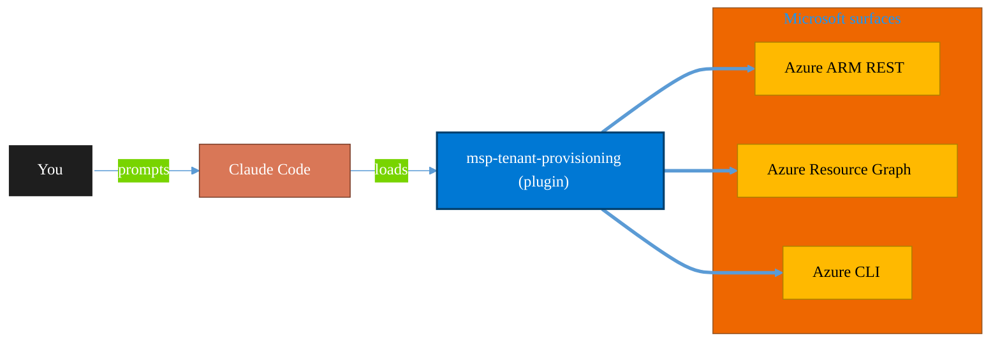

<!-- claude-m:premium-header:start -->
<div align="center">

<a id="top"></a>

# msp-tenant-provisioning

### Full MSP/CSP new customer provisioning — Partner Center CSP tenant creation, Azure subscription and management group setup, initial M365 security baseline, domain DNS configuration, and Microsoft 365 Lighthouse onboarding.

<sub>Inventory, govern, and operate Azure resources at any scale.</sub>

<br />

<table align="center">
<tr>
<td align="center"><b>Category</b><br /><code>Cloud</code></td>
<td align="center"><b>Surfaces</b><br /><sub>Azure ARM · Resource Graph · ARM REST · CLI</sub></td>
<td align="center"><b>Version</b><br /><code>1.0.0</code></td>
<td align="center"><b>Marketplace</b><br /><code>claude-m-microsoft-marketplace</code></td>
</tr>
</table>

<sub><code>microsoft</code> &nbsp;·&nbsp; <code>azure</code> &nbsp;·&nbsp; <code>m365</code> &nbsp;·&nbsp; <code>msp</code> &nbsp;·&nbsp; <code>csp</code> &nbsp;·&nbsp; <code>partner-center</code></sub>

<a href="#install"><b>Install</b></a> &nbsp;·&nbsp;
<a href="#overview"><b>Overview</b></a> &nbsp;·&nbsp;
<a href="#architecture"><b>Architecture</b></a> &nbsp;·&nbsp;
<a href="#related-plugins"><b>Related plugins</b></a> &nbsp;·&nbsp;
<a href="../README.md"><b>Marketplace</b></a>

</div>

---

> [!TIP]
> **One-line install** — `/plugin install msp-tenant-provisioning@claude-m-microsoft-marketplace`


## Overview

> Full MSP/CSP new customer provisioning — Partner Center CSP tenant creation, Azure subscription and management group setup, initial M365 security baseline, domain DNS configuration, and Microsoft 365 Lighthouse onboarding.

<details>
<summary><b>What ships in this plugin</b> (commands, agents, skills)</summary>

| Component | Items |
|---|---|
| **Commands** | `/tenant-azure-setup` · `/tenant-configure` · `/tenant-domain-setup` · `/tenant-lighthouse-onboard` · `/tenant-provision` |
| **Agents** | `provisioning-auditor` |
| **Skills** | `msp-tenant-provisioning` |

</details>


<details>
<summary><b>Quick example</b></summary>

```text
Use msp-tenant-provisioning to audit and operate Azure resources end-to-end.
```

</details>

<a id="architecture"></a>

## Architecture



<a id="install"></a>

## Install

```bash
/plugin marketplace add markus41/Claude-m
/plugin install msp-tenant-provisioning@claude-m-microsoft-marketplace
```

> [!IMPORTANT]
> This plugin operates against **Azure ARM · Resource Graph · ARM REST · CLI**. Configure credentials via environment variables — never commit secrets.

[Back to top](#top)

---

<!-- claude-m:premium-header:end -->

End-to-end new customer onboarding for Microsoft-focused MSPs and CSPs — from creating the M365 tenant via Partner Center through full Lighthouse management enrollment.

Pairs with [`lighthouse-operations`](../lighthouse-operations) for ongoing management after the customer is onboarded.

## Features

- **CSP Tenant Creation** — Create new Microsoft 365 tenants via Partner Center API with subscription ordering, one-time password capture, and immediate Partner Center customer record
- **Security Baseline** — Break-glass accounts, disable security defaults, deploy CA001–CA004 (MFA, legacy auth block, risk-based), PIM eligible assignments, authentication methods policy
- **Custom Domain** — Add and verify custom domains, full M365 DNS record set (MX, autodiscover, SRV, SPF), DKIM enablement, DMARC progression guidance
- **Azure Setup** — Management group hierarchy, subscription creation/linking, initial RBAC, Azure Policy baseline (Security Benchmark, tag governance), Defender for Cloud, budget alerts
- **Lighthouse Onboarding** — GDAP security group assignment, M365 Lighthouse enrollment verification, management template baseline deployment, Azure Lighthouse delegation
- **Provisioning Audit** — AI-assisted audit agent that verifies 11 control areas and produces a prioritized remediation report

## Commands

| Command | Description |
|---------|-------------|
| `/msp-tenant-provisioning:tenant-provision` | Create a new M365 tenant via Partner Center CSP API and order subscriptions |
| `/msp-tenant-provisioning:tenant-configure` | Apply initial security baseline: break-glass, CA policies, PIM, auth methods |
| `/msp-tenant-provisioning:tenant-domain-setup` | Add and verify custom domain, configure DNS records, DKIM, DMARC |
| `/msp-tenant-provisioning:tenant-azure-setup` | Create Azure infrastructure: management groups, subscription, policy, Defender |
| `/msp-tenant-provisioning:tenant-lighthouse-onboard` | Complete Lighthouse onboarding and generate customer handover checklist |

## Skill

The `msp-tenant-provisioning` skill activates automatically when you discuss:
- New tenant provisioning, CSP customer creation
- Partner Center API, CSP subscription ordering
- Initial M365 security baseline, Conditional Access setup
- Break-glass account configuration
- Custom domain DNS setup for M365
- Azure subscription provisioning under management groups

## Agent

**`provisioning-auditor`** — Automated audit agent. Verifies a provisioned tenant against the MSP baseline across 11 control areas and produces a scored audit report with prioritized remediation.

Trigger phrases:
- "Audit the tenant provisioning for Contoso"
- "Check if the new tenant is properly configured"
- "Verify the security baseline was applied"
- "Is the customer's GDAP and Lighthouse onboarding complete?"

## Prerequisites

- **Partner Center access** — Requires `Admin Agent` role in the CSP partner tenant
- **Azure CLI** — authenticated to the partner tenant
- **GDAP relationship** — must be approved by the customer before `tenant-configure` and later commands
- **Graph API permissions**:
  - `Policy.ReadWrite.ConditionalAccess`
  - `RoleManagement.ReadWrite.Directory`
  - `Directory.ReadWrite.All`
  - `Domain.ReadWrite.All`

## Typical Onboarding Workflow

```
Day 1 — Tenant Creation
  /msp-tenant-provisioning:tenant-provision
  → Save credentials to password vault
  → Share admin credentials with customer via secure channel

Day 1-2 — Customer approves GDAP invitation
  /lighthouse-operations:gdap-manage --action create --customer-tenant-id <id>
  → Send approval URL to customer
  → Wait for approval (customer must sign in to admin.microsoft.com)

Day 2 — Security Baseline
  /msp-tenant-provisioning:tenant-configure --tenant-id <id>
  → Break-glass, CA policies (report-only), PIM

Day 2-3 — Domain Setup (if custom domain)
  /msp-tenant-provisioning:tenant-domain-setup --tenant-id <id> --domain contoso.com
  → DNS records, DKIM, DMARC

Day 3 — Azure Setup (if customer needs Azure)
  /msp-tenant-provisioning:tenant-azure-setup --tenant-id <id>
  → Management groups, Defender, policy, budget

Day 3-4 — Lighthouse Onboarding
  /msp-tenant-provisioning:tenant-lighthouse-onboard --tenant-id <id>
  → GDAP assignments, Lighthouse enrollment, template deployment
  → Azure Lighthouse delegation
  → Customer handover document

Day 10 — Post-Baseline Review
  Enable CA001 and CA002 (after 7 days in report-only mode)

Day 30 — First Audit
  "Audit the provisioning for Contoso"
  → provisioning-auditor agent reviews all 11 control areas
```

## Configuration

After provisioning is complete, add the customer to `.claude/msp-tenant-provisioning.local.md`:

```yaml
---
partner_tenant_id: <your-partner-tenant-id>
partner_tenant_name: Contoso MSP
partner_center_customer_id: <partner-center-customer-id>
msp_support_email: support@contoso-msp.com
msp_support_phone: +1-555-000-0000
default_subscription_plan: CFQ7TTC0LF4B  # Microsoft 365 Business Premium
default_billing_cycle: Annual
default_region: eastus
standard_break_glass_naming: "Break Glass Account {n}"
ca_report_only_days: 7  # Promote CA policies after this many days
---

## Provisioned Customers

| Domain | Tenant ID | Provisioned | Plan | Licenses |
|--------|-----------|-------------|------|----------|
| contoso.com | {tenant-id} | 2026-03-01 | Business Premium | 50 |
```

## Related Plugins

| Plugin | Relationship |
|--------|-------------|
| [`lighthouse-operations`](../lighthouse-operations) | Ongoing multi-tenant operations after onboarding |
| [`lighthouse-health`](../lighthouse-health) | Health scoring and alert remediation for managed tenants |
| [`entra-id-security`](../entra-id-security) | Deep Entra ID security review for individual tenants |
| [`m365-admin`](../m365-admin) | Day-to-day M365 administration tasks |
<!-- claude-m:premium-footer:start -->

---

<a id="related-plugins"></a>

## Related plugins

<table>
<tr><th>Plugin</th><th>What it does</th></tr>
<tr><td><a href="../azure-tenant-assessment/README.md"><code>azure-tenant-assessment</code></a></td><td>Entry-point Azure tenant assessment — subscription inventory, resource catalog, security posture snapshot, cost overview, and plugin setup recommendations</td></tr>
<tr><td><a href="../license-optimizer/README.md"><code>license-optimizer</code></a></td><td>M365 license optimization for MSPs/CSPs — identify inactive licenses, map downgrades and upgrades, estimate savings, and generate multi-tenant Lighthouse reports for customer review meetings</td></tr>
<tr><td><a href="../m365-platform-clients/README.md"><code>m365-platform-clients</code></a></td><td>TypeScript patterns for Dataverse Web API and Microsoft Graph — auth, clients, and combined provisioning workflows</td></tr>
<tr><td><a href="../agent-foundry/README.md"><code>agent-foundry</code></a></td><td>Azure AI Foundry agent lifecycle management — scaffold, deploy, test, and manage AI agents with Azure AI Foundry MCP integration</td></tr>
<tr><td><a href="../azure-ai-services/README.md"><code>azure-ai-services</code></a></td><td>Azure AI workloads — Azure OpenAI Service deployments, AI Search indexes, AI Studio/Foundry projects, Cognitive Services provisioning, content filtering, and responsible AI governance</td></tr>
<tr><td><a href="../azure-containers/README.md"><code>azure-containers</code></a></td><td>Azure Container Apps, Container Instances, and Container Registry — build, push, deploy, and scale containerized workloads</td></tr>
</table>


<details>
<summary><b>Composable stacks that include <code>msp-tenant-provisioning</code></b></summary>

Combine with sibling plugins to build cross-surface runbooks. Browse the full [marketplace catalog](../README.md#plugin-catalog) for a tailored selection.

</details>

---

<div align="center">

<sub>Part of <a href="../README.md"><b>Claude-m</b></a> — the Microsoft plugin marketplace for Claude Code.</sub>

<sub>Licensed under <a href="../LICENSE">MIT</a>. Built for engineers, MSPs, SOC teams, and analytics leaders.</sub>

</div>

<!-- claude-m:premium-footer:end -->

