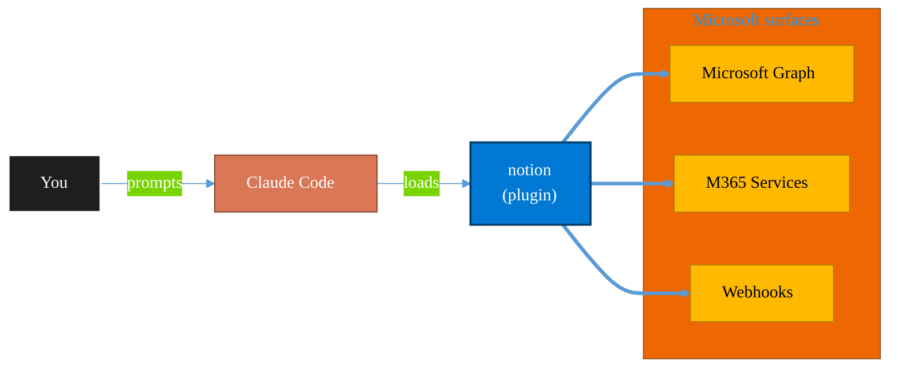

<!-- claude-m:premium-header:start -->
<div align="center">

<a id="top"></a>

# notion

### Comprehensive Notion mastery — page design and styling, every block type, databases and formulas, AI features, MCP integration, REST API automation, and professional page templates

<sub>Automate everyday Microsoft 365 collaboration workflows.</sub>

<br />

<table align="center">
<tr>
<td align="center"><b>Category</b><br /><code>Productivity</code></td>
<td align="center"><b>Surfaces</b><br /><sub>Microsoft Graph · M365 · Teams · Outlook · SharePoint · Loop</sub></td>
<td align="center"><b>Version</b><br /><code>1.0.0</code></td>
<td align="center"><b>Marketplace</b><br /><code>claude-m-microsoft-marketplace</code></td>
</tr>
</table>

<sub><code>notion</code> &nbsp;·&nbsp; <code>page-design</code> &nbsp;·&nbsp; <code>databases</code> &nbsp;·&nbsp; <code>formulas</code> &nbsp;·&nbsp; <code>blocks</code> &nbsp;·&nbsp; <code>notion-api</code></sub>

<a href="#install"><b>Install</b></a> &nbsp;·&nbsp;
<a href="#overview"><b>Overview</b></a> &nbsp;·&nbsp;
<a href="#architecture"><b>Architecture</b></a> &nbsp;·&nbsp;
<a href="#related-plugins"><b>Related plugins</b></a> &nbsp;·&nbsp;
<a href="../README.md"><b>Marketplace</b></a>

</div>

---

> [!TIP]
> **One-line install** — `/plugin install notion@claude-m-microsoft-marketplace`


## Overview

> Comprehensive Notion mastery — page design and styling, every block type, databases and formulas, AI features, MCP integration, REST API automation, and professional page templates

<details>
<summary><b>What ships in this plugin</b> (commands, agents, skills)</summary>

| Component | Items |
|---|---|
| **Commands** | `/notion-db` · `/notion-formula` · `/notion-page` · `/notion-search` · `/notion-style` · `/notion-template` |
| **Agents** | `notion-database-architect` · `notion-page-designer` |
| **Skills** | `notion-mastery` |

</details>


<details>
<summary><b>Quick example</b></summary>

```text
Use notion to automate Microsoft 365 collaboration workflows.
```

</details>

<a id="architecture"></a>

## Architecture



<a id="install"></a>

## Install

```bash
/plugin marketplace add markus41/Claude-m
/plugin install notion@claude-m-microsoft-marketplace
```

> [!IMPORTANT]
> This plugin operates against **Microsoft Graph · M365 · Teams · Outlook · SharePoint · Loop**. Configure credentials via environment variables — never commit secrets.

[Back to top](#top)

---

<!-- claude-m:premium-header:end -->

Comprehensive Notion mastery — page design and styling, every block type, databases and formulas, AI features, MCP integration, REST API automation, and professional page templates.

## Capabilities

| Area | What It Covers |
|------|---------------|
| **Page Design** | Professional layouts with callouts, columns, toggle headings, color schemes, and non-obtrusive TOC |
| **Block Types** | Every Notion block — tables, synced blocks, code, equations, mermaid diagrams, meeting notes, embeds |
| **Databases** | Schema design, views, relations, rollups, linked databases, templates, automations |
| **Formulas** | Complete Notion formula language — logic, math, text, date, list functions with patterns |
| **AI Features** | AI autofill properties, AI blocks, meeting notes with AI summaries, connected sources |
| **MCP Tools** | All 12 Notion MCP tools — search, fetch, create, update, move, duplicate, comments, teams |
| **REST API** | Full endpoint reference, authentication, JavaScript/Python SDK patterns |

## Commands

| Command | Description |
|---------|-------------|
| `/notion-page` | Create a professionally designed Notion page |
| `/notion-db` | Create or modify a database with schema and relations |
| `/notion-style` | Restyle an existing page with professional design patterns |
| `/notion-search` | Search the workspace for pages, databases, and users |
| `/notion-template` | Generate a page from a template (dashboard, wiki, meeting, PRD) |
| `/notion-formula` | Generate or debug a Notion formula from natural language |

## Agents

| Agent | Triggers On |
|-------|-------------|
| **Notion Page Designer** | Creating new pages, restyling existing pages, layout questions |
| **Notion Database Architect** | Database creation, schema design, relations, formulas |

## Skill Triggers

The Notion Mastery skill activates automatically on keywords like: `notion`, `notion page`, `notion database`, `notion formula`, `notion template`, `notion style`, `notion design`, `notion layout`, `notion columns`, `notion callout`, `notion block`, `create notion page`, `beautiful notion page`, `professional notion page`, `notion dashboard`, `notion wiki`, and many more.

## Plugin Structure

```
notion/
├── .claude-plugin/
│   └── plugin.json
├── skills/
│   └── notion-mastery/
│       ├── SKILL.md
│       ├── references/
│       │   ├── notion-markdown-spec.md
│       │   ├── page-design-patterns.md
│       │   ├── block-catalog.md
│       │   ├── database-mastery.md
│       │   ├── formula-language.md
│       │   ├── mcp-tools-guide.md
│       │   ├── api-reference.md
│       │   ├── ai-features.md
│       │   └── troubleshooting.md
│       └── examples/
│           ├── page-templates.md
│           ├── database-schemas.md
│           ├── design-showcase.md
│           └── api-automation.md
├── commands/
│   ├── notion-page.md
│   ├── notion-db.md
│   ├── notion-style.md
│   ├── notion-search.md
│   ├── notion-template.md
│   └── notion-formula.md
├── agents/
│   ├── notion-page-designer.md
│   └── notion-database-architect.md
└── README.md
```

## Prerequisites

- Notion MCP integration connected in Claude Code (provides the 12 Notion tools)
- For REST API automation: Notion integration token from https://www.notion.so/my-integrations
<!-- claude-m:premium-footer:start -->

---

<a id="related-plugins"></a>

## Related plugins

<table>
<tr><th>Plugin</th><th>What it does</th></tr>
<tr><td><a href="../microsoft-loop/README.md"><code>microsoft-loop</code></a></td><td>Microsoft Loop workspaces, pages, and components — create collaborative spaces, embed portable Loop components across M365 apps, manage via Graph API, and govern Loop at the tenant level.</td></tr>
<tr><td><a href="../onenote-knowledge-base/README.md"><code>onenote-knowledge-base</code></a></td><td>OneNote Knowledge Base - headless-first Graph automation for advanced page architecture, styling, and task workflows</td></tr>
<tr><td><a href="../teams-lifecycle/README.md"><code>teams-lifecycle</code></a></td><td>Teams lifecycle management — create and archive teams with templates, enforce naming and ownership, apply sensitivity labels, and run expiration reviews using non-technical 'project start/end' language</td></tr>
<tr><td><a href="../business-central/README.md"><code>business-central</code></a></td><td>Microsoft Dynamics 365 Business Central ERP — finance, supply chain, and inventory management via BC OData v4 / API v2.0 REST API</td></tr>
<tr><td><a href="../copilot-studio-bots/README.md"><code>copilot-studio-bots</code></a></td><td>Copilot Studio — design bot topics, author trigger phrases, configure generative AI orchestration, and publish chatbots</td></tr>
<tr><td><a href="../plugins/domain-business-name-finder/README.md"><code>domain-business-name-finder</code></a></td><td>Brainstorm business names and check domain availability across popular TLDs using Firecrawl, Perplexity, WHOIS, and Domain Search MCP servers</td></tr>
</table>


<details>
<summary><b>Composable stacks that include <code>notion</code></b></summary>

Combine with sibling plugins to build cross-surface runbooks. Browse the full [marketplace catalog](../README.md#plugin-catalog) for a tailored selection.

</details>

---

<div align="center">

<sub>Part of <a href="../README.md"><b>Claude-m</b></a> — the Microsoft plugin marketplace for Claude Code.</sub>

<sub>Licensed under <a href="../LICENSE">MIT</a>. Built for engineers, MSPs, SOC teams, and analytics leaders.</sub>

</div>

<!-- claude-m:premium-footer:end -->

