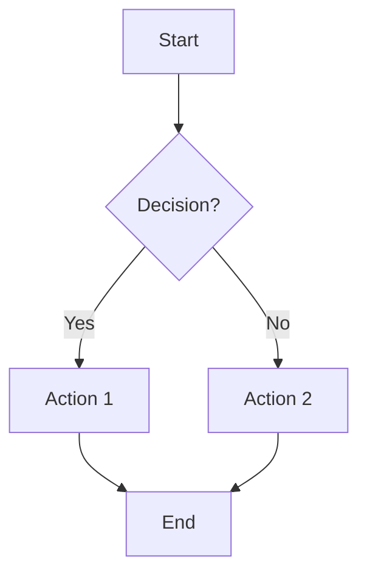

# Block Catalog — Every Notion Block Type

Complete reference for every block type available in Notion with syntax, use cases, and styling tips.

## Text Blocks

### Plain Text

```
This is plain text content. {color="blue"}
	This is a child block (indented).
```

**Use for**: Body content, descriptions, paragraphs.
**Styling**: Apply color for emphasis. Use sparingly — colored text should highlight, not dominate.

### Headings

```
# Heading 1 {color="Color"}
## Heading 2 {color="Color"}
### Heading 3 {color="Color"}
#### Heading 4 {color="Color"}
```

**Use for**: Section structure. H1 for major sections, H2 for subsections, H3 for details.
**Tip**: Use heading emojis for visual scanning: `## 📊 Analytics`, `## 🔧 Settings`.
**Limit**: H5 and H6 are not supported (convert to H4).

### Toggle Headings

```
## Section Title {toggle="true" color="Color"}
	Content visible when expanded...
	More content...
```

**Use for**: Collapsible sections that keep pages compact. Ideal for FAQs, documentation, dashboards.
**Tip**: Default state is collapsed. Put the most important info in the heading text itself.
**Rule**: Children MUST be indented with tabs to be inside the toggle.

## List Blocks

### Bulleted List

```
- First item {color="Color"}
	- Nested item
	- Another nested item
- Second item
	Child text (not a list item, but a text child)
```

**Use for**: Unordered collections, feature lists, notes.
**Tip**: Keep list items short (one line). For detailed items, add child blocks under each item.

### Numbered List

```
1. Step one {color="Color"}
	Details about step one...
2. Step two
3. Step three
```

**Use for**: Sequential steps, ranked lists, procedures.
**Tip**: Numbering is automatic — you can use `1.` for every item and Notion will number correctly.

### To-Do List

```
- [ ] Incomplete task {color="Color"}
	Subtask details...
- [x] Completed task {color="green"}
```

**Use for**: Task tracking, checklists, requirements.
**Tip**: Color completed items green and blockers red for visual status.

## Quote Block

```
> Quoted text here {color="Color"}
	Child blocks under the quote...
```

**Multi-line** (use `<br>` within a single quote):
```
> First line<br>Second line<br>Third line {color="gray_bg"}
```

**Use for**: Testimonials, key takeaways, referenced text, callout-style emphasis.
**Warning**: Multiple `>` lines create separate quotes, not one multi-line block.

## Toggle Block

```
<details color="Color">
<summary>Click to expand</summary>
	Hidden content here...
	More hidden content...
</details>
```

**Use for**: Optional details, FAQs, supplementary information.
**Tip**: Use when content is "nice to have" but not essential for scanning.

## Callout Block

```
::: callout {icon="💡" color="yellow_bg"}
**Callout title or emphasis**
Body text with details.
- Can contain lists
- And other blocks
:::
```

**Use for**: Emphasis, tips, warnings, prerequisites, key information.

**Common icon-color combinations**:

| Purpose | Icon | Color |
|---------|------|-------|
| Tip / Hint | 💡 | `yellow_bg` |
| Info / Note | ℹ️ | `blue_bg` |
| Warning | ⚠️ | `orange_bg` |
| Error / Critical | 🔴 | `red_bg` |
| Success | ✅ | `green_bg` |
| Prerequisite | 📌 | `gray_bg` |
| Important | ❗ | `red_bg` |
| Quote / Insight | 💬 | `purple_bg` |
| Resource / Link | 🔗 | `blue_bg` |
| Calendar / Date | 📅 | `purple_bg` |

**Tip**: Use **bold** for the first line as a title, then regular text for the body. Callouts can contain any block type as children.

## Divider

```
---
```

**Use for**: Visual separation between major sections. Adds "breathing room."
**Tip**: Use after hero callouts and between top-level sections. Don't overuse — one divider every 3-5 sections is plenty.

## Table

```
<table fit-page-width="true" header-row="true" header-column="false">
	<colgroup>
		<col color="gray_bg">
		<col>
	</colgroup>
	<tr>
		<td>**Header 1**</td>
		<td>**Header 2**</td>
	</tr>
	<tr>
		<td>Data</td>
		<td>Data</td>
	</tr>
</table>
```

**Attributes**:
- `fit-page-width="true"` — table stretches to fill page width
- `header-row="true"` — first row styled as header
- `header-column="true"` — first column styled as header

**Cell formatting**: Rich text only (bold, italic, links, inline code). No nested blocks.

**Color precedence**: Cell > Row > Column

**Use for**: Data comparisons, specifications, reference tables, schedules.

**Tip**: Use `header-row="true"` for structured data. Color rows for status indication.

## Code Block

````
```python
def hello():
    return "Hello, World!"
```
````

**Supported languages**: All common programming languages, markup, and config formats.

**Special**: `mermaid` language renders diagrams.

**Use for**: Code snippets, configuration examples, API responses, CLI commands.
**Rule**: Do NOT escape characters inside code blocks — content is literal.

## Mermaid Diagram

````

````

**Rules**:
- Wrap node text in double quotes when it contains special characters: `A["Notion (App)"]`
- Use `<br>` for line breaks inside labels (not `\n`)
- Don't use `\(` or `\)` — use double-quoted labels instead

**Diagram types**: `graph`, `flowchart`, `sequenceDiagram`, `classDiagram`, `stateDiagram`, `erDiagram`, `gantt`, `pie`, `journey`

## Equation Block

```
$$
E = mc^2
$$
```

**Inline math**: `$E = mc^2$` (whitespace required before/after `$`)

**Use for**: Mathematical formulas, scientific notation, technical documentation.

## Image

```
 {color="Color"}
```

**Use for**: Screenshots, diagrams, photos, illustrations.
**Tip**: Always include a caption. Wrap images in columns for side-by-side layout with text.

## Media Blocks

### Audio
```
<audio src="URL" color="Color">Caption</audio>
```

### Video
```
<video src="URL" color="Color">Caption</video>
```

### File
```
<file src="URL" color="Color">Caption</file>
```

### PDF
```
<pdf src="URL" color="Color">Caption</pdf>
```

**URL format**: Use compressed URLs `src="{{1}}"` or full URLs `src="example.com"`. Do NOT wrap full URLs in double braces.

## Structural Blocks

### Columns

```
<columns>
	<column>
		Content in left column...
	</column>
	<column>
		Content in right column...
	</column>
</columns>
```

**Use for**: Dashboards, side-by-side comparisons, text + image layouts, sidebar navigation.
**Tip**: 2 columns is most readable. 3 columns for metric cards. 4+ is too narrow.

### Table of Contents

```
<table_of_contents color="Color"/>
```

**Use for**: Long pages with many sections.
**Placement**: Inside a toggle or sidebar column — NEVER at the very top of a page.

### Synced Block (Original)

```
<synced_block>
	Content to sync across pages...
</synced_block>
```

**Use for**: Headers, footers, or any content that should be identical across multiple pages.
**Rule**: Omit `url` when creating new synced blocks (auto-generated).

### Synced Block Reference

```
<synced_block_reference url="{{URL}}">
	Synced content (editable — updates original)
</synced_block_reference>
```

**Use for**: Referencing existing synced content on other pages.
**Rule**: The `url` must point to an existing synced block.

### Meeting Notes

```
<meeting-notes>
	Weekly Team Sync
	<notes>
		Discussion points and decisions...
	</notes>
</meeting-notes>
```

**Use for**: Meeting summaries with optional AI-generated summaries and transcripts.
**Rules**:
- Omit `<summary>` and `<transcript>` when creating new blocks
- Only include `<notes>` if specifically requested
- `<transcript>` is read-only for AI

### Page (Embed/Move)

```
<page url="{{URL}}" color="Color">Page Title</page>
```

**WARNING**: This **MOVES** the referenced page. Use `<mention-page>` for links instead.

### Database (Embed/Move)

```
<database url="{{URL}}" inline="true" icon="📊" color="Color">Title</database>
```

**Linked database view**:
```
<database data-source-url="{{URL}}" inline="true">Filtered View</database>
```

**Use for**: Embedding databases in pages, creating filtered views.
- `inline="true"` — visible and interactive on page
- `inline="false"` — shows as sub-page link

### Empty Block

```
<empty-block/>
```

**Use for**: Rarely needed — Notion handles spacing automatically. Only use when explicit vertical space is required.

## Block Color Quick Reference

Any block supports `{color="Color"}`:

```
Regular text {color="blue"}
# Heading {color="red"}
- List item {color="green_bg"}
> Quote {color="purple_bg"}
- [ ] Task {color="orange"}
```

XML-style blocks use the `color` attribute:
```
<details color="blue_bg">
<table_of_contents color="gray_bg"/>
::: callout {color="yellow_bg"}
```

## Block Combination Patterns

### Status Card
```
::: callout {icon="✅" color="green_bg"}
**All Systems Operational**
Last checked: 2 minutes ago
:::
```

### Info Box with Code
```
::: callout {icon="💻" color="gray_bg"}
**Quick Start**
Install with:
` ``bash
npm install notion-client
` ``
:::
```

### Comparison Table
```
<table header-row="true" fit-page-width="true">
	<tr>
		<td>**Feature**</td>
		<td>**Free**</td>
		<td>**Pro**</td>
		<td>**Enterprise**</td>
	</tr>
	<tr>
		<td>Pages</td>
		<td>Unlimited</td>
		<td>Unlimited</td>
		<td>Unlimited</td>
	</tr>
	<tr>
		<td>File upload</td>
		<td>5 MB</td>
		<td color="green_bg">Unlimited</td>
		<td color="green_bg">Unlimited</td>
	</tr>
</table>
```

### Step-by-Step Guide
```
## 1️⃣ Install Dependencies {toggle="true"}
	```bash
	npm install
	```

## 2️⃣ Configure Environment {toggle="true"}
	Copy `.env.example` to `.env` and fill in your API keys.

## 3️⃣ Run the Application {toggle="true"}
	```bash
	npm start
	```
	::: callout {icon="✅" color="green_bg"}
	You should see "Server running on port 3000" in the console.
	:::
```
