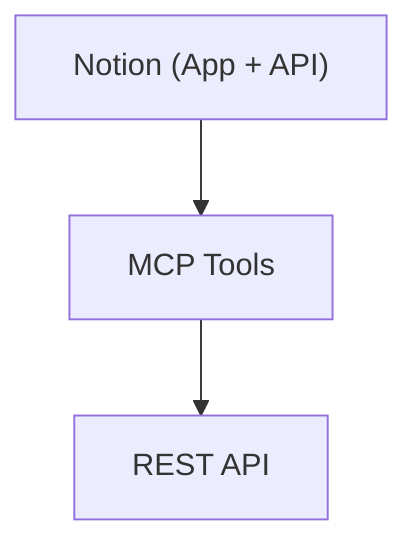

# Notion-Flavored Markdown — Complete Syntax Reference

Notion uses a custom Markdown dialect for page content. This is the authoritative reference for all block types, rich text formatting, and structural elements.

## General Rules

- Use **tabs** for indentation (children must be indented under their parent)
- Use **backslashes** to escape special characters: `\ * ~ ` $ [ ] < > { } | ^`
- Empty lines without `<empty-block/>` are stripped out
- Block colors use `{color="Color"}` attribute at the end of the first line
- XML-style blocks use `color` attribute directly

## Text Colors and Background Colors

### Text Colors (transparent background)
`gray`, `brown`, `orange`, `yellow`, `green`, `blue`, `purple`, `pink`, `red`

### Background Colors (colored background)
`gray_bg`, `brown_bg`, `orange_bg`, `yellow_bg`, `green_bg`, `blue_bg`, `purple_bg`, `pink_bg`, `red_bg`

### Color Usage

- **Block colors**: `{color="Color"}` at the end of the first line of any block
- **Inline text colors**: `<span color="blue">text</span>`
- **Inline background colors**: `<span color="yellow_bg">text</span>`

## Rich Text Formatting

### Inline Styles

| Style | Syntax | Example |
|-------|--------|---------|
| Bold | `**text**` | **bold text** |
| Italic | `*text*` | *italic text* |
| Strikethrough | `~~text~~` | ~~struck text~~ |
| Underline | `<span underline="true">text</span>` | underlined text |
| Inline code | `` `code` `` | `code` |
| Inline math | `$equation$` | Must have whitespace before `$` and after closing `$` |
| Link | `[text](URL)` | hyperlinked text |
| Citation | `[^URL]` | footnote-style citation |
| Color | `<span color="Color">text</span>` | colored text |
| Line break | `<br>` | inline line break within a block |

### Math Rules

- Whitespace **required** before opening `$` and after closing `$`
- No whitespace immediately after opening `$` or before closing `$`
- Use `$`equation`$` if equation contains Markdown delimiters

### Mentions

```
<mention-user url="{{URL}}">User name</mention-user>
<mention-page url="{{URL}}">Page title</mention-page>
<mention-database url="{{URL}}">Database name</mention-database>
<mention-data-source url="{{URL}}">Data source name</mention-data-source>
<mention-agent url="{{URL}}">Agent name</mention-agent>
```

**Date mentions**:
```
<mention-date start="YYYY-MM-DD" end="YYYY-MM-DD"/>
<mention-date start="YYYY-MM-DD" startTime="HH:mm" timeZone="IANA_TIMEZONE"/>
<mention-date start="YYYY-MM-DD" startTime="HH:mm" end="YYYY-MM-DD" endTime="HH:mm" timeZone="IANA_TIMEZONE"/>
```

- URL is always required; inner text (name/title) is optional
- Self-closing format also supported: `<mention-user url="{{URL}}"/>`
- Custom emoji: `:emoji_name:`

## Basic Block Types

### Text

```
Rich text {color="Color"}
	Children
```

### Headings

```
# Heading 1 {color="Color"}
## Heading 2 {color="Color"}
### Heading 3 {color="Color"}
#### Heading 4 {color="Color"}
```

Headings 5 and 6 are not supported — they convert to heading 4.

### Toggle Headings

```
# Heading 1 {toggle="true" color="Color"}
	Children (must be indented)

## Heading 2 {toggle="true" color="Color"}
	Children

### Heading 3 {toggle="true" color="Color"}
	Children
```

**Critical**: Children MUST be indented with tabs. Unindented content will not be inside the toggle.

### Bulleted List

```
- Rich text {color="Color"}
	Children
```

### Numbered List

```
1. Rich text {color="Color"}
	Children
```

List items should contain inline rich text — empty list items look awkward.

### To-Do

```
- [ ] Unchecked item {color="Color"}
	Children
- [x] Checked item {color="Color"}
	Children
```

### Quote

```
> Rich text {color="Color"}
	Children
```

**Multi-line quote** (use `<br>` for line breaks within a single quote):
```
> Line 1<br>Line 2<br>Line 3 {color="Color"}
```

**Important**: Multiple `>` lines create separate quote blocks, not one multi-line quote. Avoid empty `>` lines — they render as empty blockquotes.

### Toggle

```
<details color="Color">
<summary>Toggle label</summary>
	Children (must be indented)
</details>
```

### Divider

```
---
```

### Empty Line

```
<empty-block/>
```

Must be on its own line. Almost never needed — Notion handles spacing automatically.

## Advanced Block Types

### Callout

```
::: callout {icon="emoji" color="Color"}
Rich text content
Children (can include multiple blocks)
:::
```

- Uses Pandoc-style fenced divs (three or more colons)
- Can contain multiple blocks and nested children
- Use Notion-flavored Markdown inside (not HTML `<strong>`, etc.)
- Both `icon` and `color` are optional

### Columns

```
<columns>
	<column>
		Children
	</column>
	<column>
		Children
	</column>
</columns>
```

- Supports 2+ columns
- Each column can contain any block type
- Content within columns must be indented

### Table

```
<table fit-page-width="true" header-row="true" header-column="false">
	<colgroup>
		<col color="Color">
		<col color="Color">
	</colgroup>
	<tr color="Color">
		<td>Cell 1</td>
		<td color="Color">Cell 2</td>
	</tr>
	<tr>
		<td>Cell 3</td>
		<td>Cell 4</td>
	</tr>
</table>
```

**Table attributes** (all optional, default `"false"`):
- `fit-page-width` — fill page width
- `header-row` — first row is a header
- `header-column` — first column is a header

**Column definition** (`<colgroup>` is optional):
- `<col color="Color">` — column-wide color
- `<col width="N">` — column width (leave empty to auto-size)

**Color precedence** (highest to lowest):
1. Cell color (`<td color="red">`)
2. Row color (`<tr color="blue_bg">`)
3. Column color (`<col color="gray">`)

**Cell contents**: Rich text only — no headings, lists, images, or other blocks inside cells. Use Notion-flavored Markdown (not HTML) for formatting within cells.

### Code Block

````
```language
Code content
```
````

- Set the language if known (e.g., `python`, `javascript`, `mermaid`)
- Do NOT escape special characters inside code blocks — content is literal
- Write `const arr = [1, 2, 3]`, not `const arr = \[1, 2, 3\]`

### Mermaid Diagrams

````

````

- Enclose node text in double quotes when it contains special characters
- Use `<br>` for line breaks inside node labels (not `\n`)
- Do not use `\(` or `\)` — wrap the whole label in double quotes

### Equation (Block)

```
$$
LaTeX equation
$$
```

### Image

```
 {color="Color"}
```

### Audio / Video / File / PDF

```
<audio src="{{URL}}" color="Color">Caption</audio>
<video src="{{URL}}" color="Color">Caption</video>
<file src="{{URL}}" color="Color">Caption</file>
<pdf src="{{URL}}" color="Color">Caption</pdf>
```

**URL rules**: Use compressed URLs `src="{{1}}"` or full URLs `src="example.com"`. Do NOT wrap full URLs in double braces — `src="{{https://example.com}}"` does not work.

### Table of Contents

```
<table_of_contents color="Color"/>
```

Self-closing tag. Renders based on all headings on the page.

### Synced Block

**Original (creating new)**:
```
<synced_block>
	Children
</synced_block>
```

**Original (existing — URL auto-assigned)**:
```
<synced_block url="{{URL}}">
	Children
</synced_block>
```

**Reference to synced block**:
```
<synced_block_reference url="{{URL}}">
	Children
</synced_block_reference>
```

Editing a synced block reference updates the original and all references.

### Meeting Notes

```
<meeting-notes>
	Meeting title (rich text)
	<summary>
		AI-generated summary (read-only after creation)
	</summary>
	<notes>
		User notes content
	</notes>
	<transcript>
		Audio transcript (cannot be edited by AI)
	</transcript>
</meeting-notes>
```

**Rules**:
- When creating new meeting notes, omit `<summary>` and `<transcript>` tags
- Only include `<notes>` if the user specifically requests note content
- All content within sub-tags must be indented deeper than `<meeting-notes>`
- `<transcript>` is read-only for AI

### Page (Embed/Move)

```
<page url="{{URL}}" color="Color">Title</page>
```

**WARNING**: Using `<page>` with an existing page URL will **MOVE** that page. Use `<mention-page>` instead if you just want to reference it.

### Database (Embed/Move)

```
<database url="{{URL}}" inline="true" icon="Emoji" color="Color">Title</database>
```

Or create a linked database view:
```
<database data-source-url="{{URL}}" inline="true">Title</database>
```

- `url` — existing database URL (using it will MOVE the database)
- `data-source-url` — creates a linked database view
- `inline="true"` — fully visible and interactive on page
- `inline="false"` — displayed as sub-page (default)

### Unknown Block

```
<unknown url="{{URL}}" alt="Alt text"/>
```

Represents unsupported block types in the API.

## Indentation Rules

Indentation determines parent-child relationships:

```
## Section {toggle="true"}
	This text is INSIDE the toggle
	- This list is INSIDE the toggle
		- Nested list item
	::: callout {icon="💡"}
	This callout is INSIDE the toggle
	:::
This text is OUTSIDE the toggle
```

**Key rules**:
1. Use tabs (not spaces) for indentation
2. Each level of nesting requires one additional tab
3. Toggle headings, toggles, and callouts can have nested children
4. Columns require indented content within each `<column>`
5. Unindented content after an indented block exits the parent

## Block Nesting Reference

| Block Type | Can Have Children | Can Be Child |
|------------|:-:|:-:|
| Text | Yes | Yes |
| Heading | No (unless toggle) | Yes |
| Toggle Heading | Yes | Yes |
| Bulleted List | Yes | Yes |
| Numbered List | Yes | Yes |
| To-Do | Yes | Yes |
| Toggle | Yes | Yes |
| Quote | Yes | Yes |
| Callout | Yes | Yes |
| Column | Yes | Only in `<columns>` |
| Table | No | Yes |
| Code | No | Yes |
| Equation | No | Yes |
| Image | No | Yes |
| Divider | No | Yes |
| TOC | No | Yes |
| Synced Block | Yes | Yes |
| Meeting Notes | Yes (structured) | Yes |
