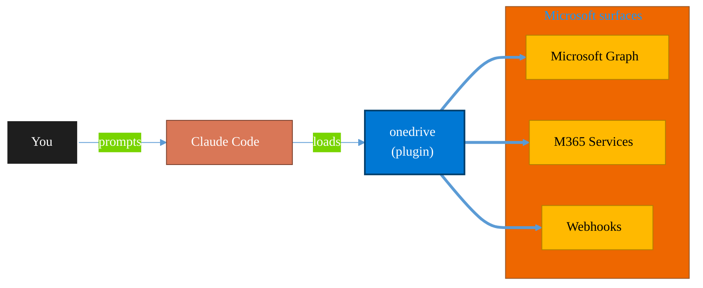

<!-- claude-m:premium-header:start -->
<div align="center">

<a id="top"></a>

# onedrive

### OneDrive file management via Microsoft Graph — upload, download, share, search, and manage files and folders

<sub>Automate everyday Microsoft 365 collaboration workflows.</sub>

<br />

<table align="center">
<tr>
<td align="center"><b>Category</b><br /><code>Productivity</code></td>
<td align="center"><b>Surfaces</b><br /><sub>Microsoft Graph · M365 · Teams · Outlook · SharePoint · Loop</sub></td>
<td align="center"><b>Version</b><br /><code>1.0.0</code></td>
<td align="center"><b>Marketplace</b><br /><code>claude-m-microsoft-marketplace</code></td>
</tr>
</table>

<sub><code>microsoft</code> &nbsp;·&nbsp; <code>onedrive</code> &nbsp;·&nbsp; <code>files</code> &nbsp;·&nbsp; <code>sharing</code> &nbsp;·&nbsp; <code>storage</code> &nbsp;·&nbsp; <code>graph-api</code></sub>

<a href="#install"><b>Install</b></a> &nbsp;·&nbsp;
<a href="#overview"><b>Overview</b></a> &nbsp;·&nbsp;
<a href="#architecture"><b>Architecture</b></a> &nbsp;·&nbsp;
<a href="#related-plugins"><b>Related plugins</b></a> &nbsp;·&nbsp;
<a href="../README.md"><b>Marketplace</b></a>

</div>

---

> [!TIP]
> **One-line install** — `/plugin install onedrive@claude-m-microsoft-marketplace`


## Overview

> OneDrive file management via Microsoft Graph — upload, download, share, search, and manage files and folders

<details>
<summary><b>What ships in this plugin</b> (commands, agents, skills)</summary>

| Component | Items |
|---|---|
| **Commands** | `/onedrive-download` · `/onedrive-search` · `/onedrive-setup` · `/onedrive-share` · `/onedrive-sync-status` · `/onedrive-upload` |
| **Agents** | `onedrive-reviewer` |
| **Skills** | `onedrive-files` |

</details>


<details>
<summary><b>Quick example</b></summary>

```text
Use onedrive to automate Microsoft 365 collaboration workflows.
```

</details>

<a id="architecture"></a>

## Architecture



<a id="install"></a>

## Install

```bash
/plugin marketplace add markus41/Claude-m
/plugin install onedrive@claude-m-microsoft-marketplace
```

> [!IMPORTANT]
> This plugin operates against **Microsoft Graph · M365 · Teams · Outlook · SharePoint · Loop**. Configure credentials via environment variables — never commit secrets.

[Back to top](#top)

---

<!-- claude-m:premium-header:end -->

A Claude Code knowledge plugin for OneDrive file management via Microsoft Graph API — upload, download, share, search, and delta sync for personal and business drives.

## What This Plugin Provides

This is a **knowledge plugin** -- it gives Claude deep expertise in OneDrive file operations so it can generate correct Graph API code, manage sharing permissions, implement delta sync patterns, and handle large file uploads. It does not contain runtime code, MCP servers, or executable scripts.

## Setup

Run `/setup` to configure authentication and verify OneDrive access:

```
/setup              # Full guided setup
/setup --minimal    # Node.js dependencies only
```

## Capabilities

| Area | What Claude Can Do |
|------|-------------------|
| **File Operations** | Upload, download, move, copy, and delete files and folders via Graph API |
| **Sharing** | Create sharing links, manage permissions, invite collaborators with scoped access |
| **Search** | Full-text search across file names and content with relevance scoring |
| **Delta Sync** | Track file changes over time with delta queries for efficient sync clients |
| **Large Files** | Resumable upload sessions for files up to 250 GB with chunked transfer |
| **Review** | Analyze OneDrive integration code for correct API usage, upload patterns, and security |

## Commands

| Command | Description |
|---------|-------------|
| `/onedrive-upload` | Upload a file to OneDrive (auto-selects simple or resumable upload) |
| `/onedrive-download` | Download a file by path or item ID |
| `/onedrive-share` | Create a sharing link for a file or folder |
| `/onedrive-search` | Search for files by name or content |
| `/onedrive-sync-status` | Check recent file changes using delta queries |
| `/setup` | Configure Azure auth and verify OneDrive access |

## Agent

| Agent | Description |
|-------|-------------|
| **OneDrive Integration Reviewer** | Reviews Graph API usage, upload patterns, sharing security, and delta sync implementation |

## Plugin Structure

```
onedrive/
├── .claude-plugin/
│   └── plugin.json
├── skills/
│   └── onedrive-files/
│       └── SKILL.md
├── commands/
│   ├── onedrive-upload.md
│   ├── onedrive-download.md
│   ├── onedrive-share.md
│   ├── onedrive-search.md
│   ├── onedrive-sync-status.md
│   └── setup.md
├── agents/
│   └── onedrive-reviewer.md
└── README.md
```

## Trigger Keywords

The skill activates automatically when conversations mention: `onedrive`, `file upload`, `file download`, `sharing link`, `file search`, `drive item`, `delta query`, `onedrive sync`, `file permissions`, `large file upload`, `resumable upload`.

## Author

Markus Ahling
<!-- claude-m:premium-footer:start -->

---

<a id="related-plugins"></a>

## Related plugins

<table>
<tr><th>Plugin</th><th>What it does</th></tr>
<tr><td><a href="../microsoft-bookings/README.md"><code>microsoft-bookings</code></a></td><td>Microsoft Bookings — manage appointment calendars, services, staff availability, and customer bookings via Graph API</td></tr>
<tr><td><a href="../microsoft-forms-surveys/README.md"><code>microsoft-forms-surveys</code></a></td><td>Microsoft Forms — create surveys, add questions, collect responses, and summarize results via Graph API</td></tr>
<tr><td><a href="../microsoft-lists-tracker/README.md"><code>microsoft-lists-tracker</code></a></td><td>Microsoft Lists — create and manage lists for process tracking, issue logs, and project trackers via Graph API</td></tr>
<tr><td><a href="../microsoft-loop/README.md"><code>microsoft-loop</code></a></td><td>Microsoft Loop workspaces, pages, and components — create collaborative spaces, embed portable Loop components across M365 apps, manage via Graph API, and govern Loop at the tenant level.</td></tr>
<tr><td><a href="../onenote-knowledge-base/README.md"><code>onenote-knowledge-base</code></a></td><td>OneNote Knowledge Base - headless-first Graph automation for advanced page architecture, styling, and task workflows</td></tr>
<tr><td><a href="../planner-orchestrator/README.md"><code>planner-orchestrator</code></a></td><td>Intelligent orchestration for Microsoft Planner — ship tasks with Claude Code, triage backlogs, plan sprint buckets, monitor deadlines, and balance workloads across plans. Integrates with microsoft-teams-mcp, microsoft-outlook-mcp, and powerbi-fabric when installed.</td></tr>
</table>


<details>
<summary><b>Composable stacks that include <code>onedrive</code></b></summary>

Combine with sibling plugins to build cross-surface runbooks. Browse the full [marketplace catalog](../README.md#plugin-catalog) for a tailored selection.

</details>

---

<div align="center">

<sub>Part of <a href="../README.md"><b>Claude-m</b></a> — the Microsoft plugin marketplace for Claude Code.</sub>

<sub>Licensed under <a href="../LICENSE">MIT</a>. Built for engineers, MSPs, SOC teams, and analytics leaders.</sub>

</div>

<!-- claude-m:premium-footer:end -->

