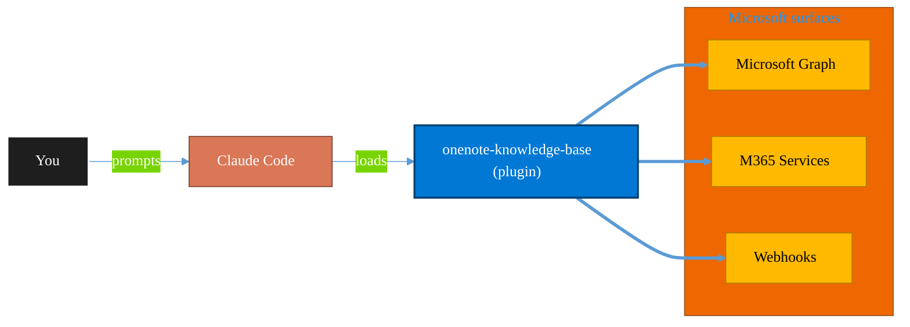

<!-- claude-m:premium-header:start -->
<div align="center">

<a id="top"></a>

# onenote-knowledge-base

### OneNote Knowledge Base - headless-first Graph automation for advanced page architecture, styling, and task workflows

<sub>Automate everyday Microsoft 365 collaboration workflows.</sub>

<br />

<table align="center">
<tr>
<td align="center"><b>Category</b><br /><code>Productivity</code></td>
<td align="center"><b>Surfaces</b><br /><sub>Microsoft Graph · M365 · Teams · Outlook · SharePoint · Loop</sub></td>
<td align="center"><b>Version</b><br /><code>2.0.0</code></td>
<td align="center"><b>Marketplace</b><br /><code>claude-m-microsoft-marketplace</code></td>
</tr>
</table>

<sub><code>microsoft</code> &nbsp;·&nbsp; <code>onenote</code> &nbsp;·&nbsp; <code>knowledge-base</code> &nbsp;·&nbsp; <code>wiki</code> &nbsp;·&nbsp; <code>meeting-notes</code> &nbsp;·&nbsp; <code>notebooks</code></sub>

<a href="#install"><b>Install</b></a> &nbsp;·&nbsp;
<a href="#overview"><b>Overview</b></a> &nbsp;·&nbsp;
<a href="#architecture"><b>Architecture</b></a> &nbsp;·&nbsp;
<a href="#related-plugins"><b>Related plugins</b></a> &nbsp;·&nbsp;
<a href="../README.md"><b>Marketplace</b></a>

</div>

---

> [!TIP]
> **One-line install** — `/plugin install onenote-knowledge-base@claude-m-microsoft-marketplace`


## Overview

> OneNote Knowledge Base - headless-first Graph automation for advanced page architecture, styling, and task workflows

<details>
<summary><b>What ships in this plugin</b> (commands, agents, skills)</summary>

| Component | Items |
|---|---|
| **Commands** | `/onenote-bulk-style-rollout` · `/onenote-columns-layout` · `/onenote-create-page` · `/onenote-hierarchy-manage` · `/onenote-meeting-notes` · `/onenote-navigation-index` · `/onenote-page-patch` · `/onenote-quality-audit` · `/onenote-search` · `/onenote-setup` · `/onenote-style-apply` · `/onenote-task-tracker` · `/onenote-template-library` |
| **Agents** | `onenote-reviewer` |
| **Skills** | `onenote-knowledge-base` |

</details>


<details>
<summary><b>Quick example</b></summary>

```text
Use onenote-knowledge-base to automate Microsoft 365 collaboration workflows.
```

</details>

<a id="architecture"></a>

## Architecture



<a id="install"></a>

## Install

```bash
/plugin marketplace add markus41/Claude-m
/plugin install onenote-knowledge-base@claude-m-microsoft-marketplace
```

> [!IMPORTANT]
> This plugin operates against **Microsoft Graph · M365 · Teams · Outlook · SharePoint · Loop**. Configure credentials via environment variables — never commit secrets.

[Back to top](#top)

---

<!-- claude-m:premium-header:end -->

A headless-first Claude Code knowledge plugin for advanced OneNote automation through Microsoft Graph.
It is designed to produce polished, consistent, and maintainable OneNote pages at scale: nested information architecture, rich tables, column layouts, searchable tags, task boards, and deterministic patch workflows.

## Headless-First Execution Policy

Default operating mode is non-interactive automation:

1. Managed Identity (preferred in Azure-hosted runtimes)
2. Service principal with certificate or secret
3. Device code fallback only when headless credentials are unavailable

Interactive browser auth should be treated as a last resort.

## What This Plugin Maximizes

| Capability | Status | How It Is Handled |
|---|---|---|
| Notebook/section/section group lifecycle | Native | Full Graph API CRUD and hierarchy orchestration |
| Nested hierarchy | Native + Pattern | Nested section groups are native; page-level nesting is modeled with parent-child naming and backlinks |
| Rich page formatting | Native | Headings, lists, tables, links, code blocks, inline font/color/background styling |
| Multi-column layouts | Pattern | Implemented with stable table-based layout instead of unsupported CSS layout constructs |
| Tags and to-do tracking | Pattern | Searchable textual tags (`#todo`, `#decision`, `#risk`) plus deterministic task tables/checklists |
| Consistent visual style | Native + Pattern | Theme command applies reusable font, color, header, and status-chip standards |
| Large updates to existing pages | Native | Single-call PATCH arrays targeting `data-id` anchors |

## Constraints You Must Respect

- OneNote Graph page content is XHTML; invalid or unsupported HTML is rejected or stripped.
- Advanced CSS layout primitives are not supported. Use table-based structure.
- Treat "client-only" visual behaviors as non-API guarantees.

## Integration Context Contract

- Canonical contract: [`docs/integration-context.md`](../docs/integration-context.md)

| Command family | tenantId | subscriptionId | environmentCloud | principalType | scopesOrRoles |
|---|---|---|---|---|---|
| Read/search operations | required | optional | required | delegated-user or service-principal | `Notes.Read` or `Notes.Read.All` |
| Create/update/delete operations | required | optional | required | delegated-user or service-principal | `Notes.ReadWrite` or `Notes.ReadWrite.All` |
| Shared notebook governance | required | optional | required | delegated-user or service-principal | OneDrive/SharePoint sharing permissions plus Notes scopes |

Fail-fast statement: stop immediately when integration context, identity mode, or API permissions are incomplete.

Redaction statement: redact tenant IDs, object IDs, secrets, and tokens from all outputs.

## Commands

| Command | Description |
|---|---|
| `/onenote-setup` | Headless-first setup and authentication validation |
| `/onenote-search` | Advanced page search with scope, recency, and tag slicing |
| `/onenote-create-page` | Rich page creation with templates, style tokens, and patch anchors |
| `/onenote-meeting-notes` | High-quality meeting notes with decisions, action tracking, and follow-up structure |
| `/onenote-hierarchy-manage` | Notebook and section group architecture with nested hierarchy patterns |
| `/onenote-page-patch` | Deterministic bulk PATCH workflows against `data-id` targets |
| `/onenote-task-tracker` | To-do and action board workflows with owner/due/status governance |
| `/onenote-style-apply` | Enforce consistent typography, colors, headers, and status chips |
| `/onenote-columns-layout` | Build polished 2-3 column page layouts using supported XHTML patterns |
| `/onenote-quality-audit` | Lint page quality: structure, accessibility, styling consistency, and stale task risk |
| `/onenote-template-library` | Create, version, and instantiate reusable high-quality page templates |
| `/onenote-bulk-style-rollout` | Roll out visual themes across sections/notebooks with dry-run and drift reporting |
| `/onenote-navigation-index` | Build parent-child indexes, backlinks, and nested documentation navigation maps |

## Reviewer Agent

| Agent | Description |
|---|---|
| `onenote-reviewer` | Reviews architecture, formatting, styling consistency, task hygiene, and automation safety |

## Trigger Keywords

`onenote`, `knowledge base`, `headless onenote`, `onenote styling`, `onenote table`, `onenote columns`, `onenote tasks`, `onenote tags`, `onenote hierarchy`, `onenote patch`

## Nested Documentation Map

The plugin now includes nested reference docs for deeper operations and architecture guidance:

1. `skills/onenote-knowledge-base/references/nested/architecture/nested-information-architecture.md`
2. `skills/onenote-knowledge-base/references/nested/templates/template-catalog.md`
3. `skills/onenote-knowledge-base/references/nested/operations/headless-operations-runbook.md`
<!-- claude-m:premium-footer:start -->

---

<a id="related-plugins"></a>

## Related plugins

<table>
<tr><th>Plugin</th><th>What it does</th></tr>
<tr><td><a href="../microsoft-bookings/README.md"><code>microsoft-bookings</code></a></td><td>Microsoft Bookings — manage appointment calendars, services, staff availability, and customer bookings via Graph API</td></tr>
<tr><td><a href="../microsoft-forms-surveys/README.md"><code>microsoft-forms-surveys</code></a></td><td>Microsoft Forms — create surveys, add questions, collect responses, and summarize results via Graph API</td></tr>
<tr><td><a href="../microsoft-lists-tracker/README.md"><code>microsoft-lists-tracker</code></a></td><td>Microsoft Lists — create and manage lists for process tracking, issue logs, and project trackers via Graph API</td></tr>
<tr><td><a href="../microsoft-loop/README.md"><code>microsoft-loop</code></a></td><td>Microsoft Loop workspaces, pages, and components — create collaborative spaces, embed portable Loop components across M365 apps, manage via Graph API, and govern Loop at the tenant level.</td></tr>
<tr><td><a href="../onedrive/README.md"><code>onedrive</code></a></td><td>OneDrive file management via Microsoft Graph — upload, download, share, search, and manage files and folders</td></tr>
<tr><td><a href="../planner-orchestrator/README.md"><code>planner-orchestrator</code></a></td><td>Intelligent orchestration for Microsoft Planner — ship tasks with Claude Code, triage backlogs, plan sprint buckets, monitor deadlines, and balance workloads across plans. Integrates with microsoft-teams-mcp, microsoft-outlook-mcp, and powerbi-fabric when installed.</td></tr>
</table>


<details>
<summary><b>Composable stacks that include <code>onenote-knowledge-base</code></b></summary>

Combine with sibling plugins to build cross-surface runbooks. Browse the full [marketplace catalog](../README.md#plugin-catalog) for a tailored selection.

</details>

---

<div align="center">

<sub>Part of <a href="../README.md"><b>Claude-m</b></a> — the Microsoft plugin marketplace for Claude Code.</sub>

<sub>Licensed under <a href="../LICENSE">MIT</a>. Built for engineers, MSPs, SOC teams, and analytics leaders.</sub>

</div>

<!-- claude-m:premium-footer:end -->

