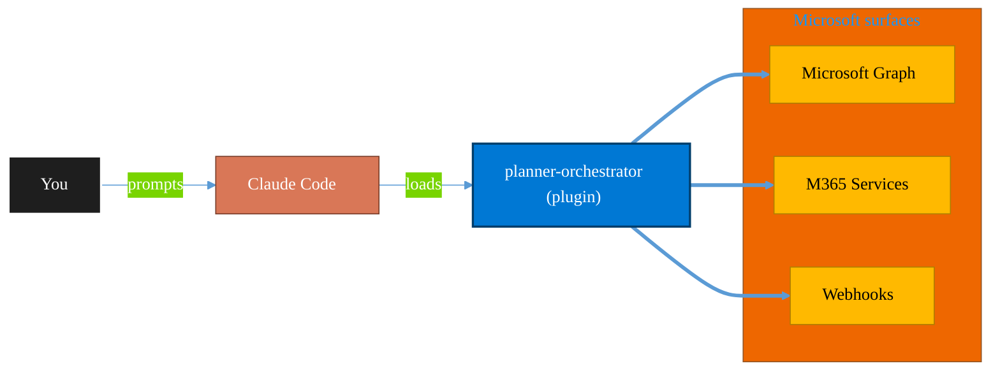

<!-- claude-m:premium-header:start -->
<div align="center">

<a id="top"></a>

# planner-orchestrator

### Intelligent orchestration for Microsoft Planner — ship tasks with Claude Code, triage backlogs, plan sprint buckets, monitor deadlines, and balance workloads across plans. Integrates with microsoft-teams-mcp, microsoft-outlook-mcp, and powerbi-fabric when installed.

<sub>Automate everyday Microsoft 365 collaboration workflows.</sub>

<br />

<table align="center">
<tr>
<td align="center"><b>Category</b><br /><code>Productivity</code></td>
<td align="center"><b>Surfaces</b><br /><sub>Microsoft Graph · M365 · Teams · Outlook · SharePoint · Loop</sub></td>
<td align="center"><b>Version</b><br /><code>1.0.0</code></td>
<td align="center"><b>Marketplace</b><br /><code>claude-m-microsoft-marketplace</code></td>
</tr>
</table>

<sub><code>microsoft</code> &nbsp;·&nbsp; <code>planner</code> &nbsp;·&nbsp; <code>orchestration</code> &nbsp;·&nbsp; <code>workflow</code> &nbsp;·&nbsp; <code>tasks</code> &nbsp;·&nbsp; <code>sprint</code></sub>

<a href="#install"><b>Install</b></a> &nbsp;·&nbsp;
<a href="#overview"><b>Overview</b></a> &nbsp;·&nbsp;
<a href="#architecture"><b>Architecture</b></a> &nbsp;·&nbsp;
<a href="#related-plugins"><b>Related plugins</b></a> &nbsp;·&nbsp;
<a href="../README.md"><b>Marketplace</b></a>

</div>

---

> [!TIP]
> **One-line install** — `/plugin install planner-orchestrator@claude-m-microsoft-marketplace`


## Overview

> Intelligent orchestration for Microsoft Planner — ship tasks with Claude Code, triage backlogs, plan sprint buckets, monitor deadlines, and balance workloads across plans. Integrates with microsoft-teams-mcp, microsoft-outlook-mcp, and powerbi-fabric when installed.

<details>
<summary><b>What ships in this plugin</b> (commands, agents, skills)</summary>

| Component | Items |
|---|---|
| **Commands** | `/orchestrate` · `/ship` · `/sprint` · `/status` · `/triage` |
| **Agents** | `bucket-planner` · `deadline-monitor` · `portfolio-manager` · `ship-orchestrator` · `task-triage` · `teams-notifier` · `workload-balancer` |
| **Skills** | `planner-orchestration` |

</details>


<details>
<summary><b>Quick example</b></summary>

```text
Use planner-orchestrator to automate Microsoft 365 collaboration workflows.
```

</details>

<a id="architecture"></a>

## Architecture



<a id="install"></a>

## Install

```bash
/plugin marketplace add markus41/Claude-m
/plugin install planner-orchestrator@claude-m-microsoft-marketplace
```

> [!IMPORTANT]
> This plugin operates against **Microsoft Graph · M365 · Teams · Outlook · SharePoint · Loop**. Configure credentials via environment variables — never commit secrets.

[Back to top](#top)

---

<!-- claude-m:premium-header:end -->

Intelligent orchestration layer for Microsoft Planner — ship tasks with Claude Code, triage backlogs, plan sprint buckets, monitor deadlines, balance workloads, and optionally push updates to Teams and Outlook.

## Prerequisites

- `planner-todo` plugin installed (provides the Graph API layer)
- Microsoft Graph delegated permissions: `Tasks.ReadWrite`, `Group.Read.All`
- Git repository (required for `/planner-orchestrator:ship`)

## Install

```bash
/plugin install planner-orchestrator@claude-m-microsoft-marketplace
```

## Commands

| Command | Description |
|---------|-------------|
| `/planner-orchestrator:ship <taskId>` | Implement a Planner task end-to-end with Claude Code — branch, code, test, PR, mark Done |
| `/planner-orchestrator:triage <planId>` | Auto-prioritize, label, assign, and route backlog tasks |
| `/planner-orchestrator:sprint <planId>` | Capacity-aware sprint bucket planning with WSJF scoring |
| `/planner-orchestrator:status [planId]` | Deadline report — overdue, at-risk, stalled, unassigned |
| `/planner-orchestrator:orchestrate` | Portfolio overview, workload balance, full health analysis |

## Agents

| Agent | Triggered by |
|-------|-------------|
| `ship-orchestrator` | `/ship` command — implements a Planner task as code |
| `bucket-planner` | `/sprint` command — capacity-aware sprint planning |
| `task-triage` | `/triage` command — backlog classification |
| `deadline-monitor` | `/status` command — at-risk task scanning |
| `portfolio-manager` | `/orchestrate --portfolio` — cross-plan health dashboard |
| `workload-balancer` | `/orchestrate --balance` — assignment distribution analysis |
| `teams-notifier` | Any command with `--teams` or after ship completes |

## Built-in MCP Servers

These Microsoft MCP servers are bundled directly in `.mcp.json` and activate automatically:

| Server | Package | Purpose |
|--------|---------|---------|
| `azure` | `@azure/mcp` | Azure resource context for deployment tasks |
| `azure-devops` | `@microsoft/azure-devops-mcp` | Work item sync, PR creation in ADO repos |
| `powerbi-modeling` | `@microsoft/powerbi-modeling-mcp` | Power BI DAX queries, push datasets for plan reporting |
| `playwright` | `@playwright/mcp` | E2E browser testing during `/ship` workflow |
| `devbox` | `@microsoft/devbox-mcp` | Dev Box provisioning for isolated feature testing |
| `m365-toolkit` | `@microsoft/m365agentstoolkit-mcp` | Teams app validation and M365 resource provisioning |
| `markitdown` | `markitdown[mcp]` (uvx) | Convert PDF/DOCX task attachments to readable Markdown |
| `microsoft-learn` | `https://learn.microsoft.com/api/mcp` | Official Microsoft docs (no auth needed) |

**Prerequisites**: Node.js + npx (for npm packages), `az login` (for Azure/ADO/Power BI auth),
Python + uv (for markitdown). The `microsoft-learn` server requires no setup.

## Optional Cross-Plugin Integration

When these plugins are also installed, the orchestrator delegates to them automatically:

| Plugin | What it enables |
|--------|----------------|
| `microsoft-teams-mcp` | Post adaptive card summaries and ship notifications |
| `microsoft-outlook-mcp` | Send deadline digest emails to plan owners |
| `powerbi-fabric` | Export plan data for Power BI dashboards |
| `azure-devops` | Sync Planner tasks with ADO work items |

All integrations degrade gracefully — if a plugin isn't installed, the action is skipped and noted in the output.

## Ship Workflow

```
/planner-orchestrator:ship <taskId>
```

1. Fetches task + checklist from Planner
2. Creates a git branch (`feature/{taskId}-{slug}`)
3. Explores codebase for context
4. Plans implementation — **asks for your approval**
5. Writes code + tests — **shows diff for review**
6. Runs test suite
7. Creates commit + PR
8. Marks Planner task 100% Done, moves to Done bucket
9. Posts Teams notification (if available)

Supports `--dry-run`, `--resume`, `--status`, and `--from=<STATE>`.

## Example Prompts

```
"Ship the planner task AAMkAGE..."
"Triage the backlog in plan AbCdEf..."
"Plan what goes into our Sprint 14 bucket"
"What's overdue across all our Planner boards?"
"Show me a portfolio view of all our plans"
"Who's overloaded in the dev team's Planner?"
"Post our Planner status to Teams"
```
<!-- claude-m:premium-footer:start -->

---

<a id="related-plugins"></a>

## Related plugins

<table>
<tr><th>Plugin</th><th>What it does</th></tr>
<tr><td><a href="../planner-todo/README.md"><code>planner-todo</code></a></td><td>Microsoft Planner and To Do task management via Graph API — classic plans, Premium Dataverse projects, buckets, tasks, assignments, checklists, nested plans, roster plans, sprints, goals, and Business Scenarios</td></tr>
<tr><td><a href="../microsoft-loop/README.md"><code>microsoft-loop</code></a></td><td>Microsoft Loop workspaces, pages, and components — create collaborative spaces, embed portable Loop components across M365 apps, manage via Graph API, and govern Loop at the tenant level.</td></tr>
<tr><td><a href="../microsoft-bookings/README.md"><code>microsoft-bookings</code></a></td><td>Microsoft Bookings — manage appointment calendars, services, staff availability, and customer bookings via Graph API</td></tr>
<tr><td><a href="../microsoft-forms-surveys/README.md"><code>microsoft-forms-surveys</code></a></td><td>Microsoft Forms — create surveys, add questions, collect responses, and summarize results via Graph API</td></tr>
<tr><td><a href="../microsoft-lists-tracker/README.md"><code>microsoft-lists-tracker</code></a></td><td>Microsoft Lists — create and manage lists for process tracking, issue logs, and project trackers via Graph API</td></tr>
<tr><td><a href="../plugins/teams/README.md"><code>microsoft-teams-mcp</code></a></td><td>Send messages, create meetings, and manage Teams channels via MCP.</td></tr>
</table>


<details>
<summary><b>Composable stacks that include <code>planner-orchestrator</code></b></summary>

Combine with sibling plugins to build cross-surface runbooks. Browse the full [marketplace catalog](../README.md#plugin-catalog) for a tailored selection.

</details>

---

<div align="center">

<sub>Part of <a href="../README.md"><b>Claude-m</b></a> — the Microsoft plugin marketplace for Claude Code.</sub>

<sub>Licensed under <a href="../LICENSE">MIT</a>. Built for engineers, MSPs, SOC teams, and analytics leaders.</sub>

</div>

<!-- claude-m:premium-footer:end -->

