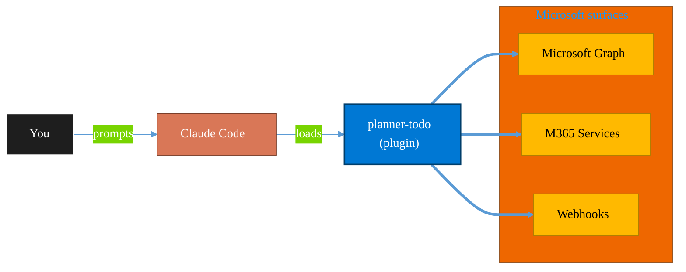

<!-- claude-m:premium-header:start -->
<div align="center">

<a id="top"></a>

# planner-todo

### Microsoft Planner and To Do task management via Graph API — classic plans, Premium Dataverse projects, buckets, tasks, assignments, checklists, nested plans, roster plans, sprints, goals, and Business Scenarios

<sub>Automate everyday Microsoft 365 collaboration workflows.</sub>

<br />

<table align="center">
<tr>
<td align="center"><b>Category</b><br /><code>Productivity</code></td>
<td align="center"><b>Surfaces</b><br /><sub>Microsoft Graph · M365 · Teams · Outlook · SharePoint · Loop</sub></td>
<td align="center"><b>Version</b><br /><code>1.0.0</code></td>
<td align="center"><b>Marketplace</b><br /><code>claude-m-microsoft-marketplace</code></td>
</tr>
</table>

<sub><code>microsoft</code> &nbsp;·&nbsp; <code>planner</code> &nbsp;·&nbsp; <code>to-do</code> &nbsp;·&nbsp; <code>tasks</code> &nbsp;·&nbsp; <code>project-management</code> &nbsp;·&nbsp; <code>graph-api</code></sub>

<a href="#install"><b>Install</b></a> &nbsp;·&nbsp;
<a href="#overview"><b>Overview</b></a> &nbsp;·&nbsp;
<a href="#architecture"><b>Architecture</b></a> &nbsp;·&nbsp;
<a href="#related-plugins"><b>Related plugins</b></a> &nbsp;·&nbsp;
<a href="../README.md"><b>Marketplace</b></a>

</div>

---

> [!TIP]
> **One-line install** — `/plugin install planner-todo@claude-m-microsoft-marketplace`


## Overview

> Microsoft Planner and To Do task management via Graph API — classic plans, Premium Dataverse projects, buckets, tasks, assignments, checklists, nested plans, roster plans, sprints, goals, and Business Scenarios

<details>
<summary><b>What ships in this plugin</b> (commands, agents, skills)</summary>

| Component | Items |
|---|---|
| **Commands** | `/planner-bucket-create` · `/planner-business-scenario` · `/planner-goals` · `/planner-nested-plan` · `/planner-plan-create` · `/planner-roster-create` · `/planner-setup` · `/planner-sprint` · `/planner-task-assign` · `/planner-task-completion` · `/planner-task-create` · `/planner-task-dependency` · `/planner-task-details` · `/planner-task-list` · `/planner-task-notes` · `/planner-task-update` · `/todo-list-create` · `/todo-task-create-recurring` · `/todo-task-create` · `/todo-tasks-list` |
| **Agents** | `planner-reviewer` |
| **Skills** | `planner-todo` |

</details>


<details>
<summary><b>Quick example</b></summary>

```text
Use planner-todo to automate Microsoft 365 collaboration workflows.
```

</details>

<a id="architecture"></a>

## Architecture



<a id="install"></a>

## Install

```bash
/plugin marketplace add markus41/Claude-m
/plugin install planner-todo@claude-m-microsoft-marketplace
```

> [!IMPORTANT]
> This plugin operates against **Microsoft Graph · M365 · Teams · Outlook · SharePoint · Loop**. Configure credentials via environment variables — never commit secrets.

[Back to top](#top)

---

<!-- claude-m:premium-header:end -->

A Claude Code knowledge plugin for Microsoft Planner and Microsoft To Do task management via Graph API — plans, buckets, tasks, assignments, checklists, and personal to-do lists.

## What This Plugin Provides

This is a **knowledge plugin** -- it gives Claude deep expertise in Planner and To Do APIs so it can generate correct Graph API code for task management, sprint board setup, assignment workflows, and personal productivity automation. It does not contain runtime code, MCP servers, or executable scripts.

## Setup

Run `/setup` to configure authentication and verify Planner/To Do access:

```
/setup              # Full guided setup
/setup --minimal    # Node.js dependencies only
```

## Capabilities

| Area | What Claude Can Do |
|------|-------------------|
| **Planner Plans** | Create plans tied to M365 Groups, configure buckets for workflow stages |
| **Tasks** | Create, assign, update, and track tasks with priority, due dates, and checklists |
| **Assignments** | Assign tasks to users with proper ETag concurrency handling |
| **Labels** | Configure and apply category labels for task classification |
| **To Do Lists** | Create personal task lists with steps, reminders, and recurrence |
| **Review** | Analyze Planner/To Do integration code for correct API usage and ETag handling |

## Commands

| Command | Description |
|---------|-------------|
| `/planner-plan-create` | Create a Planner plan with buckets for a Microsoft 365 Group |
| `/planner-task-create` | Create a task with assignment, due date, and priority |
| `/planner-task-assign` | Assign or reassign a task to users |
| `/planner-bucket-create` | Create a new bucket in a plan |
| `/todo-list-create` | Create a personal To Do list |
| `/todo-task-create` | Create a To Do task with due date and reminder |
| `/setup` | Configure Azure auth and verify Planner/To Do access |

## Agent

| Agent | Description |
|-------|-------------|
| **Planner & To Do Reviewer** | Reviews Graph API usage, ETag concurrency handling, task creation patterns |

## Plugin Structure

```
planner-todo/
├── .claude-plugin/
│   └── plugin.json
├── skills/
│   └── planner-todo/
│       └── SKILL.md
├── commands/
│   ├── planner-plan-create.md
│   ├── planner-task-create.md
│   ├── planner-task-assign.md
│   ├── planner-bucket-create.md
│   ├── todo-list-create.md
│   ├── todo-task-create.md
│   └── setup.md
├── agents/
│   └── planner-reviewer.md
└── README.md
```

## Trigger Keywords

The skill activates automatically when conversations mention: `planner`, `to do`, `todo`, `task management`, `plan create`, `bucket`, `task assignment`, `checklist`, `project board`, `sprint planning`, `kanban`, `task list`.

## Author

Markus Ahling
<!-- claude-m:premium-footer:start -->

---

<a id="related-plugins"></a>

## Related plugins

<table>
<tr><th>Plugin</th><th>What it does</th></tr>
<tr><td><a href="../planner-orchestrator/README.md"><code>planner-orchestrator</code></a></td><td>Intelligent orchestration for Microsoft Planner — ship tasks with Claude Code, triage backlogs, plan sprint buckets, monitor deadlines, and balance workloads across plans. Integrates with microsoft-teams-mcp, microsoft-outlook-mcp, and powerbi-fabric when installed.</td></tr>
<tr><td><a href="../dynamics-365-project-ops/README.md"><code>dynamics-365-project-ops</code></a></td><td>Dynamics 365 Project Operations via Dataverse Web API — projects, WBS, time and expense tracking, resource assignments, project contracts, and billing</td></tr>
<tr><td><a href="../dynamics-365-crm/README.md"><code>dynamics-365-crm</code></a></td><td>Dynamics 365 Sales and Customer Service via Dataverse Web API — leads, opportunities, accounts, contacts, cases, SLAs, queues, pipeline reporting, and CRM workflow automation</td></tr>
<tr><td><a href="../dynamics-365-field-service/README.md"><code>dynamics-365-field-service</code></a></td><td>Dynamics 365 Field Service via Dataverse Web API — work orders, bookings, resource scheduling, service accounts, assets, and IoT-triggered service events</td></tr>
<tr><td><a href="../microsoft-bookings/README.md"><code>microsoft-bookings</code></a></td><td>Microsoft Bookings — manage appointment calendars, services, staff availability, and customer bookings via Graph API</td></tr>
<tr><td><a href="../microsoft-forms-surveys/README.md"><code>microsoft-forms-surveys</code></a></td><td>Microsoft Forms — create surveys, add questions, collect responses, and summarize results via Graph API</td></tr>
</table>


<details>
<summary><b>Composable stacks that include <code>planner-todo</code></b></summary>

Combine with sibling plugins to build cross-surface runbooks. Browse the full [marketplace catalog](../README.md#plugin-catalog) for a tailored selection.

</details>

---

<div align="center">

<sub>Part of <a href="../README.md"><b>Claude-m</b></a> — the Microsoft plugin marketplace for Claude Code.</sub>

<sub>Licensed under <a href="../LICENSE">MIT</a>. Built for engineers, MSPs, SOC teams, and analytics leaders.</sub>

</div>

<!-- claude-m:premium-footer:end -->

