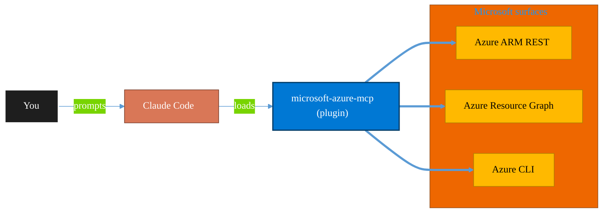

<!-- claude-m:premium-header:start -->
<div align="center">

<a id="top"></a>

# microsoft-azure-mcp

### Inspect subscriptions, resource groups, and resources via MCP.

<sub>Inventory, govern, and operate Azure resources at any scale.</sub>

<br />

<table align="center">
<tr>
<td align="center"><b>Category</b><br /><code>Cloud</code></td>
<td align="center"><b>Surfaces</b><br /><sub>Azure ARM · Resource Graph · ARM REST · CLI</sub></td>
<td align="center"><b>Version</b><br /><code>1.0.0</code></td>
<td align="center"><b>Marketplace</b><br /><code>claude-m-microsoft-marketplace</code></td>
</tr>
</table>

<sub><code>microsoft</code> &nbsp;·&nbsp; <code>azure</code> &nbsp;·&nbsp; <code>infrastructure</code></sub>

<a href="#install"><b>Install</b></a> &nbsp;·&nbsp;
<a href="#overview"><b>Overview</b></a> &nbsp;·&nbsp;
<a href="#architecture"><b>Architecture</b></a> &nbsp;·&nbsp;
<a href="#related-plugins"><b>Related plugins</b></a> &nbsp;·&nbsp;
<a href="../../README.md"><b>Marketplace</b></a>

</div>

---

> [!TIP]
> **One-line install** — `/plugin install microsoft-azure-mcp@claude-m-microsoft-marketplace`


## Overview

> Inspect subscriptions, resource groups, and resources via MCP.


<details>
<summary><b>Quick example</b></summary>

```text
Use microsoft-azure-mcp to audit and operate Azure resources end-to-end.
```

</details>

<a id="architecture"></a>

## Architecture



<a id="install"></a>

## Install

```bash
/plugin marketplace add markus41/Claude-m
/plugin install microsoft-azure-mcp@claude-m-microsoft-marketplace
```

> [!IMPORTANT]
> This plugin operates against **Azure ARM · Resource Graph · ARM REST · CLI**. Configure credentials via environment variables — never commit secrets.

[Back to top](#top)

---

<!-- claude-m:premium-header:end -->

Connect Claude to Microsoft Azure via the Model Context Protocol (MCP).

## Features

- **List Subscriptions**: View all Azure subscriptions
- **List Resource Groups**: Browse resource groups in a subscription
- **List Resources**: View resources in a resource group
- **Get Resource Details**: Retrieve detailed information about specific Azure resources

## Installation

### From Claude Code Marketplace

```bash
/plugin marketplace add markus41/Claude-m
/plugin install "Microsoft Azure MCP"
```

### Manual Configuration

Add to your `.claude/settings.json`:

```json
{
  "mcpServers": {
    "microsoft-azure": {
      "command": "node",
      "args": ["/path/to/Claude-m/dist/index.js"],
      "env": {
        "MICROSOFT_CLIENT_ID": "your-client-id",
        "MICROSOFT_CLIENT_SECRET": "your-client-secret",
        "MICROSOFT_TENANT_ID": "your-tenant-id",
        "MICROSOFT_ACCESS_TOKEN": "your-access-token"
      }
    }
  }
}
```

## Required Azure Permissions

- `https://management.azure.com/user_impersonation` - Access to Azure Resource Manager

## Available Tools

### `azure_list_subscriptions`
Lists all Azure subscriptions accessible to the signed-in user.

### `azure_list_resource_groups`
Lists all resource groups in an Azure subscription.

**Arguments:**
- `subscriptionId` (string): Azure subscription ID

### `azure_list_resources`
Lists all resources in an Azure resource group.

**Arguments:**
- `subscriptionId` (string): Azure subscription ID
- `resourceGroup` (string): Resource group name

### `azure_get_resource`
Gets details of a specific Azure resource.

**Arguments:**
- `subscriptionId` (string): Azure subscription ID
- `resourceGroup` (string): Resource group name
- `provider` (string): Resource provider namespace, e.g. Microsoft.Compute
- `resourceType` (string): Resource type, e.g. virtualMachines
- `resourceName` (string): Resource name
- `apiVersion` (string, optional): API version override

## Example Usage

```
List subscriptions:
> Use azure_list_subscriptions to see all my Azure subscriptions

View resources:
> Use azure_list_resource_groups to see resource groups in subscription xyz
```

## License

ISC
<!-- claude-m:premium-footer:start -->

---

<a id="related-plugins"></a>

## Related plugins

<table>
<tr><th>Plugin</th><th>What it does</th></tr>
<tr><td><a href="../../agent-foundry/README.md"><code>agent-foundry</code></a></td><td>Azure AI Foundry agent lifecycle management — scaffold, deploy, test, and manage AI agents with Azure AI Foundry MCP integration</td></tr>
<tr><td><a href="../../azure-ai-services/README.md"><code>azure-ai-services</code></a></td><td>Azure AI workloads — Azure OpenAI Service deployments, AI Search indexes, AI Studio/Foundry projects, Cognitive Services provisioning, content filtering, and responsible AI governance</td></tr>
<tr><td><a href="../../azure-containers/README.md"><code>azure-containers</code></a></td><td>Azure Container Apps, Container Instances, and Container Registry — build, push, deploy, and scale containerized workloads</td></tr>
<tr><td><a href="../../azure-cost-governance/README.md"><code>azure-cost-governance</code></a></td><td>Azure FinOps and governance workflows — query costs, monitor budgets, detect anomalies, and identify idle resources for optimization</td></tr>
<tr><td><a href="../../azure-document-intelligence/README.md"><code>azure-document-intelligence</code></a></td><td>Azure AI Document Intelligence — OCR, prebuilt models (invoices, receipts, IDs, tax forms), custom models, layout analysis, document classification, and batch processing</td></tr>
<tr><td><a href="../../azure-functions/README.md"><code>azure-functions</code></a></td><td>Azure Functions — triggers, bindings, Durable Functions, deployment, and local development with Azure Functions Core Tools</td></tr>
</table>


<details>
<summary><b>Composable stacks that include <code>microsoft-azure-mcp</code></b></summary>

Combine with sibling plugins to build cross-surface runbooks. Browse the full [marketplace catalog](../../README.md#plugin-catalog) for a tailored selection.

</details>

---

<div align="center">

<sub>Part of <a href="../../README.md"><b>Claude-m</b></a> — the Microsoft plugin marketplace for Claude Code.</sub>

<sub>Licensed under <a href="../../LICENSE">MIT</a>. Built for engineers, MSPs, SOC teams, and analytics leaders.</sub>

</div>

<!-- claude-m:premium-footer:end -->

