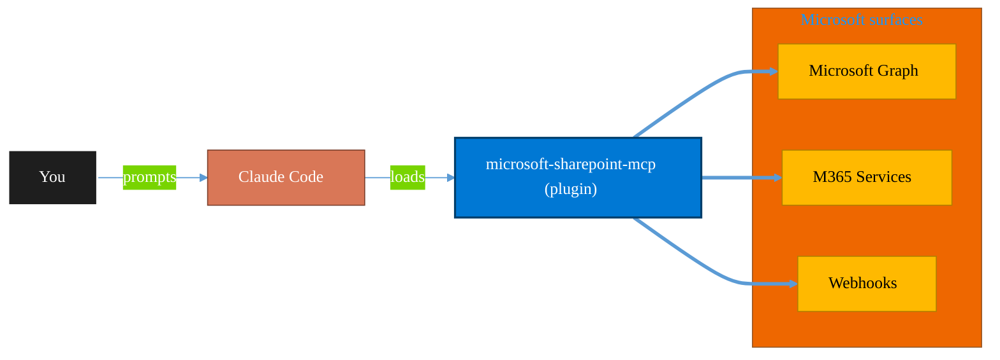

<!-- claude-m:premium-header:start -->
<div align="center">

<a id="top"></a>

# microsoft-sharepoint-mcp

### Browse and transfer SharePoint files through MCP tools.

<sub>Automate everyday Microsoft 365 collaboration workflows.</sub>

<br />

<table align="center">
<tr>
<td align="center"><b>Category</b><br /><code>Productivity</code></td>
<td align="center"><b>Surfaces</b><br /><sub>Microsoft Graph · M365 · Teams · Outlook · SharePoint · Loop</sub></td>
<td align="center"><b>Version</b><br /><code>1.0.0</code></td>
<td align="center"><b>Marketplace</b><br /><code>claude-m-microsoft-marketplace</code></td>
</tr>
</table>

<sub><code>microsoft</code> &nbsp;·&nbsp; <code>sharepoint</code> &nbsp;·&nbsp; <code>documents</code></sub>

<a href="#install"><b>Install</b></a> &nbsp;·&nbsp;
<a href="#overview"><b>Overview</b></a> &nbsp;·&nbsp;
<a href="#architecture"><b>Architecture</b></a> &nbsp;·&nbsp;
<a href="#related-plugins"><b>Related plugins</b></a> &nbsp;·&nbsp;
<a href="../../README.md"><b>Marketplace</b></a>

</div>

---

> [!TIP]
> **One-line install** — `/plugin install microsoft-sharepoint-mcp@claude-m-microsoft-marketplace`


## Overview

> Browse and transfer SharePoint files through MCP tools.


<details>
<summary><b>Quick example</b></summary>

```text
Use microsoft-sharepoint-mcp to automate Microsoft 365 collaboration workflows.
```

</details>

<a id="architecture"></a>

## Architecture



<a id="install"></a>

## Install

```bash
/plugin marketplace add markus41/Claude-m
/plugin install microsoft-sharepoint-mcp@claude-m-microsoft-marketplace
```

> [!IMPORTANT]
> This plugin operates against **Microsoft Graph · M365 · Teams · Outlook · SharePoint · Loop**. Configure credentials via environment variables — never commit secrets.

[Back to top](#top)

---

<!-- claude-m:premium-header:end -->

Connect Claude to Microsoft SharePoint via the Model Context Protocol (MCP).

## Features

- **List Sites**: Browse accessible SharePoint sites
- **List Files**: View files in document libraries
- **Upload Files**: Upload files to SharePoint
- **Download Files**: Get download URLs for SharePoint files

## Installation

### From Claude Code Marketplace

```bash
/plugin marketplace add markus41/Claude-m
/plugin install "Microsoft SharePoint MCP"
```

### Manual Configuration

Add to your `.claude/settings.json`:

```json
{
  "mcpServers": {
    "microsoft-sharepoint": {
      "command": "node",
      "args": ["/path/to/Claude-m/dist/index.js"],
      "env": {
        "MICROSOFT_CLIENT_ID": "your-client-id",
        "MICROSOFT_CLIENT_SECRET": "your-client-secret",
        "MICROSOFT_TENANT_ID": "your-tenant-id",
        "MICROSOFT_ACCESS_TOKEN": "your-access-token"
      }
    }
  }
}
```

## Required Microsoft Graph Permissions

- `Sites.ReadWrite.All` - Access SharePoint sites
- `Files.ReadWrite.All` - Read and write files

## Available Tools

### `sharepoint_list_sites`
Lists accessible SharePoint sites.

### `sharepoint_list_files`
Lists files in a SharePoint document library or folder.

**Arguments:**
- `siteId` (string): SharePoint site ID
- `driveId` (string, optional): Drive ID
- `folderId` (string, optional): Folder item ID (defaults to root)

### `sharepoint_upload_file`
Uploads a file to a SharePoint document library.

**Arguments:**
- `siteId` (string): SharePoint site ID
- `driveId` (string, optional): Drive ID
- `parentFolderId` (string, optional): Parent folder item ID
- `fileName` (string): Name for the uploaded file
- `content` (string): Base64-encoded file content
- `mimeType` (string, optional): MIME type of the file

### `sharepoint_download_file`
Gets the download URL for a file in SharePoint.

**Arguments:**
- `siteId` (string): SharePoint site ID
- `driveId` (string, optional): Drive ID
- `itemId` (string): Drive-item ID of the file

## Example Usage

```
List sites:
> Use sharepoint_list_sites to see all accessible SharePoint sites

Browse files:
> Use sharepoint_list_files to see files in site abc123
```

## License

ISC
<!-- claude-m:premium-footer:start -->

---

<a id="related-plugins"></a>

## Related plugins

<table>
<tr><th>Plugin</th><th>What it does</th></tr>
<tr><td><a href="../../microsoft-lists-tracker/README.md"><code>microsoft-lists-tracker</code></a></td><td>Microsoft Lists — create and manage lists for process tracking, issue logs, and project trackers via Graph API</td></tr>
<tr><td><a href="../../sharepoint-file-intelligence/README.md"><code>sharepoint-file-intelligence</code></a></td><td>Scan, categorize, deduplicate, and organize SharePoint and OneDrive files at scale using Microsoft Graph.</td></tr>
<tr><td><a href="../../business-central/README.md"><code>business-central</code></a></td><td>Microsoft Dynamics 365 Business Central ERP — finance, supply chain, and inventory management via BC OData v4 / API v2.0 REST API</td></tr>
<tr><td><a href="../../copilot-studio-bots/README.md"><code>copilot-studio-bots</code></a></td><td>Copilot Studio — design bot topics, author trigger phrases, configure generative AI orchestration, and publish chatbots</td></tr>
<tr><td><a href="../../dynamics-365-crm/README.md"><code>dynamics-365-crm</code></a></td><td>Dynamics 365 Sales and Customer Service via Dataverse Web API — leads, opportunities, accounts, contacts, cases, SLAs, queues, pipeline reporting, and CRM workflow automation</td></tr>
<tr><td><a href="../../dynamics-365-field-service/README.md"><code>dynamics-365-field-service</code></a></td><td>Dynamics 365 Field Service via Dataverse Web API — work orders, bookings, resource scheduling, service accounts, assets, and IoT-triggered service events</td></tr>
</table>


<details>
<summary><b>Composable stacks that include <code>microsoft-sharepoint-mcp</code></b></summary>

Combine with sibling plugins to build cross-surface runbooks. Browse the full [marketplace catalog](../../README.md#plugin-catalog) for a tailored selection.

</details>

---

<div align="center">

<sub>Part of <a href="../../README.md"><b>Claude-m</b></a> — the Microsoft plugin marketplace for Claude Code.</sub>

<sub>Licensed under <a href="../../LICENSE">MIT</a>. Built for engineers, MSPs, SOC teams, and analytics leaders.</sub>

</div>

<!-- claude-m:premium-footer:end -->

