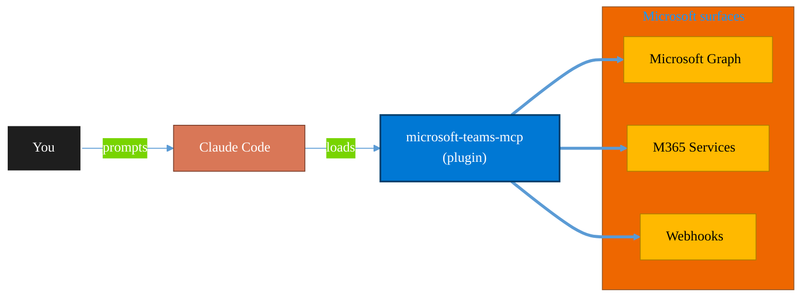

<!-- claude-m:premium-header:start -->
<div align="center">

<a id="top"></a>

# microsoft-teams-mcp

### Send messages, create meetings, and manage Teams channels via MCP.

<sub>Automate everyday Microsoft 365 collaboration workflows.</sub>

<br />

<table align="center">
<tr>
<td align="center"><b>Category</b><br /><code>Productivity</code></td>
<td align="center"><b>Surfaces</b><br /><sub>Microsoft Graph · M365 · Teams · Outlook · SharePoint · Loop</sub></td>
<td align="center"><b>Version</b><br /><code>1.0.0</code></td>
<td align="center"><b>Marketplace</b><br /><code>claude-m-microsoft-marketplace</code></td>
</tr>
</table>

<sub><code>microsoft</code> &nbsp;·&nbsp; <code>teams</code> &nbsp;·&nbsp; <code>collaboration</code></sub>

<a href="#install"><b>Install</b></a> &nbsp;·&nbsp;
<a href="#overview"><b>Overview</b></a> &nbsp;·&nbsp;
<a href="#architecture"><b>Architecture</b></a> &nbsp;·&nbsp;
<a href="#related-plugins"><b>Related plugins</b></a> &nbsp;·&nbsp;
<a href="../../README.md"><b>Marketplace</b></a>

</div>

---

> [!TIP]
> **One-line install** — `/plugin install microsoft-teams-mcp@claude-m-microsoft-marketplace`


## Overview

> Send messages, create meetings, and manage Teams channels via MCP.


<details>
<summary><b>Quick example</b></summary>

```text
Use microsoft-teams-mcp to automate Microsoft 365 collaboration workflows.
```

</details>

<a id="architecture"></a>

## Architecture



<a id="install"></a>

## Install

```bash
/plugin marketplace add markus41/Claude-m
/plugin install microsoft-teams-mcp@claude-m-microsoft-marketplace
```

> [!IMPORTANT]
> This plugin operates against **Microsoft Graph · M365 · Teams · Outlook · SharePoint · Loop**. Configure credentials via environment variables — never commit secrets.

[Back to top](#top)

---

<!-- claude-m:premium-header:end -->

Connect Claude to Microsoft Teams via the Model Context Protocol (MCP).

## Features

- **List Teams**: Get all Microsoft Teams the signed-in user has joined
- **List Channels**: View channels within a specific team
- **Send Messages**: Post messages to Teams channels
- **Create Meetings**: Schedule online meetings in Microsoft Teams

## Installation

### From Claude Code Marketplace

```bash
/plugin marketplace add markus41/Claude-m
/plugin install "Microsoft Teams MCP"
```

### Manual Configuration

Add to your `.claude/settings.json`:

```json
{
  "mcpServers": {
    "microsoft-teams": {
      "command": "node",
      "args": ["/path/to/Claude-m/dist/index.js"],
      "env": {
        "MICROSOFT_CLIENT_ID": "your-client-id",
        "MICROSOFT_CLIENT_SECRET": "your-client-secret",
        "MICROSOFT_TENANT_ID": "your-tenant-id",
        "MICROSOFT_ACCESS_TOKEN": "your-access-token"
      }
    }
  }
}
```

## Required Microsoft Graph Permissions

- `ChannelMessage.Send` - Send messages to channels
- `Chat.ReadWrite` - Read and write chats
- `OnlineMeetings.ReadWrite` - Create and manage meetings
- `Team.ReadBasic.All` - Read basic team information

## Available Tools

### `teams_list_teams`
Lists all Microsoft Teams the signed-in user has joined.

### `teams_list_channels`
Lists channels within a specific team.

**Arguments:**
- `teamId` (string): The ID of the team

### `teams_send_message`
Sends a message to a Microsoft Teams channel.

**Arguments:**
- `teamId` (string): Team ID
- `channelId` (string): Channel ID
- `message` (string): Message content (HTML or plain text)

### `teams_create_meeting`
Creates a new online meeting in Microsoft Teams.

**Arguments:**
- `subject` (string): Meeting subject
- `startDateTime` (string): ISO-8601 start date-time
- `endDateTime` (string): ISO-8601 end date-time
- `attendees` (array, optional): Attendee email addresses

## Example Usage

```
List my Teams:
> Use the teams_list_teams tool

Send a message:
> Use teams_send_message to send "Hello from Claude!" to the General channel
```

## License

ISC
<!-- claude-m:premium-footer:start -->

---

<a id="related-plugins"></a>

## Related plugins

<table>
<tr><th>Plugin</th><th>What it does</th></tr>
<tr><td><a href="../../microsoft-loop/README.md"><code>microsoft-loop</code></a></td><td>Microsoft Loop workspaces, pages, and components — create collaborative spaces, embed portable Loop components across M365 apps, manage via Graph API, and govern Loop at the tenant level.</td></tr>
<tr><td><a href="../../planner-orchestrator/README.md"><code>planner-orchestrator</code></a></td><td>Intelligent orchestration for Microsoft Planner — ship tasks with Claude Code, triage backlogs, plan sprint buckets, monitor deadlines, and balance workloads across plans. Integrates with microsoft-teams-mcp, microsoft-outlook-mcp, and powerbi-fabric when installed.</td></tr>
<tr><td><a href="../../teams-lifecycle/README.md"><code>teams-lifecycle</code></a></td><td>Teams lifecycle management — create and archive teams with templates, enforce naming and ownership, apply sensitivity labels, and run expiration reviews using non-technical 'project start/end' language</td></tr>
<tr><td><a href="../../business-central/README.md"><code>business-central</code></a></td><td>Microsoft Dynamics 365 Business Central ERP — finance, supply chain, and inventory management via BC OData v4 / API v2.0 REST API</td></tr>
<tr><td><a href="../../copilot-studio-bots/README.md"><code>copilot-studio-bots</code></a></td><td>Copilot Studio — design bot topics, author trigger phrases, configure generative AI orchestration, and publish chatbots</td></tr>
<tr><td><a href="../../dynamics-365-crm/README.md"><code>dynamics-365-crm</code></a></td><td>Dynamics 365 Sales and Customer Service via Dataverse Web API — leads, opportunities, accounts, contacts, cases, SLAs, queues, pipeline reporting, and CRM workflow automation</td></tr>
</table>


<details>
<summary><b>Composable stacks that include <code>microsoft-teams-mcp</code></b></summary>

Combine with sibling plugins to build cross-surface runbooks. Browse the full [marketplace catalog](../../README.md#plugin-catalog) for a tailored selection.

</details>

---

<div align="center">

<sub>Part of <a href="../../README.md"><b>Claude-m</b></a> — the Microsoft plugin marketplace for Claude Code.</sub>

<sub>Licensed under <a href="../../LICENSE">MIT</a>. Built for engineers, MSPs, SOC teams, and analytics leaders.</sub>

</div>

<!-- claude-m:premium-footer:end -->

