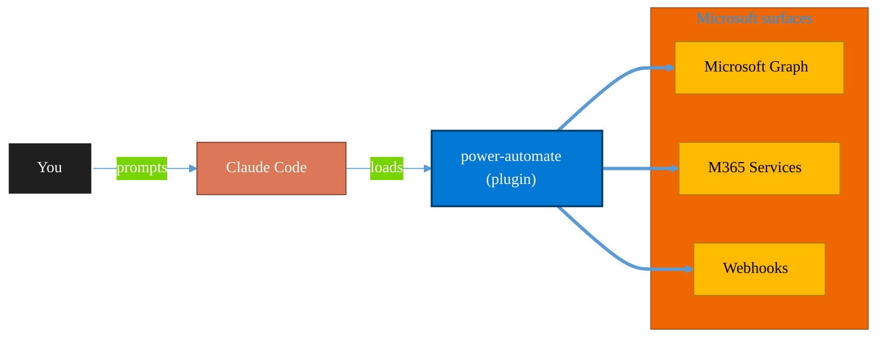

<!-- claude-m:premium-header:start -->
<div align="center">

<a id="top"></a>

# power-automate

### Design and troubleshoot Power Automate cloud flows — trigger/action patterns, run diagnostics, retries, and deployment-safe flow definitions

<sub>Automate everyday Microsoft 365 collaboration workflows.</sub>

<br />

<table align="center">
<tr>
<td align="center"><b>Category</b><br /><code>Productivity</code></td>
<td align="center"><b>Surfaces</b><br /><sub>Microsoft Graph · M365 · Teams · Outlook · SharePoint · Loop</sub></td>
<td align="center"><b>Version</b><br /><code>1.0.0</code></td>
<td align="center"><b>Marketplace</b><br /><code>claude-m-microsoft-marketplace</code></td>
</tr>
</table>

<sub><code>microsoft</code> &nbsp;·&nbsp; <code>power-automate</code> &nbsp;·&nbsp; <code>flows</code> &nbsp;·&nbsp; <code>automation</code> &nbsp;·&nbsp; <code>dataverse</code> &nbsp;·&nbsp; <code>power-platform</code></sub>

<a href="#install"><b>Install</b></a> &nbsp;·&nbsp;
<a href="#overview"><b>Overview</b></a> &nbsp;·&nbsp;
<a href="#architecture"><b>Architecture</b></a> &nbsp;·&nbsp;
<a href="#related-plugins"><b>Related plugins</b></a> &nbsp;·&nbsp;
<a href="../README.md"><b>Marketplace</b></a>

</div>

---

> [!TIP]
> **One-line install** — `/plugin install power-automate@claude-m-microsoft-marketplace`


## Overview

> Design and troubleshoot Power Automate cloud flows — trigger/action patterns, run diagnostics, retries, and deployment-safe flow definitions

<details>
<summary><b>What ships in this plugin</b> (commands, agents, skills)</summary>

| Component | Items |
|---|---|
| **Commands** | `/flow-debug` · `/flow-deploy-check` · `/flow-design` · `/flow-setup` · `/pa-ai-builder` · `/pa-bpf-design` · `/pa-custom-connector` · `/pa-governance` |
| **Agents** | `power-automate-reviewer` |
| **Skills** | `power-automate` |

</details>


<details>
<summary><b>Quick example</b></summary>

```text
Use power-automate to automate Microsoft 365 collaboration workflows.
```

</details>

<a id="architecture"></a>

## Architecture



<a id="install"></a>

## Install

```bash
/plugin marketplace add markus41/Claude-m
/plugin install power-automate@claude-m-microsoft-marketplace
```

> [!IMPORTANT]
> This plugin operates against **Microsoft Graph · M365 · Teams · Outlook · SharePoint · Loop**. Configure credentials via environment variables — never commit secrets.

[Back to top](#top)

---

<!-- claude-m:premium-header:end -->

Power Automate cloud flow design and troubleshooting guidance.

## What this plugin helps with
- Create robust flow definitions and trigger patterns
- Diagnose failed runs and connector/auth issues
- Apply retry, idempotency, and error-handling patterns
- Prepare deployment-safe flow artifacts

## Included commands
- `commands/setup.md`
- `commands/flow-design.md`
- `commands/flow-debug.md`
- `commands/flow-deploy-check.md`

## Skill
- `skills/power-automate/SKILL.md`

## Plugin structure
- `.claude-plugin/plugin.json`
- `skills/power-automate/SKILL.md`
- `commands/setup.md`
- `commands/flow-design.md`
- `commands/flow-debug.md`
- `commands/flow-deploy-check.md`
- `agents/power-automate-reviewer.md`
<!-- claude-m:premium-footer:start -->

---

<a id="related-plugins"></a>

## Related plugins

<table>
<tr><th>Plugin</th><th>What it does</th></tr>
<tr><td><a href="../excel-office-scripts/README.md"><code>excel-office-scripts</code></a></td><td>Deep knowledge of Excel Office Scripts — Microsoft's TypeScript-based automation platform for Excel on the web</td></tr>
<tr><td><a href="../power-pages/README.md"><code>power-pages</code></a></td><td>Microsoft Power Pages — sites, page templates, Liquid, web forms, table permissions, web roles, and Dataverse portal integration</td></tr>
<tr><td><a href="../dynamics-365-crm/README.md"><code>dynamics-365-crm</code></a></td><td>Dynamics 365 Sales and Customer Service via Dataverse Web API — leads, opportunities, accounts, contacts, cases, SLAs, queues, pipeline reporting, and CRM workflow automation</td></tr>
<tr><td><a href="../dynamics-365-field-service/README.md"><code>dynamics-365-field-service</code></a></td><td>Dynamics 365 Field Service via Dataverse Web API — work orders, bookings, resource scheduling, service accounts, assets, and IoT-triggered service events</td></tr>
<tr><td><a href="../dynamics-365-project-ops/README.md"><code>dynamics-365-project-ops</code></a></td><td>Dynamics 365 Project Operations via Dataverse Web API — projects, WBS, time and expense tracking, resource assignments, project contracts, and billing</td></tr>
<tr><td><a href="../excel-automation/README.md"><code>excel-automation</code></a></td><td>Excel data cleaning with pandas, Office Script generation, and Power Automate flow creation</td></tr>
</table>


<details>
<summary><b>Composable stacks that include <code>power-automate</code></b></summary>

Combine with sibling plugins to build cross-surface runbooks. Browse the full [marketplace catalog](../README.md#plugin-catalog) for a tailored selection.

</details>

---

<div align="center">

<sub>Part of <a href="../README.md"><b>Claude-m</b></a> — the Microsoft plugin marketplace for Claude Code.</sub>

<sub>Licensed under <a href="../LICENSE">MIT</a>. Built for engineers, MSPs, SOC teams, and analytics leaders.</sub>

</div>

<!-- claude-m:premium-footer:end -->

