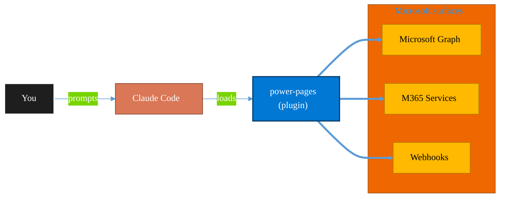

<!-- claude-m:premium-header:start -->
<div align="center">

<a id="top"></a>

# power-pages

### Microsoft Power Pages — sites, page templates, Liquid, web forms, table permissions, web roles, and Dataverse portal integration

<sub>Automate everyday Microsoft 365 collaboration workflows.</sub>

<br />

<table align="center">
<tr>
<td align="center"><b>Category</b><br /><code>Productivity</code></td>
<td align="center"><b>Surfaces</b><br /><sub>Microsoft Graph · M365 · Teams · Outlook · SharePoint · Loop</sub></td>
<td align="center"><b>Version</b><br /><code>1.0.0</code></td>
<td align="center"><b>Marketplace</b><br /><code>claude-m-microsoft-marketplace</code></td>
</tr>
</table>

<sub><code>microsoft</code> &nbsp;·&nbsp; <code>power-pages</code> &nbsp;·&nbsp; <code>portals</code> &nbsp;·&nbsp; <code>power-platform</code> &nbsp;·&nbsp; <code>liquid</code> &nbsp;·&nbsp; <code>dataverse</code></sub>

<a href="#install"><b>Install</b></a> &nbsp;·&nbsp;
<a href="#overview"><b>Overview</b></a> &nbsp;·&nbsp;
<a href="#architecture"><b>Architecture</b></a> &nbsp;·&nbsp;
<a href="#related-plugins"><b>Related plugins</b></a> &nbsp;·&nbsp;
<a href="../README.md"><b>Marketplace</b></a>

</div>

---

> [!TIP]
> **One-line install** — `/plugin install power-pages@claude-m-microsoft-marketplace`


## Overview

> Microsoft Power Pages — sites, page templates, Liquid, web forms, table permissions, web roles, and Dataverse portal integration

<details>
<summary><b>What ships in this plugin</b> (commands, agents, skills)</summary>

| Component | Items |
|---|---|
| **Commands** | `/pages-permissions` · `/pages-setup` · `/pages-site-create` · `/pages-template-apply` · `/pages-webform-create` |
| **Agents** | `pages-reviewer` |
| **Skills** | `power-pages` |

</details>


<details>
<summary><b>Quick example</b></summary>

```text
Use power-pages to automate Microsoft 365 collaboration workflows.
```

</details>

<a id="architecture"></a>

## Architecture



<a id="install"></a>

## Install

```bash
/plugin marketplace add markus41/Claude-m
/plugin install power-pages@claude-m-microsoft-marketplace
```

> [!IMPORTANT]
> This plugin operates against **Microsoft Graph · M365 · Teams · Outlook · SharePoint · Loop**. Configure credentials via environment variables — never commit secrets.

[Back to top](#top)

---

<!-- claude-m:premium-header:end -->

Build and manage Microsoft Power Pages (formerly Portals) websites backed by Dataverse. Design page templates with Liquid, create multi-step web forms, configure table permissions and web roles, and manage authentication providers.

## What this plugin helps with
- Create and manage Power Pages sites and web pages
- Author Liquid templates with FetchXML data queries
- Build multi-step web forms for data collection
- Configure table permissions and web roles for security
- Set up authentication with Azure AD B2C or external OIDC providers

## Included commands
- `/setup` — Install PAC CLI, authenticate to Dataverse, verify portal access
- `/pages-site-create` — Create a new Power Pages site with home page
- `/pages-template-apply` — Create or update web templates with Liquid content
- `/pages-webform-create` — Scaffold multi-step web forms
- `/pages-permissions` — Configure table permissions and web roles

## Skill
- `skills/power-pages/SKILL.md` — Comprehensive Power Pages reference covering Liquid, forms, permissions, and authentication

## Agent
- `agents/pages-reviewer.md` — Reviews Liquid template quality, table permission security, and web role assignments

## Required Dataverse Roles
| Role | Purpose |
|---|---|
| System Administrator | Full access to all portal configuration tables |
| System Customizer | Create and modify portal components |

## Coverage against Microsoft documentation

| Feature domain | Coverage status |
|---|---|
| Site creation and page management | Covered |
| Liquid template language | Covered |
| Web forms (multi-step) | Covered |
| Table permissions and web roles | Covered |
| Authentication providers | Covered |
| PAC CLI for local development | Covered |
<!-- claude-m:premium-footer:start -->

---

<a id="related-plugins"></a>

## Related plugins

<table>
<tr><th>Plugin</th><th>What it does</th></tr>
<tr><td><a href="../power-automate/README.md"><code>power-automate</code></a></td><td>Design and troubleshoot Power Automate cloud flows — trigger/action patterns, run diagnostics, retries, and deployment-safe flow definitions</td></tr>
<tr><td><a href="../dynamics-365-crm/README.md"><code>dynamics-365-crm</code></a></td><td>Dynamics 365 Sales and Customer Service via Dataverse Web API — leads, opportunities, accounts, contacts, cases, SLAs, queues, pipeline reporting, and CRM workflow automation</td></tr>
<tr><td><a href="../dynamics-365-field-service/README.md"><code>dynamics-365-field-service</code></a></td><td>Dynamics 365 Field Service via Dataverse Web API — work orders, bookings, resource scheduling, service accounts, assets, and IoT-triggered service events</td></tr>
<tr><td><a href="../dynamics-365-project-ops/README.md"><code>dynamics-365-project-ops</code></a></td><td>Dynamics 365 Project Operations via Dataverse Web API — projects, WBS, time and expense tracking, resource assignments, project contracts, and billing</td></tr>
<tr><td><a href="../planner-todo/README.md"><code>planner-todo</code></a></td><td>Microsoft Planner and To Do task management via Graph API — classic plans, Premium Dataverse projects, buckets, tasks, assignments, checklists, nested plans, roster plans, sprints, goals, and Business Scenarios</td></tr>
<tr><td><a href="../business-central/README.md"><code>business-central</code></a></td><td>Microsoft Dynamics 365 Business Central ERP — finance, supply chain, and inventory management via BC OData v4 / API v2.0 REST API</td></tr>
</table>


<details>
<summary><b>Composable stacks that include <code>power-pages</code></b></summary>

Combine with sibling plugins to build cross-surface runbooks. Browse the full [marketplace catalog](../README.md#plugin-catalog) for a tailored selection.

</details>

---

<div align="center">

<sub>Part of <a href="../README.md"><b>Claude-m</b></a> — the Microsoft plugin marketplace for Claude Code.</sub>

<sub>Licensed under <a href="../LICENSE">MIT</a>. Built for engineers, MSPs, SOC teams, and analytics leaders.</sub>

</div>

<!-- claude-m:premium-footer:end -->

