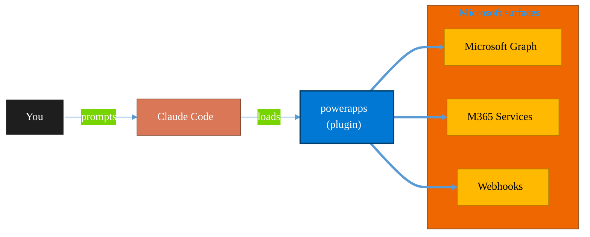

<!-- claude-m:premium-header:start -->
<div align="center">

<a id="top"></a>

# powerapps

### Microsoft Power Apps development — canvas app creation, model-driven app scaffolding, deployment, formulas, custom connectors, component libraries, and PCF controls

<sub>Automate everyday Microsoft 365 collaboration workflows.</sub>

<br />

<table align="center">
<tr>
<td align="center"><b>Category</b><br /><code>Productivity</code></td>
<td align="center"><b>Surfaces</b><br /><sub>Microsoft Graph · M365 · Teams · Outlook · SharePoint · Loop</sub></td>
<td align="center"><b>Version</b><br /><code>1.1.0</code></td>
<td align="center"><b>Marketplace</b><br /><code>claude-m-microsoft-marketplace</code></td>
</tr>
</table>

<sub><code>microsoft</code> &nbsp;·&nbsp; <code>power-apps</code> &nbsp;·&nbsp; <code>canvas</code> &nbsp;·&nbsp; <code>model-driven</code> &nbsp;·&nbsp; <code>power-fx</code> &nbsp;·&nbsp; <code>connectors</code></sub>

<a href="#install"><b>Install</b></a> &nbsp;·&nbsp;
<a href="#overview"><b>Overview</b></a> &nbsp;·&nbsp;
<a href="#architecture"><b>Architecture</b></a> &nbsp;·&nbsp;
<a href="#related-plugins"><b>Related plugins</b></a> &nbsp;·&nbsp;
<a href="../README.md"><b>Marketplace</b></a>

</div>

---

> [!TIP]
> **One-line install** — `/plugin install powerapps@claude-m-microsoft-marketplace`


## Overview

> Microsoft Power Apps development — canvas app creation, model-driven app scaffolding, deployment, formulas, custom connectors, component libraries, and PCF controls

<details>
<summary><b>What ships in this plugin</b> (commands, agents, skills)</summary>

| Component | Items |
|---|---|
| **Commands** | `/pa-app-create` · `/pa-app-from-data` · `/pa-canvas-screen` · `/pa-component-create` · `/pa-connector-create` · `/pa-deploy` · `/pa-formula` · `/pa-mda-create` · `/pa-model-driven-form` · `/pa-setup` · `/pa-solution-checker` |
| **Agents** | `powerapps-reviewer` |
| **Skills** | `powerapps-dev` |

</details>


<details>
<summary><b>Quick example</b></summary>

```text
Use powerapps to automate Microsoft 365 collaboration workflows.
```

</details>

<a id="architecture"></a>

## Architecture



<a id="install"></a>

## Install

```bash
/plugin marketplace add markus41/Claude-m
/plugin install powerapps@claude-m-microsoft-marketplace
```

> [!IMPORTANT]
> This plugin operates against **Microsoft Graph · M365 · Teams · Outlook · SharePoint · Loop**. Configure credentials via environment variables — never commit secrets.

[Back to top](#top)

---

<!-- claude-m:premium-header:end -->

A Claude Code knowledge plugin for Power Apps development — canvas app Power Fx formulas, model-driven app configuration, custom connector development, component libraries, and solution checker analysis.

## What This Plugin Provides

This is a **knowledge plugin** -- it gives Claude deep expertise in Power Apps so it can generate correct Power Fx formulas, design model-driven forms, build custom connectors, create reusable components, and validate solutions. It does not contain runtime code, MCP servers, or executable scripts.

## Setup

Run `/setup` to configure Power Platform environment access:

```
/setup              # Full guided setup
/setup --minimal    # Node.js dependencies only
/setup --with-pcf   # Include PCF control development tools
```

## Capabilities

| Area | What Claude Can Do |
|------|-------------------|
| **Canvas Apps** | Generate screens, galleries, forms with correct Power Fx formulas and delegation handling |
| **Power Fx** | Generate formulas with proper delegation, error handling, and performance patterns |
| **Model-Driven** | Configure forms, views, business rules, business process flows, and site maps |
| **Custom Connectors** | Generate OpenAPI 2.0 definitions with authentication for REST APIs |
| **Components** | Build reusable canvas components with typed input/output properties |
| **Solution Checker** | Static analysis for delegation issues, security, and naming conventions |
| **Review** | Analyze formulas for delegation compliance, performance, and best practices |

## Commands

| Command | Description |
|---------|-------------|
| `/pa-canvas-screen` | Generate a canvas screen (list, detail, form, dashboard, settings) |
| `/pa-formula` | Generate a Power Fx formula from natural language |
| `/pa-connector-create` | Generate a custom connector OpenAPI definition |
| `/pa-component-create` | Generate a reusable canvas component |
| `/pa-model-driven-form` | Generate a model-driven form configuration |
| `/pa-solution-checker` | Run static analysis on Power Apps components |
| `/setup` | Configure Power Platform environment access |

## Agent

| Agent | Description |
|-------|-------------|
| **Power Apps Reviewer** | Reviews Power Fx delegation, model-driven config, connectors, and naming conventions |

## Plugin Structure

```
powerapps/
├── .claude-plugin/
│   └── plugin.json
├── skills/
│   └── powerapps-dev/
│       └── SKILL.md
├── commands/
│   ├── pa-canvas-screen.md
│   ├── pa-formula.md
│   ├── pa-connector-create.md
│   ├── pa-component-create.md
│   ├── pa-model-driven-form.md
│   ├── pa-solution-checker.md
│   └── setup.md
├── agents/
│   └── powerapps-reviewer.md
└── README.md
```

## Trigger Keywords

The skill activates automatically when conversations mention: `power apps`, `powerapps`, `canvas app`, `model-driven`, `power fx`, `custom connector`, `component library`, `pcf control`, `gallery`, `form control`, `app formula`, `delegation`, `patch function`, `collect function`.

## Author

Markus Ahling
<!-- claude-m:premium-footer:start -->

---

<a id="related-plugins"></a>

## Related plugins

<table>
<tr><th>Plugin</th><th>What it does</th></tr>
<tr><td><a href="../business-central/README.md"><code>business-central</code></a></td><td>Microsoft Dynamics 365 Business Central ERP — finance, supply chain, and inventory management via BC OData v4 / API v2.0 REST API</td></tr>
<tr><td><a href="../copilot-studio-bots/README.md"><code>copilot-studio-bots</code></a></td><td>Copilot Studio — design bot topics, author trigger phrases, configure generative AI orchestration, and publish chatbots</td></tr>
<tr><td><a href="../dynamics-365-crm/README.md"><code>dynamics-365-crm</code></a></td><td>Dynamics 365 Sales and Customer Service via Dataverse Web API — leads, opportunities, accounts, contacts, cases, SLAs, queues, pipeline reporting, and CRM workflow automation</td></tr>
<tr><td><a href="../dynamics-365-field-service/README.md"><code>dynamics-365-field-service</code></a></td><td>Dynamics 365 Field Service via Dataverse Web API — work orders, bookings, resource scheduling, service accounts, assets, and IoT-triggered service events</td></tr>
<tr><td><a href="../dynamics-365-project-ops/README.md"><code>dynamics-365-project-ops</code></a></td><td>Dynamics 365 Project Operations via Dataverse Web API — projects, WBS, time and expense tracking, resource assignments, project contracts, and billing</td></tr>
<tr><td><a href="../excel-automation/README.md"><code>excel-automation</code></a></td><td>Excel data cleaning with pandas, Office Script generation, and Power Automate flow creation</td></tr>
</table>


<details>
<summary><b>Composable stacks that include <code>powerapps</code></b></summary>

Combine with sibling plugins to build cross-surface runbooks. Browse the full [marketplace catalog](../README.md#plugin-catalog) for a tailored selection.

</details>

---

<div align="center">

<sub>Part of <a href="../README.md"><b>Claude-m</b></a> — the Microsoft plugin marketplace for Claude Code.</sub>

<sub>Licensed under <a href="../LICENSE">MIT</a>. Built for engineers, MSPs, SOC teams, and analytics leaders.</sub>

</div>

<!-- claude-m:premium-footer:end -->

