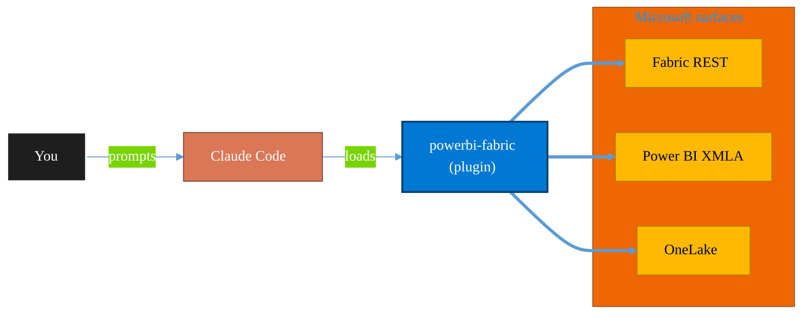

<!-- claude-m:premium-header:start -->
<div align="center">

<a id="top"></a>

# powerbi-fabric

### DAX measures, Power Query M, Power BI Embedded, deployment pipelines, PBIP scaffolding, Fabric Lakehouse, Direct Lake, performance optimization

<sub>Build, mirror, and govern analytics estates on Fabric.</sub>

<br />

<table align="center">
<tr>
<td align="center"><b>Category</b><br /><code>Analytics</code></td>
<td align="center"><b>Surfaces</b><br /><sub>Microsoft Fabric · Power BI · OneLake · DAX · KQL</sub></td>
<td align="center"><b>Version</b><br /><code>1.0.0</code></td>
<td align="center"><b>Marketplace</b><br /><code>claude-m-microsoft-marketplace</code></td>
</tr>
</table>

<sub><code>microsoft</code> &nbsp;·&nbsp; <code>power-bi</code> &nbsp;·&nbsp; <code>dax</code> &nbsp;·&nbsp; <code>power-query</code> &nbsp;·&nbsp; <code>fabric</code> &nbsp;·&nbsp; <code>pbip</code></sub>

<a href="#install"><b>Install</b></a> &nbsp;·&nbsp;
<a href="#overview"><b>Overview</b></a> &nbsp;·&nbsp;
<a href="#architecture"><b>Architecture</b></a> &nbsp;·&nbsp;
<a href="#related-plugins"><b>Related plugins</b></a> &nbsp;·&nbsp;
<a href="../README.md"><b>Marketplace</b></a>

</div>

---

> [!TIP]
> **One-line install** — `/plugin install powerbi-fabric@claude-m-microsoft-marketplace`


## Overview

> DAX measures, Power Query M, Power BI Embedded, deployment pipelines, PBIP scaffolding, Fabric Lakehouse, Direct Lake, performance optimization

<details>
<summary><b>What ships in this plugin</b> (commands, agents, skills)</summary>

| Component | Items |
|---|---|
| **Commands** | `/pbi-dashboard-create` · `/pbi-dataflow` · `/pbi-dataset-refresh` · `/pbi-deploy-pipeline` · `/pbi-direct-lake-model` · `/pbi-embed` · `/pbi-fabric-notebook` · `/pbi-fabric-pipeline` · `/pbi-measure` · `/pbi-model-validate` · `/pbi-query` · `/pbi-report-create` · `/pbi-rls-role` · `/pbi-scaffold` · `/pbi-scorecard-manage` · `/pbi-setup` · `/pbi-workspace-create` |
| **Agents** | `dax-reviewer` · `pbi-performance-advisor` |
| **Skills** | `powerbi-analytics` |

</details>


<details>
<summary><b>Quick example</b></summary>

```text
Use powerbi-fabric to design, build, and govern Fabric / Power BI assets.
```

</details>

<a id="architecture"></a>

## Architecture



<a id="install"></a>

## Install

```bash
/plugin marketplace add markus41/Claude-m
/plugin install powerbi-fabric@claude-m-microsoft-marketplace
```

> [!IMPORTANT]
> This plugin operates against **Microsoft Fabric · Power BI · OneLake · DAX · KQL**. Configure credentials via environment variables — never commit secrets.

[Back to top](#top)

---

<!-- claude-m:premium-header:end -->

A Claude Code knowledge plugin for Power BI development, DAX authoring, Power Query M transformations, workspace management, PBIP project scaffolding, Power BI Embedded, deployment pipeline automation, performance optimization, and Microsoft Fabric integration.

## What This Plugin Provides

This is a **knowledge plugin** -- it gives Claude deep expertise in the Power BI and Fabric ecosystem so it can generate correct code, scripts, and architectural advice. It does not contain runtime code, MCP servers, or executable scripts.

## Setup

Run `/setup` to configure authentication and verify Power BI access:

```
/setup                        # Full guided setup
/setup --minimal              # Node.js dependencies only
/setup --with-fabric          # Include Fabric/Lakehouse configuration
/setup --with-desktop-check   # Verify Power BI Desktop installation
```

## Prerequisites

- Power BI tenant with Fabric enabled and workspace access.
- Permission to create and manage reports, dashboards, and scorecards in target workspaces.
- API access configured for Power BI REST operations.

## Capabilities

| Area | What Claude Can Do |
|------|-------------------|
| **DAX Measures** | Generate, review, and optimize DAX measures with correct filter context, time intelligence, and KPI patterns |
| **Power Query M** | Generate M code for data source connections, transformations, pagination, and custom functions |
| **PBIP Projects** | Scaffold complete Power BI Project structures with TMDL files, model definitions, and report layouts |
| **REST API** | Generate TypeScript code for workspace management, dataset refresh, report export, embedding, and deployment pipelines |
| **Fabric** | Generate PySpark notebooks for Lakehouse data pipelines, Direct Lake models, Dataflow Gen2, and medallion architecture |
| **Embedded** | Generate server-side embed token services and client-side powerbi-client SDK code with React component support |
| **Performance** | Diagnose VertiPaq memory issues, SE/FE bottlenecks, Direct Lake fallback, and composite model inefficiencies |
| **Review** | Analyze existing DAX, M code, and PBIP structures for correctness, performance, and best practices |

## Output Formats

- **PBIP (Power BI Project)** -- Git-friendly text-based project files with TMDL or model.bim
- **Classic .pbix** -- guidance for direct upload via Power BI Service REST API
- **DAX** -- header-comment format with measure name, description, and dependencies
- **Power Query M** -- complete let/in queries with typed columns and step comments
- **TypeScript** -- REST API client code with MSAL authentication and error handling
- **PySpark** -- Fabric notebook cells with Delta table read/write patterns

## Commands

| Command | Description |
|---------|-------------|
| `/pbi-measure` | Generate a DAX measure from natural language description |
| `/pbi-query` | Generate Power Query M code for data transformation |
| `/pbi-workspace-create` | Generate REST API code to create and configure a workspace |
| `/pbi-dataset-refresh` | Generate code to trigger and monitor a dataset refresh |
| `/pbi-scaffold` | Generate a complete PBIP project structure |
| `/pbi-fabric-notebook` | Generate a Fabric PySpark notebook for data pipelines |
| `/pbi-embed` | Generate Power BI Embedded token service and client-side SDK code (App/User Owns Data, optional React wrapper) |
| `/pbi-deploy-pipeline` | Generate TypeScript to automate deployment pipeline stages (Dev→Test or Test→Prod) with polling |
| `/pbi-dashboard-create` | Create and validate Power BI dashboard assets in Fabric workspaces |
| `/pbi-report-create` | Create and validate Power BI reports with deterministic dataset bindings |
| `/pbi-scorecard-manage` | Manage scorecards, KPI ownership, and goal status governance |
| `/setup` | Set up Azure auth, verify workspace access, and optionally configure Fabric |

## Routing Boundaries

- Use `fabric-graph-geo` for Graph model/queryset, Map, and Exploration preview workflows.
- Use `fabric-data-store` for Event Schema Set and Datamart ownership workflows.
- Keep `powerbi-fabric` focused on reports, dashboards, scorecards, semantic modeling, and BI delivery patterns.

## Agents

| Agent | Description |
|-------|-------------|
| **DAX & Power BI Reviewer** | Reviews DAX measures, M code, PBIP structure, semantic model design, and REST API usage |
| **PBI Performance Advisor** | Diagnoses slow reports, VertiPaq memory bloat, Direct Lake fallback, and DAX Formula Engine bottlenecks |

## Plugin Structure

```
powerbi-fabric/
├── .claude-plugin/
│   └── plugin.json
├── skills/
│   └── powerbi-analytics/
│       ├── SKILL.md                              # Core knowledge (triggers on DAX, Power Query, PBIP, etc.)
│       ├── references/
│       │   ├── dax-patterns.md                   # DAX functions, time intelligence, KPI patterns
│       │   ├── power-query-m.md                  # M language, source connections, transforms, folding
│       │   ├── pbi-rest-api.md                   # REST API endpoints with TypeScript examples
│       │   ├── pbip-format.md                    # PBIP structure, TMDL, model.bim, Git workflow
│       │   ├── fabric-integration.md             # Lakehouse, notebooks, Direct Lake, pipelines
│       │   ├── performance-optimization.md       # VertiPaq, SE/FE, aggregations, Direct Lake framing
│       │   └── troubleshooting.md                # DAX errors, refresh failures, Direct Lake, M errors, REST API
│       └── examples/
│           ├── dax-measures.md                   # 10+ complete DAX measures
│           ├── power-query-transformations.md    # 6 complete M code examples
│           ├── workspace-management.md           # 5 TypeScript REST API examples
│           ├── pbip-scaffolding.md               # 3 complete PBIP project examples
│           └── dataflow-gen2.md                  # SQL folding, REST pagination, incremental refresh M code
├── commands/
│   ├── pbi-measure.md
│   ├── pbi-query.md
│   ├── pbi-workspace-create.md
│   ├── pbi-dataset-refresh.md
│   ├── pbi-scaffold.md
│   ├── pbi-fabric-notebook.md
│   ├── pbi-fabric-pipeline.md
│   ├── pbi-direct-lake-model.md
│   ├── pbi-embed.md
│   ├── pbi-deploy-pipeline.md
│   └── pbi-setup.md
├── agents/
│   ├── dax-reviewer.md
│   └── pbi-performance-advisor.md
└── README.md
```

## Trigger Keywords

The skill activates automatically when conversations mention: `dax`, `DAX measure`, `power query`, `M code`, `power bi`, `pbip`, `pbix`, `semantic model`, `fabric`, `lakehouse`, `pbi workspace`, `dataset refresh`, `power query M`, `calculated column`, `measure`, `embed token`, `deployment pipeline`, `performance`, `VertiPaq`, `direct lake fallback`, `dataflow gen2`.

## Author

Markus Ahling
<!-- claude-m:premium-footer:start -->

---

<a id="related-plugins"></a>

## Related plugins

<table>
<tr><th>Plugin</th><th>What it does</th></tr>
<tr><td><a href="../fabric-semantic-models/README.md"><code>fabric-semantic-models</code></a></td><td>Microsoft Fabric Semantic Models — Direct Lake modeling, DAX governance, calculation groups, XMLA deployment, and semantic link automation</td></tr>
<tr><td><a href="../fabric-capacity-ops/README.md"><code>fabric-capacity-ops</code></a></td><td>Microsoft Fabric Capacity Operations — CU monitoring, throttling diagnostics, workload tuning, autoscale planning, and cost-performance optimization</td></tr>
<tr><td><a href="../fabric-data-engineering/README.md"><code>fabric-data-engineering</code></a></td><td>Microsoft Fabric Data Engineering — lakehouses, Spark notebooks, data pipelines, Delta Lake tables, lakehouse SQL endpoints, multi-notebook orchestration, workspace lifecycle management, pipeline monitoring, and advanced optimization</td></tr>
<tr><td><a href="../fabric-graph-geo/README.md"><code>fabric-graph-geo</code></a></td><td>Microsoft Fabric graph and geospatial analytics - graph model, graph queryset, map, and exploration workflows with preview guardrails.</td></tr>
<tr><td><a href="../fabric-mirroring/README.md"><code>fabric-mirroring</code></a></td><td>Microsoft Fabric Mirroring — source onboarding, CDC replication, latency monitoring, schema drift handling, and reconciliation workflows</td></tr>
<tr><td><a href="../powerbi-paginated-reports/README.md"><code>powerbi-paginated-reports</code></a></td><td>Power BI paginated reports through Fabric — RDL authoring, VB.NET expressions, data source configuration, rendering/export, REST API automation, SSRS-to-Fabric migration, performance tuning, and troubleshooting</td></tr>
</table>


<details>
<summary><b>Composable stacks that include <code>powerbi-fabric</code></b></summary>

Combine with sibling plugins to build cross-surface runbooks. Browse the full [marketplace catalog](../README.md#plugin-catalog) for a tailored selection.

</details>

---

<div align="center">

<sub>Part of <a href="../README.md"><b>Claude-m</b></a> — the Microsoft plugin marketplace for Claude Code.</sub>

<sub>Licensed under <a href="../LICENSE">MIT</a>. Built for engineers, MSPs, SOC teams, and analytics leaders.</sub>

</div>

<!-- claude-m:premium-footer:end -->

