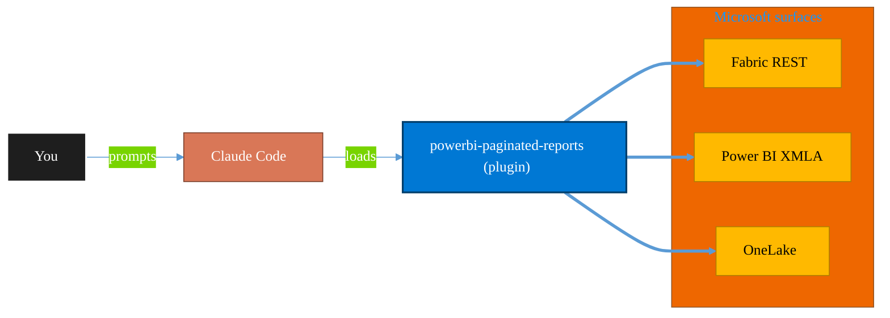

<!-- claude-m:premium-header:start -->
<div align="center">

<a id="top"></a>

# powerbi-paginated-reports

### Power BI paginated reports through Fabric — RDL authoring, VB.NET expressions, data source configuration, rendering/export, REST API automation, SSRS-to-Fabric migration, performance tuning, and troubleshooting

<sub>Build, mirror, and govern analytics estates on Fabric.</sub>

<br />

<table align="center">
<tr>
<td align="center"><b>Category</b><br /><code>Analytics</code></td>
<td align="center"><b>Surfaces</b><br /><sub>Microsoft Fabric · Power BI · OneLake · DAX · KQL</sub></td>
<td align="center"><b>Version</b><br /><code>1.0.0</code></td>
<td align="center"><b>Marketplace</b><br /><code>claude-m-microsoft-marketplace</code></td>
</tr>
</table>

<sub><code>microsoft</code> &nbsp;·&nbsp; <code>power-bi</code> &nbsp;·&nbsp; <code>paginated-reports</code> &nbsp;·&nbsp; <code>rdl</code> &nbsp;·&nbsp; <code>ssrs</code> &nbsp;·&nbsp; <code>fabric</code></sub>

<a href="#install"><b>Install</b></a> &nbsp;·&nbsp;
<a href="#overview"><b>Overview</b></a> &nbsp;·&nbsp;
<a href="#architecture"><b>Architecture</b></a> &nbsp;·&nbsp;
<a href="#related-plugins"><b>Related plugins</b></a> &nbsp;·&nbsp;
<a href="../README.md"><b>Marketplace</b></a>

</div>

---

> [!TIP]
> **One-line install** — `/plugin install powerbi-paginated-reports@claude-m-microsoft-marketplace`


## Overview

> Power BI paginated reports through Fabric — RDL authoring, VB.NET expressions, data source configuration, rendering/export, REST API automation, SSRS-to-Fabric migration, performance tuning, and troubleshooting

<details>
<summary><b>What ships in this plugin</b> (commands, agents, skills)</summary>

| Component | Items |
|---|---|
| **Commands** | `/pr-datasource` · `/pr-deploy` · `/pr-expression` · `/pr-migrate` · `/pr-scaffold` · `/pr-setup` · `/pr-subscription` · `/pr-validate` |
| **Agents** | `paginated-performance-advisor` · `rdl-reviewer` |
| **Skills** | `paginated-reports` |

</details>


<details>
<summary><b>Quick example</b></summary>

```text
Use powerbi-paginated-reports to design, build, and govern Fabric / Power BI assets.
```

</details>

<a id="architecture"></a>

## Architecture



<a id="install"></a>

## Install

```bash
/plugin marketplace add markus41/Claude-m
/plugin install powerbi-paginated-reports@claude-m-microsoft-marketplace
```

> [!IMPORTANT]
> This plugin operates against **Microsoft Fabric · Power BI · OneLake · DAX · KQL**. Configure credentials via environment variables — never commit secrets.

[Back to top](#top)

---

<!-- claude-m:premium-header:end -->

Comprehensive knowledge plugin for Power BI paginated reports through Microsoft Fabric — from RDL authoring to SSRS migration. This is a knowledge plugin (no runtime dependencies).

## Setup

```bash
/pr-setup
# or with flags:
/pr-setup --minimal
/pr-setup --skip-desktop
```

## Capabilities

| Area | What Claude Can Do |
|------|-------------------|
| RDL Authoring | Generate and modify RDL XML, data regions, report items, page layout |
| Expressions | Write VB.NET expressions, custom code, conditional formatting |
| Data Sources | Configure Fabric Lakehouse, Warehouse, Semantic Model, Azure SQL, Dataverse |
| Rendering | Configure PDF, Excel, Word, CSV, XML export with device info settings |
| REST API | Generate TypeScript for import, export, parameters, subscriptions |
| Deployment | Upload .rdl to Fabric workspace, bind gateway, set credentials |
| Migration | Assess SSRS reports for Fabric compatibility, auto-fix common issues |
| Performance | Diagnose query, rendering, and capacity bottlenecks |
| Troubleshooting | Resolve data source errors, expression errors, rendering issues |

## Commands

| Command | Description |
|---------|-------------|
| `/pr-setup` | Interactive setup — Report Builder, workspace, data source, auth |
| `/pr-scaffold` | Generate RDL template (invoice, table, matrix, list, subreport) |
| `/pr-validate` | Analyze RDL for issues, Fabric compatibility, best practices |
| `/pr-deploy` | Deploy .rdl to Fabric workspace via REST API |
| `/pr-migrate` | SSRS-to-Fabric compatibility scan with auto-fix |
| `/pr-datasource` | Configure data source and dataset for any Fabric source |
| `/pr-subscription` | Create/manage email subscriptions via REST API |
| `/pr-expression` | Generate VB.NET expressions from natural language |

## Agents

| Agent | Description |
|-------|-------------|
| RDL Reviewer | Reviews RDL files for correctness, compatibility, and best practices |
| Performance Advisor | Diagnoses performance bottlenecks with optimization roadmap |

## Plugin Structure

```
powerbi-paginated-reports/
├── .claude-plugin/plugin.json
├── .mcp.json
├── README.md
├── skills/paginated-reports/
│   ├── SKILL.md
│   ├── references/
│   │   ├── rdl-structure.md
│   │   ├── expressions-code.md
│   │   ├── data-sources-datasets.md
│   │   ├── rendering-export.md
│   │   ├── rest-api.md
│   │   ├── performance-tuning.md
│   │   ├── ssrs-migration.md
│   │   └── troubleshooting.md
│   └── examples/
│       ├── rdl-templates.md
│       ├── expression-patterns.md
│       ├── api-automation.md
│       └── migration-checklist.md
├── commands/
│   ├── pr-setup.md
│   ├── pr-scaffold.md
│   ├── pr-validate.md
│   ├── pr-deploy.md
│   ├── pr-migrate.md
│   ├── pr-datasource.md
│   ├── pr-subscription.md
│   └── pr-expression.md
└── agents/
    ├── rdl-reviewer.md
    └── paginated-performance-advisor.md
```

## Trigger Keywords

paginated report, rdl, report definition language, report builder, ssrs, sql server reporting services, tablix, data region, report parameter, subreport, drillthrough, report rendering, report export, report subscription, paginated deploy, report data source, pixel-perfect report, print-ready report, ssrs migration, paginated performance, report expression, custom code report

## Author

Markus Ahling
<!-- claude-m:premium-footer:start -->

---

<a id="related-plugins"></a>

## Related plugins

<table>
<tr><th>Plugin</th><th>What it does</th></tr>
<tr><td><a href="../powerbi-fabric/README.md"><code>powerbi-fabric</code></a></td><td>DAX measures, Power Query M, Power BI Embedded, deployment pipelines, PBIP scaffolding, Fabric Lakehouse, Direct Lake, performance optimization</td></tr>
<tr><td><a href="../fabric-ai-agents/README.md"><code>fabric-ai-agents</code></a></td><td>Microsoft Fabric AI and operations agents - anomaly detector, data agent, operations agent, ontology, and digital twin builder workflows with preview guardrails.</td></tr>
<tr><td><a href="../fabric-capacity-ops/README.md"><code>fabric-capacity-ops</code></a></td><td>Microsoft Fabric Capacity Operations — CU monitoring, throttling diagnostics, workload tuning, autoscale planning, and cost-performance optimization</td></tr>
<tr><td><a href="../fabric-data-activator/README.md"><code>fabric-data-activator</code></a></td><td>Microsoft Fabric Data Activator — Reflex triggers, condition-based alerts, real-time actions, and event-driven automation on Fabric data</td></tr>
<tr><td><a href="../fabric-data-engineering/README.md"><code>fabric-data-engineering</code></a></td><td>Microsoft Fabric Data Engineering — lakehouses, Spark notebooks, data pipelines, Delta Lake tables, lakehouse SQL endpoints, multi-notebook orchestration, workspace lifecycle management, pipeline monitoring, and advanced optimization</td></tr>
<tr><td><a href="../fabric-data-factory/README.md"><code>fabric-data-factory</code></a></td><td>Microsoft Fabric Data Factory — data pipelines, Dataflow Gen2, Copy activity, orchestration patterns, and scheduling</td></tr>
</table>


<details>
<summary><b>Composable stacks that include <code>powerbi-paginated-reports</code></b></summary>

Combine with sibling plugins to build cross-surface runbooks. Browse the full [marketplace catalog](../README.md#plugin-catalog) for a tailored selection.

</details>

---

<div align="center">

<sub>Part of <a href="../README.md"><b>Claude-m</b></a> — the Microsoft plugin marketplace for Claude Code.</sub>

<sub>Licensed under <a href="../LICENSE">MIT</a>. Built for engineers, MSPs, SOC teams, and analytics leaders.</sub>

</div>

<!-- claude-m:premium-footer:end -->

