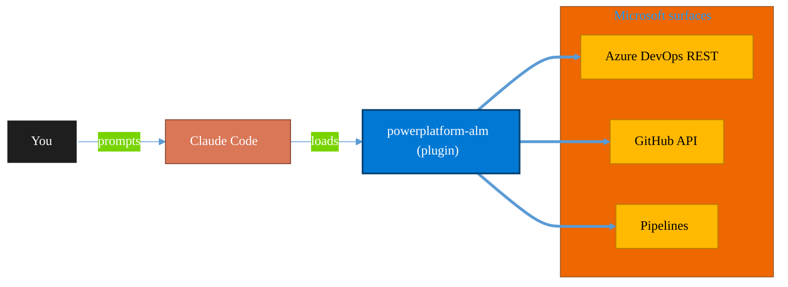

<!-- claude-m:premium-header:start -->
<div align="center">

<a id="top"></a>

# powerplatform-alm

### Power Platform ALM — environments, solution transport, CI/CD pipelines, PCF controls, and deployment automation

<sub>Ship reliably with first-class CI/CD and ALM.</sub>

<br />

<table align="center">
<tr>
<td align="center"><b>Category</b><br /><code>DevOps</code></td>
<td align="center"><b>Surfaces</b><br /><sub>Azure DevOps · GitHub · Pipelines · ALM · IaC</sub></td>
<td align="center"><b>Version</b><br /><code>1.0.0</code></td>
<td align="center"><b>Marketplace</b><br /><code>claude-m-microsoft-marketplace</code></td>
</tr>
</table>

<sub><code>microsoft</code> &nbsp;·&nbsp; <code>power-platform</code> &nbsp;·&nbsp; <code>alm</code> &nbsp;·&nbsp; <code>cicd</code> &nbsp;·&nbsp; <code>pcf</code> &nbsp;·&nbsp; <code>solutions</code></sub>

<a href="#install"><b>Install</b></a> &nbsp;·&nbsp;
<a href="#overview"><b>Overview</b></a> &nbsp;·&nbsp;
<a href="#architecture"><b>Architecture</b></a> &nbsp;·&nbsp;
<a href="#related-plugins"><b>Related plugins</b></a> &nbsp;·&nbsp;
<a href="../README.md"><b>Marketplace</b></a>

</div>

---

> [!TIP]
> **One-line install** — `/plugin install powerplatform-alm@claude-m-microsoft-marketplace`


## Overview

> Power Platform ALM — environments, solution transport, CI/CD pipelines, PCF controls, and deployment automation

<details>
<summary><b>What ships in this plugin</b> (commands, agents, skills)</summary>

| Component | Items |
|---|---|
| **Commands** | `/alm-env-create` · `/alm-env-list` · `/alm-envvar-set` · `/alm-pcf-build` · `/alm-pcf-init` · `/alm-pipeline-generate` · `/alm-setup` · `/alm-solution-diff` · `/alm-solution-export` · `/alm-solution-import` |
| **Agents** | `alm-reviewer` |
| **Skills** | `alm-lifecycle` |

</details>


<details>
<summary><b>Quick example</b></summary>

```text
Use powerplatform-alm to ship work through pipelines with full ALM.
```

</details>

<a id="architecture"></a>

## Architecture



<a id="install"></a>

## Install

```bash
/plugin marketplace add markus41/Claude-m
/plugin install powerplatform-alm@claude-m-microsoft-marketplace
```

> [!IMPORTANT]
> This plugin operates against **Azure DevOps · GitHub · Pipelines · ALM · IaC**. Configure credentials via environment variables — never commit secrets.

[Back to top](#top)

---

<!-- claude-m:premium-header:end -->

A Claude Code knowledge plugin for Power Platform Application Lifecycle Management. Provides deep expertise in environment provisioning, solution transport, CI/CD pipeline automation, connection reference management, environment variables, and PCF control development.

## Setup

Run `/setup` to install the PAC CLI, configure environments, and authenticate:

```
/setup                    # Full guided setup
/setup --minimal          # PAC CLI install + auth only
/setup --with-cicd        # Include CI/CD pipeline setup (Azure DevOps or GitHub)
/setup --with-pcf         # Include PCF control development environment
```

## What This Plugin Provides

This is a **knowledge plugin** — it gives Claude expertise to generate correct code, scripts, pipeline YAML, and advice for Power Platform ALM. It does not contain runtime code, MCP servers, or executable scripts.

## Skills

### ALM Lifecycle (`skills/alm-lifecycle/SKILL.md`)

Core knowledge covering the full Power Platform ALM cycle:

- **Environment Management** — Create, copy, reset, delete environments via Admin API and PAC CLI
- **Solution Transport** — Export/import managed and unmanaged solutions, versioning, dependency management
- **CI/CD Pipelines** — Azure DevOps Build Tools and GitHub Actions templates for automated deployment
- **Connection References** — Map logical connection names to physical connections per environment
- **Environment Variables** — Configure per-environment values for URLs, feature flags, and settings
- **PCF Development** — Scaffold, build, test, and deploy custom controls (field, dataset, React)

## Commands

| Command | Description |
|---------|-------------|
| `setup` | Install PAC CLI, configure environments, authenticate, and optionally set up CI/CD and PCF |
| `alm-env-create` | Create and configure a Power Platform environment |
| `alm-env-list` | List environments with status and capacity |
| `alm-solution-export` | Export solution as managed or unmanaged zip |
| `alm-solution-import` | Import solution with connection/variable mapping |
| `alm-solution-diff` | Compare solutions across environments or versions |
| `alm-pipeline-generate` | Generate CI/CD pipeline YAML (Azure DevOps or GitHub Actions) |
| `alm-pcf-init` | Scaffold a new PCF control from template |
| `alm-pcf-build` | Build and optionally deploy a PCF control |
| `alm-envvar-set` | Set environment variable values per environment |

## Agents

### ALM Reviewer (`agents/alm-reviewer.md`)

Reviews Power Platform ALM artifacts for correctness and best practices:

- Solution structure and managed/unmanaged choices
- Pipeline YAML task names, secret handling, gate configuration
- PCF control manifests, lifecycle implementation, React patterns
- Connection reference mapping completeness
- Environment variable coverage across deployment settings
- Deployment settings file correctness

## Reference Files

| File | Content |
|------|---------|
| `references/environment-management.md` | Admin API, PAC CLI, capacity, roles, settings |
| `references/solution-transport.md` | Export/import, versioning, upgrade, unpack/pack, checker |
| `references/cicd-pipelines.md` | Azure DevOps and GitHub Actions YAML, Build Tools, gates |
| `references/connection-references.md` | Logical mapping, deployment settings, programmatic creation |
| `references/environment-variables.md` | Types, definition vs value, usage in flows/apps/plugins |
| `references/pcf-development.md` | Scaffold, manifest, lifecycle, React, dataset, build/deploy |

## Examples

| File | Content |
|------|---------|
| `examples/environment-promotion.md` | Full dev-to-test-to-prod scripts (TypeScript + Bash) |
| `examples/pipeline-templates.md` | Complete Azure DevOps and GitHub Actions YAML templates |
| `examples/pcf-scaffolding.md` | Star rating, card gallery, and rich text editor controls |
| `examples/solution-diff.md` | Solution comparison scripts and report generation |

## Key Technologies

- **PAC CLI** — `pac auth`, `pac solution`, `pac pcf`, `pac env`
- **Power Platform Build Tools** — Azure DevOps extension for solution management
- **GitHub Actions** — `microsoft/powerplatform-actions` marketplace actions
- **Dataverse Web API** — REST API for environment and solution operations
- **PCF** — PowerApps Component Framework for custom controls
- **Fluent UI v9** — Microsoft's design system for React-based PCF controls
<!-- claude-m:premium-footer:start -->

---

<a id="related-plugins"></a>

## Related plugins

<table>
<tr><th>Plugin</th><th>What it does</th></tr>
<tr><td><a href="../fabric-gitops-cicd/README.md"><code>fabric-gitops-cicd</code></a></td><td>Microsoft Fabric GitOps CI/CD — workspace Git integration, deployment pipelines, artifact promotion, branch strategy, and release validation</td></tr>
<tr><td><a href="../azure-devops/README.md"><code>azure-devops</code></a></td><td>Comprehensive Azure DevOps expertise — Git repos with passwordless auth (GCM, WIF, SSH), YAML and Classic pipelines, deployment environments, agent pools, work items, boards, sprints, test plans, security namespaces, dashboards, wikis, service hooks, Analytics OData, CLI, and extensions</td></tr>
<tr><td><a href="../fabric-developer-runtime/README.md"><code>fabric-developer-runtime</code></a></td><td>Microsoft Fabric developer runtime operations - GraphQL API, environments, user data functions, and variable library governance.</td></tr>
<tr><td><a href="../azure-devops-orchestrator/README.md"><code>azure-devops-orchestrator</code></a></td><td>Intelligent orchestration for Azure DevOps — ship work items with Claude Code, triage backlogs, plan sprints, coordinate releases, monitor pipelines, and balance workloads across projects. Integrates with microsoft-teams-mcp and microsoft-outlook-mcp when installed.</td></tr>
<tr><td><a href="../azure-dotnet-webapp/README.md"><code>azure-dotnet-webapp</code></a></td><td>Scaffold and build ASP.NET Core Web API and Blazor apps on Azure — Minimal API, controllers, Microsoft.Identity.Web, EF Core, SignalR, OpenAPI, App Service deployment, and Graph API integration patterns.</td></tr>
<tr><td><a href="../azure-graph-dotnet/README.md"><code>azure-graph-dotnet</code></a></td><td>Scaffold and build Microsoft Graph C# / .NET solutions on Azure — Functions, Container Jobs, Azure Identity, Polly resilience, and SharePoint file intelligence implementations.</td></tr>
</table>


<details>
<summary><b>Composable stacks that include <code>powerplatform-alm</code></b></summary>

Combine with sibling plugins to build cross-surface runbooks. Browse the full [marketplace catalog](../README.md#plugin-catalog) for a tailored selection.

</details>

---

<div align="center">

<sub>Part of <a href="../README.md"><b>Claude-m</b></a> — the Microsoft plugin marketplace for Claude Code.</sub>

<sub>Licensed under <a href="../LICENSE">MIT</a>. Built for engineers, MSPs, SOC teams, and analytics leaders.</sub>

</div>

<!-- claude-m:premium-footer:end -->

