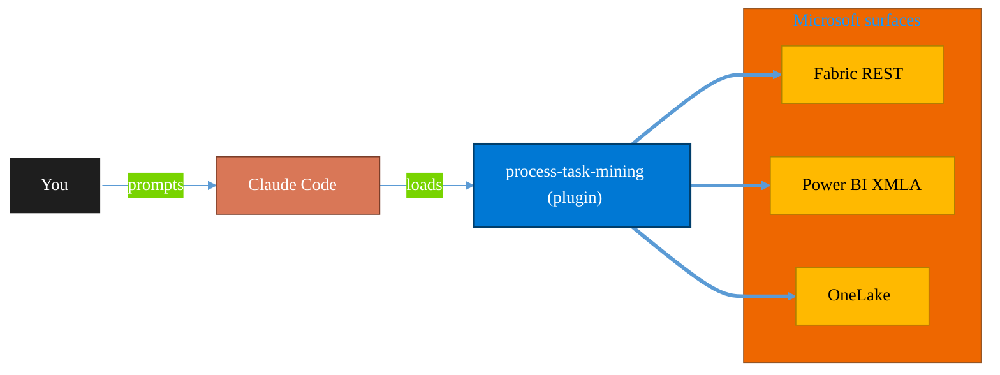

<!-- claude-m:premium-header:start -->
<div align="center">

<a id="top"></a>

# process-task-mining

### Process and task mining from M365, Power Automate, and Azure Monitor logs — extract event logs, discover process models, analyze performance, and check conformance

<sub>Build, mirror, and govern analytics estates on Fabric.</sub>

<br />

<table align="center">
<tr>
<td align="center"><b>Category</b><br /><code>Analytics</code></td>
<td align="center"><b>Surfaces</b><br /><sub>Microsoft Fabric · Power BI · OneLake · DAX · KQL</sub></td>
<td align="center"><b>Version</b><br /><code>1.0.0</code></td>
<td align="center"><b>Marketplace</b><br /><code>claude-m-microsoft-marketplace</code></td>
</tr>
</table>

<sub><code>microsoft</code> &nbsp;·&nbsp; <code>process-mining</code> &nbsp;·&nbsp; <code>task-mining</code> &nbsp;·&nbsp; <code>power-automate</code> &nbsp;·&nbsp; <code>azure-monitor</code> &nbsp;·&nbsp; <code>m365</code></sub>

<a href="#install"><b>Install</b></a> &nbsp;·&nbsp;
<a href="#overview"><b>Overview</b></a> &nbsp;·&nbsp;
<a href="#architecture"><b>Architecture</b></a> &nbsp;·&nbsp;
<a href="#related-plugins"><b>Related plugins</b></a> &nbsp;·&nbsp;
<a href="../README.md"><b>Marketplace</b></a>

</div>

---

> [!TIP]
> **One-line install** — `/plugin install process-task-mining@claude-m-microsoft-marketplace`


## Overview

> Process and task mining from M365, Power Automate, and Azure Monitor logs — extract event logs, discover process models, analyze performance, and check conformance

<details>
<summary><b>What ships in this plugin</b> (commands, agents, skills)</summary>

| Component | Items |
|---|---|
| **Commands** | `/conformance-check` · `/log-extract` · `/mining-setup` · `/performance-analyze` · `/process-discover` · `/resource-analyze` |
| **Agents** | `process-mining-reviewer` |
| **Skills** | `process-task-mining` |

</details>


<details>
<summary><b>Quick example</b></summary>

```text
Use process-task-mining to design, build, and govern Fabric / Power BI assets.
```

</details>

<a id="architecture"></a>

## Architecture



<a id="install"></a>

## Install

```bash
/plugin marketplace add markus41/Claude-m
/plugin install process-task-mining@claude-m-microsoft-marketplace
```

> [!IMPORTANT]
> This plugin operates against **Microsoft Fabric · Power BI · OneLake · DAX · KQL**. Configure credentials via environment variables — never commit secrets.

[Back to top](#top)

---

<!-- claude-m:premium-header:end -->

Process and task mining from Microsoft log sources — extract event logs, discover process models, analyze performance, check conformance, and audit workload distribution.

## What this plugin does

Analyzes **what work is actually being done** inside Microsoft systems by reconstructing real business process execution paths from existing log data. No additional instrumentation needed — uses log data that already exists in:

- **Power Automate** — cloud flow run history (flow-level or action-level)
- **M365 Unified Audit Log** — SharePoint, Teams, Exchange, Entra ID, Power Platform events
- **Azure Monitor / Log Analytics** — ARM operations, Entra audit, custom app logs via KQL
- **Dataverse Audit Log** — entity create/update/delete/access events

## Commands

| Command | Purpose |
|---|---|
| `/mining-setup` | Interactive wizard — capture sources, auth, time window; produce `mining-context.json` |
| `/log-extract` | Pull events from one or more sources → unified event log CSV |
| `/process-discover` | Event log CSV → Directly-Follows Graph (Mermaid) + process variants table |
| `/performance-analyze` | Throughput time, waiting time, bottleneck table, rework detection |
| `/conformance-check` | Actual log vs. reference process → fitness score + deviation report |
| `/resource-analyze` | Workload per user, handover network, per-user conformance, authorization audit |

## Typical workflow

```bash
# 1. Set up the mining context
/mining-setup --sources pa,m365

# 2. Extract event logs
/log-extract --context mining-context.json --output event-log.csv

# 3. Discover what process actually runs
/process-discover event-log.csv

# 4. Measure performance and find bottlenecks
/performance-analyze event-log.csv

# 5. Compare against intended process
/conformance-check event-log.csv --reference reference-process.txt

# 6. Analyze people and workload
/resource-analyze event-log.csv --handover-network
```

## Event log format

The unified event log CSV is a superset of Microsoft's official **PA Process Mining** ingestion format and can be directly imported into the Power Automate Process Mining UI for native visualization:

| Field | Required | Description |
|---|---|---|
| `caseId` | Yes | Process instance ID |
| `activityName` | Yes | Step name |
| `timestamp` | Yes | ISO 8601 UTC |
| `resource` | Yes | User UPN or service |
| `lifecycle` | Yes | `start` or `complete` |
| `duration_ms` | No | Duration in milliseconds |
| `sourceSystem` | Yes | `power-automate`, `m365-audit`, `azure-monitor`, `dataverse` |
| `rawEventId` | No | Original event ID |

## Required permissions

| Source | Permission |
|---|---|
| Power Automate | `Flow.Read.All` (Power Platform API) |
| M365 Unified Audit Log | `AuditLog.Read.All` (Graph Beta) |
| Azure Monitor | `Reader` + `Log Analytics Reader` (Azure RBAC) |
| Dataverse | `System Administrator` or Audit Log Reader |

## Key constraints

- M365 UAL retention: **180 days** (standard) / **1 year** (E5) / **10 years** (add-on)
- Graph Audit API: maximum **10 concurrent** query jobs; results available for **30 days**
- PA Task Mining (desktop recordings) has **no programmatic API** — this plugin uses log-based approximation

## Official documentation

- [PA Process Mining](https://learn.microsoft.com/en-us/power-automate/process-mining-overview)
- [PA Process Mining data format](https://learn.microsoft.com/en-us/power-automate/process-mining-processes-and-data)
- [M365 Unified Audit Log](https://learn.microsoft.com/en-us/purview/audit-solutions-overview)
- [Graph Audit Log Query API](https://learn.microsoft.com/en-us/graph/api/security-auditcoreroot-list-auditlogqueries)
- [Office 365 Management Activity API](https://learn.microsoft.com/en-us/office/office-365-management-api/office-365-management-activity-api-reference)
- [Dataverse Auditing](https://learn.microsoft.com/en-us/power-platform/admin/manage-dataverse-auditing)
<!-- claude-m:premium-footer:start -->

---

<a id="related-plugins"></a>

## Related plugins

<table>
<tr><th>Plugin</th><th>What it does</th></tr>
<tr><td><a href="../fabric-ai-agents/README.md"><code>fabric-ai-agents</code></a></td><td>Microsoft Fabric AI and operations agents - anomaly detector, data agent, operations agent, ontology, and digital twin builder workflows with preview guardrails.</td></tr>
<tr><td><a href="../fabric-capacity-ops/README.md"><code>fabric-capacity-ops</code></a></td><td>Microsoft Fabric Capacity Operations — CU monitoring, throttling diagnostics, workload tuning, autoscale planning, and cost-performance optimization</td></tr>
<tr><td><a href="../fabric-data-activator/README.md"><code>fabric-data-activator</code></a></td><td>Microsoft Fabric Data Activator — Reflex triggers, condition-based alerts, real-time actions, and event-driven automation on Fabric data</td></tr>
<tr><td><a href="../fabric-data-engineering/README.md"><code>fabric-data-engineering</code></a></td><td>Microsoft Fabric Data Engineering — lakehouses, Spark notebooks, data pipelines, Delta Lake tables, lakehouse SQL endpoints, multi-notebook orchestration, workspace lifecycle management, pipeline monitoring, and advanced optimization</td></tr>
<tr><td><a href="../fabric-data-factory/README.md"><code>fabric-data-factory</code></a></td><td>Microsoft Fabric Data Factory — data pipelines, Dataflow Gen2, Copy activity, orchestration patterns, and scheduling</td></tr>
<tr><td><a href="../fabric-data-prep-jobs/README.md"><code>fabric-data-prep-jobs</code></a></td><td>Microsoft Fabric data preparation jobs - Dataflow Gen1, Apache Airflow jobs, mounted Azure Data Factory pipelines, and dbt job governance for deterministic prep workflows.</td></tr>
</table>


<details>
<summary><b>Composable stacks that include <code>process-task-mining</code></b></summary>

Combine with sibling plugins to build cross-surface runbooks. Browse the full [marketplace catalog](../README.md#plugin-catalog) for a tailored selection.

</details>

---

<div align="center">

<sub>Part of <a href="../README.md"><b>Claude-m</b></a> — the Microsoft plugin marketplace for Claude Code.</sub>

<sub>Licensed under <a href="../LICENSE">MIT</a>. Built for engineers, MSPs, SOC teams, and analytics leaders.</sub>

</div>

<!-- claude-m:premium-footer:end -->

