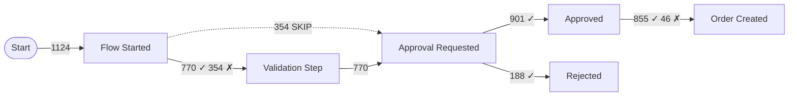

# Conformance Check

Compare an actual event log against an intended reference process and report fitness score, per-case deviations, and per-activity deviation rates.

## Step 1 — Load Event Log and Reference Process

**Load event log:** Read the CSV file. Validate required columns: `caseId`, `activityName`, `timestamp`.

**Load reference process:** Read the `--reference` file. Supported formats:

### Format 1: Simple sequence (`.txt`)
```
START
Flow Started
Validation Step
Approval Requested
{Approved | Rejected}
Order Created
END
```
Syntax: `{A | B}` = choice (either A or B allowed); `[A]` = optional activity; `A+` = one or more; `*` = any activity allowed at this position.

### Format 2: JSON process spec (`.json`)
```json
{
  "name": "Order Approval Process",
  "activities": ["Flow Started", "Validation Step", "Approval Requested", "Approved", "Rejected", "Order Created"],
  "required": ["Flow Started", "Approval Requested"],
  "optional": ["Validation Step"],
  "choices": [{"activities": ["Approved", "Rejected"], "minOccurrences": 1, "maxOccurrences": 1}],
  "sequence": [
    "Flow Started",
    "Validation Step?",
    "Approval Requested",
    "Approved|Rejected",
    "Order Created?"
  ],
  "maxRepetitions": {"default": 1, "overrides": {}}
}
```

### Format 3: Markdown process description (`.md`)
Claude interprets a natural-language or semi-structured process description and extracts the implied sequence and rules.

## Step 2 — Apply Tolerance Mode

**Strict mode** (`--tolerance strict`): Any activity not in the reference spec is a deviation; exact sequence order required.

**Lenient mode** (`--tolerance lenient`, default): Activities not in the reference are flagged but not counted as violations; out-of-order activities are flagged only when a required predecessor is missing.

## Step 3 — Token-Based Replay per Case

For each case, replay the actual activity sequence against the reference process:

1. Initialize tokens at START
2. For each activity in the case's sorted sequence:
   - If activity matches the next expected step(s): consume token, advance
   - If activity is a choice: verify it belongs to the allowed choice set
   - If activity is optional in the reference: skip gracefully
   - If activity is unexpected: record **extra activity deviation**
3. At END of case, check for **missing required activities** not encountered
4. Check **wrong order**: activity occurred before its required predecessor
5. Check **repeated activity**: activity occurred more than `maxRepetitions` times

**Deviation types:**

| Type | Description | Strict | Lenient |
|---|---|---|---|
| Missing required activity | Expected step never occurred | Violation | Violation |
| Extra activity | Unexpected activity not in reference | Violation | Warning |
| Wrong order | Activity before required predecessor | Violation | Violation |
| Repeated activity | Activity beyond max allowed occurrences | Violation | Warning |

## Step 4 — Conformance Metrics

Calculate:
- **Fitness** = cases with zero violations / total cases (0.0–1.0)
- **Fitness (lenient)** = cases with zero violations (excluding warnings) / total cases
- **Per-activity deviation rate** = % of cases where this activity caused a deviation
- **Mean deviations per case** = total deviations / total cases

## Step 5 — Deviation Report

**Case-level deviations (sample — top 20 most deviated cases):**

```markdown
| Case ID | Deviations | Deviation Details |
|---|---|---|
| case-001 | 2 | Missing: "Validation Step"; Extra: "Manual Override" |
| case-002 | 1 | Wrong order: "Order Created" before "Approved" |
| case-003 | 3 | Repeated: "Approval Requested" ×3; Missing: "Order Created" |
```

**Per-activity deviation summary:**

```markdown
| Activity | Deviation Rate | Type | Cases Affected |
|---|---|---|---|
| Validation Step | 31.4% | Missing | 354 |
| Manual Override | 8.2% | Extra (unexpected) | 92 |
| Order Created | 4.1% | Wrong order | 46 |
| Approval Requested | 2.0% | Repeated | 23 |
```

**Deviation distribution (Mermaid):**


## Step 6 — Produce Report

```markdown
## Executive Summary
- Conformance fitness: [N]% of cases follow the reference process exactly
- [N] cases have at least one deviation — most common: [deviation type]
- Most problematic activity: [activity] — deviates in [N]% of cases
- [N]% of cases skip the [required step] — this may indicate a process compliance gap
- Recommendation: [top action based on findings]

## Key Metrics
| Metric | Value |
|---|---|
| Total Cases Analyzed | N |
| Fitness (strict) | N% |
| Fitness (lenient) | N% |
| Cases with Deviations | N (N%) |
| Total Deviations Found | N |
| Mean Deviations per Case | N |
| Tolerance Mode | strict / lenient |

## Reference Process
[Echo the interpreted reference process sequence]

## Deviation Summary
[Per-activity deviation table]

## Conformance Diagram
[Mermaid DFG with conformance overlay — ✓ compliant transitions, ✗ deviated]

## Sample Deviated Cases
[Top 20 deviated cases table]

## Findings
### Finding 1: [Most Significant Deviation]
**Evidence**: [Activity] missing in [N]% of cases
**Impact**: [Business impact — e.g., "Orders shipped without approval in N cases"]
**Recommendation**: [Specific action — e.g., "Add validation gate; configure flow to require approval before Order Created"]

## Action Items
| Priority | Action | Owner | Effort |
|---|---|---|---|
| High | Enforce [missing required activity] via flow validation | Process Owner | Medium |
| Medium | Investigate [extra activity] occurrences for legitimate exceptions | Process Analyst | Low |

## Data Quality Notes
[Any caveats about the reference spec interpretation, excluded cases]

## Next Steps
Run: /resource-analyze <event-log-file> --per-user-conformance --reference <spec> to identify which users show the highest deviation rates
```
