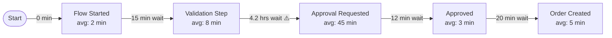

# Performance Analyze

Measure throughput time, waiting time, bottlenecks, and rework from a unified event log CSV. Produces a structured performance report.

## Step 1 — Load and Validate

Read the input CSV. Validate presence of: `caseId`, `activityName`, `timestamp`.

Infer `--time-unit` automatically if not specified:
- Mean case duration < 2 hours → minutes
- Mean case duration < 7 days → hours
- Otherwise → days

## Step 2 — Case-Level Throughput Time

For each case:
- **Start time** = earliest `timestamp`
- **End time** = latest `timestamp`
- **Throughput time** = end − start (in selected time unit)

Exclude cases with only a single event (no meaningful throughput time).

Calculate statistics across all cases:
- Mean, median, P10, P90, P95, max throughput time
- Standard deviation
- Cases exceeding P90 → flag as "slow cases"

**Throughput time distribution:** Group cases into buckets (e.g., < P25, P25–P50, P50–P75, P75–P90, > P90) and report count per bucket.

## Step 3 — Activity-Level Processing Time

When `lifecycle` column is present and contains both `start` and `complete` events for the same activity in the same case:
- **Processing time** = complete.timestamp − start.timestamp

When only point-in-time events exist (no lifecycle differentiation):
- Processing time = 0; note this in Data Quality Notes

For each activity, report:
- Mean processing time, P90 processing time
- % of total throughput time attributed to this activity

## Step 4 — Waiting Time Between Activities

For each consecutive activity pair (A → B) within a case:
- **Waiting time** = B.start.timestamp − A.complete.timestamp
  - If lifecycle not available: B.timestamp − A.timestamp

For each transition, calculate mean and P90 waiting time. Flag transitions where:
- P90 waiting time > `--bottleneck-threshold-p90` (default: twice the median waiting time across all transitions)
- Mean waiting time > overall mean case throughput × 0.3 (transition consumes >30% of case time)

## Step 5 — Bottleneck Table

Rank activities/transitions by P90 waiting time descending:

```markdown
| Rank | Activity (Before Handover) | Avg Wait | P90 Wait | % Cases | Bottleneck? |
|---|---|---|---|---|---|
| 1 | Approval Requested → Approved | 4.2 hrs | 18.3 hrs | 80.2% | YES ⚠️ |
| 2 | Order Created → Shipped | 1.1 hrs | 3.4 hrs | 79.1% | YES ⚠️ |
| 3 | Flow Started → Validation | 0.2 hrs | 0.5 hrs | 100% | No |
```

## Step 6 — Rework Detection (if --rework-detection enabled or always)

For each case, identify activities that appear more than once in the event sequence. These are **rework loops**.

Report:
- Total rework instances (activity repetitions)
- % of cases containing rework
- Most repeated activities: activity name → count of repetitions → % of its total occurrences that are rework
- Estimate rework cost: average additional throughput time added to rework cases vs. non-rework cases

```markdown
| Activity | Rework Cases | Avg Extra Time | Total Repetitions |
|---|---|---|---|
| Validation Step | 87 (7.7%) | +2.3 hrs | 124 |
| Approval Requested | 23 (2.0%) | +6.1 hrs | 28 |
```

## Step 7 — Performance Heatmap (DFG with Performance Overlay)

Produce a Mermaid DFG where edge labels show **mean waiting time** instead of frequency, and node labels include mean processing time:



Flag ⚠️ on transitions where P90 wait > bottleneck threshold.

## Step 8 — Produce Report

```markdown
## Executive Summary
- Mean end-to-end throughput time: [X hrs/days]
- P90 throughput time: [X] — cases above this threshold should be investigated
- [N] bottleneck transitions identified where waiting time exceeds 2× median
- Rework detected in [N]% of cases — primary rework point: [activity]
- Top 10% of cases (by duration) account for [N]% of total process time

## Key Metrics
| Metric | Value |
|---|---|
| Total Cases | N |
| Mean Throughput Time | X hrs |
| Median Throughput Time | X hrs |
| P90 Throughput Time | X hrs |
| Max Throughput Time | X hrs |
| Rework Rate | N% |
| Cases with Bottleneck Impact | N% |

## Throughput Time Distribution
| Bucket | Cases | % |
|---|---|---|
| < P25 (fast) | N | % |
| P25–P75 (normal) | N | % |
| P75–P90 (slow) | N | % |
| > P90 (very slow) | N | % |

## Bottleneck Analysis
[Bottleneck table]

## Rework Analysis
[Rework table]

## Performance Heatmap
[Mermaid DFG with performance overlay]

## Findings
### Finding 1: [Bottleneck Title]
**Evidence**: P90 waiting time before [activity] = X hrs; affects N% of cases
**Impact**: Cases experiencing this delay average [X] hrs longer end-to-end
**Recommendation**: Investigate [activity] queue; consider SLA alert if wait > X hrs

### Finding 2: [Rework Title]
**Evidence**: [Activity] repeats in N cases; adds avg X hrs per rework instance
**Impact**: N × X = total estimated wasted hours per analysis period
**Recommendation**: Root-cause rework triggers; add validation gate before first occurrence

## Action Items
| Priority | Action | Owner | Effort |
|---|---|---|---|
| High | Set SLA alert on [bottleneck activity] | Process Owner | Low |
| High | Investigate rework loop at [activity] | Process Analyst | Medium |
| Medium | Automate [activity] to reduce processing time | IT / Developer | High |

## Data Quality Notes
[Caveats about missing lifecycle events, excluded cases, time zone assumptions]

## Next Steps
Run: /conformance-check <event-log-file> --reference <process-spec> to compare actual vs. intended process
```
