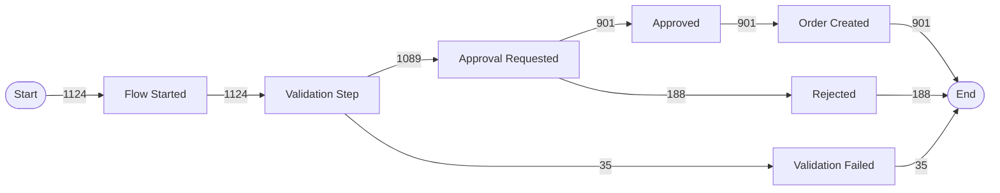

# Process Discover

Construct a Directly-Follows Graph (DFG) and process variants table from a unified event log CSV. Outputs a structured report with Mermaid diagram and variant ranking.

## Step 1 — Load and Validate Event Log

Read the input CSV file. Validate:
- Required columns present: `caseId`, `activityName`, `timestamp`
- `timestamp` column parses as valid ISO 8601 dates
- No completely empty `caseId` values (warn if placeholder `UNKNOWN-*` rows exceed 5%)
- Minimum viable dataset: ≥ 10 cases and ≥ 3 distinct activity names

Report basic statistics:
- Total events
- Total unique cases
- Total unique activity names (list them)
- Time range: earliest to latest timestamp
- Sources present (from `sourceSystem` column if available)

## Step 2 — Sort Events within Cases

For each case, sort all events by `timestamp` ascending. When two events have the same timestamp:
- If both `lifecycle` values present: `start` before `complete`
- Otherwise: sort by `activityName` alphabetically (deterministic)

## Step 3 — Construct Directly-Follows Graph

For each case, iterate through the sorted activity sequence and record:
- `START → first_activity`
- `activity[i] → activity[i+1]` for all consecutive pairs
- `last_activity → END`

Count frequency of each edge. Calculate:
- **Absolute count** — number of times this transition occurred
- **Relative frequency** — count / total transitions from source node

Identify the **happy path**: the sequence of edges forming the path from START to END with the highest total frequency. Mark these edges distinctly.

## Step 4 — Generate Mermaid DFG

Produce a Mermaid `flowchart LR` diagram:
- Nodes: activities (use box `[Name]`), START `([Start])`, END `([End])`
- Edges: labeled with absolute count
- Show top edges by frequency; if more than 15 distinct activities, prune edges with count < `--min-frequency` (default: 1% of total cases)
- Happy path edges use `-->` notation; low-frequency paths can use `-.->` (dotted) if supported

Example output:


## Step 5 — Process Variants Table

Group cases by their unique activity sequence (join with ` → `). Rank by frequency descending.

For each variant, calculate:
- **Count** — number of cases with this sequence
- **% Cases** — count / total cases
- **Cumulative %** — running total
- **Mean throughput time** — average (last_timestamp − first_timestamp) for cases in this variant

Apply `--top-variants` filter (default: 10). Flag the first variant(s) covering >80% of cases as "Happy Path".

```markdown
| Rank | Variant | Cases | % Cases | Cumul. % | Mean Time | Label |
|---|---|---|---|---|---|---|
| 1 | Flow Started → Approval → Approved → Order Created | 901 | 80.2% | 80.2% | 2.3 hrs | Happy Path |
| 2 | Flow Started → Approval → Rejected | 188 | 16.7% | 96.9% | 1.1 hrs | |
| 3 | Flow Started → Validation Failed | 35 | 3.1% | 100% | 0.3 hrs | Exceptional |
```

Flag variants with count = 1 as potential data quality issues.

## Step 6 — Produce Report

Output the full structured report:

```markdown
## Executive Summary
- [N] distinct process variants found across [N] cases
- The happy path ([top variant]) covers [N]% of cases and has a mean throughput time of [X]
- [N] exceptional variants (<1% frequency) may indicate data quality issues or edge-case handling
- Top bottleneck candidate: [activity with most fan-in divergence]
- [Notable finding: e.g., "23% of cases skip Validation Step entirely"]

## Key Metrics
| Metric | Value |
|---|---|
| Total Cases | N |
| Total Events | N |
| Distinct Activities | N |
| Distinct Variants | N |
| Date Range | YYYY-MM-DD to YYYY-MM-DD |
| Sources | power-automate, m365-audit |

## Process Model (Directly-Follows Graph)
[Mermaid diagram]

## Process Variants
[Variant table]

## Activity Frequency Table
| Activity | Occurrences | Cases (%) | Avg Duration |
|---|---|---|---|
| Flow Started | 1,124 | 100% | — |
| Approval Requested | 1,124 | 100% | 45 min |
| Approved | 901 | 80.2% | 12 min |
...

## Data Quality Notes
- N events with null/unknown caseId excluded
- N cases with single event (no transitions) — excluded from variant analysis
- Timestamp gaps > 7 days in N cases — may indicate paused/suspended processes

## Next Steps
Run: /performance-analyze <event-log-file> to identify throughput time distribution and bottlenecks
```
