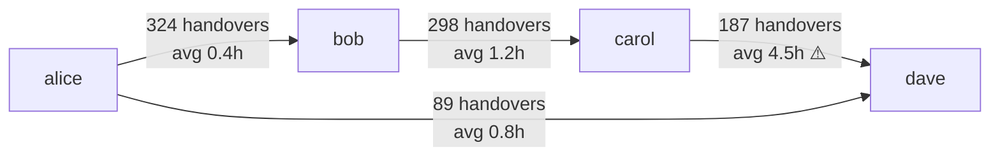

# Resource Analyze

Analyze the people and organizational dimension of a process: who does what, who is overloaded, where handovers cause delays, which users deviate from the intended process, and whether unauthorized users performed sensitive steps.

## Step 1 — Load and Validate

Read the event log CSV. Validate required columns: `caseId`, `activityName`, `timestamp`, `resource`.

If `resource` column has more than 20% null/unknown values, warn that resource analysis results will be incomplete and may be skewed toward the remaining identifiable users.

Resolve `--top-users` (default: 20) — limits output tables to top N users by activity count.

## Step 2 — Workload Distribution

For each unique `resource` value:
1. Count total activities performed
2. Calculate percentage of total activities
3. Calculate mean throughput time for cases they participated in (first to last event in a case they appear in)
4. Calculate mean number of activities per case (their "depth" of involvement)

**Overload detection:** Calculate mean and standard deviation of per-user activity counts across all users. Flag users whose count > mean + 2σ as **OVERLOADED**. Flag users < mean − 2σ as **Underutilized**.

```markdown
| Rank | User | Activities | % Total | Mean Case Time | Status |
|---|---|---|---|---|---|
| 1 | alice@contoso.com | 456 | 40.6% | 2.1 hrs | OVERLOADED ⚠️ |
| 2 | bob@contoso.com | 312 | 27.7% | 1.8 hrs | Normal |
| 3 | carol@contoso.com | 289 | 25.7% | 1.9 hrs | Normal |
| 4 | dave@contoso.com | 67 | 6.0% | 3.2 hrs | Underutilized |
```

Also produce an **activity-by-user matrix**: rows = top activities, columns = top users, cells = count. Useful for identifying single points of failure (one user dominates an activity).

## Step 3 — Handover Network (if --handover-network or by default)

For each consecutive activity pair (A → B) within a case where `resource(A) ≠ resource(B)`, record handover `(userA → userB)`.

Calculate per handover pair:
- **Frequency** — how many times this handover occurs
- **Mean handover delay** — time from A's timestamp to B's timestamp
- **P90 handover delay** — 90th percentile delay

Flag pairs where mean delay > P75 of all handover delays as **handover bottlenecks**.

**Mermaid handover network:**


**Handover table:**
```markdown
| From | To | Handovers | Avg Delay | P90 Delay | Bottleneck? |
|---|---|---|---|---|---|
| carol@contoso.com | dave@contoso.com | 187 | 4.5 hrs | 12.3 hrs | YES ⚠️ |
| alice@contoso.com | bob@contoso.com | 324 | 0.4 hrs | 0.9 hrs | No |
```

## Step 4 — Per-User Conformance (if --per-user-conformance and --reference provided)

Load the reference process spec. For each user, identify all cases they participated in, then apply the conformance check logic (from `/conformance-check` SKILL.md §3) to those cases only.

Report per user:
- Cases participated in
- Conformant cases (zero violations)
- User conformance rate (%)
- Most common deviation type for this user

Rank by deviation rate descending:

```markdown
| User | Cases | Conformant | Conformance Rate | Top Deviation |
|---|---|---|---|---|
| dave@contoso.com | 67 | 41 | 61.2% ⚠️ | Missing: "Validation Step" |
| alice@contoso.com | 456 | 421 | 92.3% | Extra: "Manual Override" |
| bob@contoso.com | 312 | 309 | 99.0% | None |
```

Flag users with conformance rate < 80% as requiring process training or investigation.

## Step 5 — Role / Authorization Check (if --role-check and --expected-roles provided)

Load the expected roles file. Format:
```json
{
  "Approval Requested": ["approver-group@contoso.com", "alice@contoso.com", "bob@contoso.com"],
  "Order Created": ["fulfillment-team@contoso.com"],
  "Manual Override": ["admin@contoso.com"]
}
```

For each activity event in the log, check if the `resource` UPN matches the authorized list. If not, flag as **unauthorized execution**.

```markdown
| Case ID | Activity | Actual User | Authorized Users | Violation |
|---|---|---|---|---|
| case-045 | Approval Requested | carol@contoso.com | alice, bob | YES ⚠️ |
| case-112 | Order Created | dave@contoso.com | fulfillment-team | YES ⚠️ |
```

**Authorization summary:**
- Total unauthorized actions: N
- Unique unauthorized users: N
- Most violated activity: [activity] — N unauthorized executions
- Risk level: High (if unauthorized actions on sensitive activities), Medium, or Low

## Step 6 — Produce Report

```markdown
## Executive Summary
- [N] unique users active in the analyzed process period
- [N] users are OVERLOADED (>2σ above mean workload) — primary: [user]
- [N] handover bottlenecks identified — slowest: [pair] with avg [X] hrs delay
- Per-user conformance: [user] shows lowest conformance at [N]% — top deviation: [type]
- [N] unauthorized activity executions detected across [N] cases

## Key Metrics
| Metric | Value |
|---|---|
| Total Users Active | N |
| Overloaded Users | N |
| Underutilized Users | N |
| Total Handovers | N |
| Handover Bottlenecks | N |
| Avg Conformance Rate | N% |
| Unauthorized Actions | N |

## Workload Distribution
[Workload table]

## Activity-by-User Matrix
[Matrix — top 10 activities × top 10 users]

## Handover Network
[Mermaid diagram]

[Handover table with bottlenecks flagged]

## Per-User Conformance
[Per-user conformance table — if --per-user-conformance]

## Authorization Violations
[Violation table — if --role-check]

[Authorization summary]

## Findings
### Finding 1: Workload Imbalance
**Evidence**: [user] handles [N]% of all activities; next user handles [N]%
**Impact**: Single point of failure risk; [user] throughput time [X]% higher than team average
**Recommendation**: Redistribute [activity type] tasks; consider queue-based assignment

### Finding 2: Handover Bottleneck
**Evidence**: [userA → userB] handovers avg [X] hrs; P90 = [X] hrs
**Impact**: [N] cases delayed by > [X] hrs waiting for [userB]
**Recommendation**: Investigate [userB] queue depth; set handover SLA alert at [X] hrs

### Finding 3: Authorization Gap (if applicable)
**Evidence**: [N] unauthorized executions of [activity] by users not in approved list
**Impact**: Compliance risk — SOX/audit finding if [activity] is a controlled step
**Recommendation**: Add authorization check in flow; review security role assignments

## Action Items
| Priority | Action | Owner | Effort |
|---|---|---|---|
| High | Rebalance [activity] workload away from [overloaded user] | Team Lead | Medium |
| High | Set SLA alert on [handover bottleneck] pair | Process Owner | Low |
| High | Restrict [activity] to authorized users via flow condition | IT / Developer | Low |
| Medium | Schedule process training for [low-conformance users] | HR / Process Owner | Low |

## Data Quality Notes
[Resource anonymization status; % of events with null resource; limitations]

## Next Steps
Use findings to update the reference process spec and re-run /conformance-check with the revised spec, or escalate authorization findings to the security team.
```
