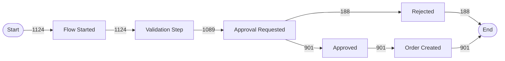
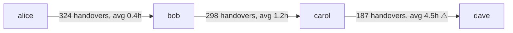

# Process and Task Mining — Microsoft Log Sources

This skill provides end-to-end knowledge for extracting event logs from Microsoft systems, constructing process models, analyzing performance, checking conformance, and producing structured reports for process improvement.

## 1. Integration Context Contract

### Required Permissions per Source

| Source | Permission Required | Scope |
|---|---|---|
| Power Automate | `Flow.Read.All` | Power Platform API |
| M365 Unified Audit Log | `AuditLog.Read.All` | Microsoft Graph Beta |
| Azure Monitor / Log Analytics | `Reader` + `Log Analytics Reader` | Azure RBAC |
| Dataverse Audit Log | `System Administrator` or Audit Log Reader | Dataverse environment |
| Power Platform Activity Logs | `AuditLog.Read.All` | Office 365 Management Activity API |

### Licensing Requirements

| Tenant License | UAL Retention | Notes |
|---|---|---|
| Standard (E3/Business) | 180 days | Default for most tenants |
| E5 / E5 Compliance | 1 year (365 days) | Included with E5 |
| 10-Year Audit Add-on | 10 years | Requires explicit add-on license |

**Always check tenant license during setup** — running a query against logs older than the retention window silently returns zero results.

### Concurrent Query Limits (Graph Audit Log API)

- Maximum **10 concurrent** audit query jobs per admin
- Maximum **1 unfiltered** query at a time
- Query results remain available for **30 days** after job completion
- Always use async pattern: POST query → poll status → GET results

---

## 2. Base URLs

```
Power Platform API:   https://api.powerplatform.com/powerautomate/environments/{envId}
M365 Audit (Graph):   https://graph.microsoft.com/beta/security/auditLog/queries
O365 Mgmt API:        https://manage.office.com/api/v1.0/{tenantId}/activity/feed/subscriptions
Power Platform Logs:  https://manage.office.com/api/v1.0/{tenantId}/activity/feed/audit/PowerPlatformAdminActivity
Dataverse:            https://{org}.{region}.dynamics.com/api/data/v9.2/audits
Azure Monitor CLI:    az monitor log-analytics query --workspace {id} --analytics-query "..."
```

---

## 3. API Endpoints

### 3.1 Power Automate — Flow Runs

**List runs for a specific flow:**
```http
GET https://api.powerplatform.com/powerautomate/environments/{envId}/flowRuns
  ?workflowId={flowId}
  &api-version=2022-03-01-preview
  &$filter=startTime ge {ISO8601} and startTime le {ISO8601}
  &$top=1000
```

**Response fields used for event log:**

| Response Field | Maps To |
|---|---|
| `name` | `rawEventId` |
| `startTime` | `timestamp` (lifecycle: start) |
| `endTime` | `timestamp` (lifecycle: complete) |
| `status` | activity enrichment |
| `trigger.name` | `activityName` prefix |
| `correlation.clientTrackingId` | `caseId` candidate |

**CaseId strategy for Power Automate:** Use `correlation.clientTrackingId` if set; otherwise use the flow run `name` (GUID). For flows triggered by SharePoint/Dataverse items, extract the item ID from the trigger output and use it as `caseId` to correlate multiple flow runs on the same business object.

**Activity name mapping (flow-level granularity):**

| Flow Status | ActivityName |
|---|---|
| Running (trigger fired) | `Flow Started` |
| Succeeded | `Flow Completed` |
| Failed | `Flow Failed` |
| TimedOut | `Flow Timed Out` |
| Cancelled | `Flow Cancelled` |

For **action-level granularity**, retrieve individual action run details:
```http
GET https://api.powerplatform.com/powerautomate/environments/{envId}/flowRuns/{runId}/actions
  ?api-version=2022-03-01-preview
```

### 3.2 M365 Unified Audit Log — Graph Beta (Async Pattern)

**Step 1 — Create query job:**
```http
POST https://graph.microsoft.com/beta/security/auditLog/queries
Content-Type: application/json

{
  "displayName": "process-mining-{timestamp}",
  "filterStartDateTime": "2026-02-01T00:00:00Z",
  "filterEndDateTime": "2026-03-01T00:00:00Z",
  "recordTypeFilters": ["SharePoint", "SharePointFileOperation", "MicrosoftTeams"],
  "operationFilters": ["FileAccessed", "FileModified", "FileUploaded", "FileDeleted"]
}
```

**Supported recordTypeFilters (process mining relevant):**

| Filter Value | Content |
|---|---|
| `SharePoint` | SharePoint admin and site operations |
| `SharePointFileOperation` | File create/read/update/delete |
| `MicrosoftTeams` | Teams messages, meetings, membership |
| `Exchange` | Email send/receive, calendar |
| `PowerPlatformAdminActivity` | Environment, connector, DLP changes |
| `PowerAutomateActivity` | Flow creation, edits, run starts |
| `EntraAudit` | User/group/app changes |

**Step 2 — Poll until succeeded:**
```http
GET https://graph.microsoft.com/beta/security/auditLog/queries/{queryId}
```
Poll every 10–30 seconds until `status` = `succeeded`.

**Step 3 — Retrieve results (paginated):**
```http
GET https://graph.microsoft.com/beta/security/auditLog/queries/{queryId}/records
  ?$top=1000
  &$skiptoken={token}
```

**Key response fields:**

| Field | Description |
|---|---|
| `id` | Record GUID → `rawEventId` |
| `createdDateTime` | UTC timestamp → `timestamp` |
| `userPrincipalName` | Actor UPN → `resource` |
| `operation` | Action performed → `activityName` |
| `objectId` | Affected object → `caseId` candidate |
| `clientIP` | Source IP |
| `workload` | Service (SharePoint, Teams, etc.) |
| `auditData` | JSON blob with operation-specific details |

### 3.3 Office 365 Management Activity API (Power Platform Logs)

Power Platform activity (flow runs, connector usage, DLP events) is surfaced through the **Office 365 Management Activity API**, not a dedicated PA API.

**List available subscriptions:**
```bash
curl -H "Authorization: Bearer {token}" \
  "https://manage.office.com/api/v1.0/{tenantId}/activity/feed/subscriptions/list"
```

**Start subscription (one-time per content type):**
```bash
curl -X POST -H "Authorization: Bearer {token}" \
  "https://manage.office.com/api/v1.0/{tenantId}/activity/feed/subscriptions/start?contentType=Audit.General"
```

**Fetch available content blobs:**
```bash
curl -H "Authorization: Bearer {token}" \
  "https://manage.office.com/api/v1.0/{tenantId}/activity/feed/audit/Audit.General
   ?startTime=2026-02-01T00:00:00&endTime=2026-03-01T00:00:00"
```

Each blob URL then returns an array of audit records. Filter by `Workload = "PowerAutomate"` or `Workload = "PowerPlatform"`.

### 3.4 Azure Monitor — Log Analytics KQL

```bash
az monitor log-analytics query \
  --workspace {workspaceId} \
  --analytics-query "
    AzureActivity
    | where TimeGenerated between (datetime(2026-02-01) .. datetime(2026-03-01))
    | where ResourceGroup == '{rg}'
    | project TimeGenerated, Caller, OperationNameValue, ResourceId, ResultType, CorrelationId
    | order by TimeGenerated asc
  " \
  --output json
```

**Common KQL tables for process mining:**

| Table | Content |
|---|---|
| `AzureActivity` | ARM operations — resource create/update/delete |
| `AuditLogs` | Entra ID user/group/app changes |
| `SigninLogs` | Authentication events |
| `PowerPlatformConnectorActivity` | Power Platform connector calls (if LA workspace linked) |
| Custom tables | Application-specific event tables |

**CaseId strategy for Azure Monitor:** Use `CorrelationId` for ARM operations; use a business-key dimension (resource ID segment, ticket ID extracted from tags) where available.

### 3.5 Dataverse Audit Log

```http
GET https://{org}.{region}.dynamics.com/api/data/v9.2/audits
  ?$filter=createdon ge {ISO8601} and createdon le {ISO8601}
  &$select=auditid,createdon,operation,objecttypecode,_userid_value,attributemask
  &$expand=regardingobjectid_systemuser($select=fullname,internalemailaddress)
  &$orderby=createdon asc
  &$top=5000
```

**Dataverse operation codes:**

| Code | Operation |
|---|---|
| 1 | Create |
| 2 | Update |
| 3 | Delete |
| 4 | Access |
| 64 | Assign |
| 65 | Share |

**CaseId strategy for Dataverse:** Use the `_regardingobjectid_value` (the record GUID that was acted on) as `caseId`. This groups all audit events for the same business record into one process instance.

---

## 4. Native PA Process Mining Format

Microsoft's official PA Process Mining ingestion format (CSV import via Power Automate Process Mining in Power Platform):

| Column | Required | Description |
|---|---|---|
| `CaseId` | Required | Process instance identifier |
| `ActivityName` | Required | Name of the process step |
| `StartTimestamp` | Required | ISO 8601 UTC start time |
| `EndTimestamp` | Optional | ISO 8601 UTC end time |
| `Resource` | Optional | Who performed the step (UPN or system) |

**Reference:** https://learn.microsoft.com/en-us/power-automate/process-mining-processes-and-data

The `log-extract` command output is a **superset** of this format — it can be directly imported into PA Process Mining for native visualization.

---

## 5. Unified Event Log Schema

The plugin's canonical schema used between `log-extract` and all analysis commands:

| Field | Required | Description |
|---|---|---|
| `caseId` | Yes | Process instance ID — e.g., flow run ID, SharePoint item ID, Dataverse record GUID |
| `activityName` | Yes | Human-readable step — e.g., "Flow Started", "File Modified", "Approval Requested" |
| `timestamp` | Yes | ISO 8601 UTC — the event time |
| `resource` | Yes | Actor UPN or service principal display name |
| `lifecycle` | Yes | `start` or `complete` |
| `duration_ms` | No | Duration in milliseconds (for complete events where start+end are known) |
| `sourceSystem` | Yes | `power-automate`, `m365-audit`, `azure-monitor`, `dataverse` |
| `rawEventId` | No | Original event ID from source system for traceability |

**CSV column order:** `caseId,activityName,timestamp,resource,lifecycle,duration_ms,sourceSystem,rawEventId`

---

## 6. Source Field Mapping Tables

### Power Automate → Unified Schema

| PA Field | Unified Field | Notes |
|---|---|---|
| `correlation.clientTrackingId` or `name` | `caseId` | Prefer clientTrackingId; fall back to run GUID |
| `"Flow Started"` (derived from status=Running) | `activityName` | |
| `startTime` | `timestamp` | lifecycle=start |
| `endTime` | `timestamp` | lifecycle=complete |
| Flow owner UPN | `resource` | |
| `"power-automate"` | `sourceSystem` | |
| `name` (run GUID) | `rawEventId` | |

For action-level: use `{flowName} - {actionName}` as `activityName`.

### M365 Audit → Unified Schema

| Graph Field | Unified Field | Notes |
|---|---|---|
| `objectId` | `caseId` | File path, item ID, or mailbox; normalize to consistent key |
| `operation` | `activityName` | Map to friendly name where needed |
| `createdDateTime` | `timestamp` | lifecycle=complete (point-in-time events) |
| `userPrincipalName` | `resource` | |
| `"m365-audit"` | `sourceSystem` | |
| `id` | `rawEventId` | |

### Azure Monitor → Unified Schema

| AzureActivity Field | Unified Field | Notes |
|---|---|---|
| `CorrelationId` | `caseId` | Groups related ARM operations |
| `OperationNameValue` | `activityName` | Trim `Microsoft.*/*/` prefix to friendly name |
| `TimeGenerated` | `timestamp` | lifecycle=complete |
| `Caller` | `resource` | UPN or service principal ID |
| `"azure-monitor"` | `sourceSystem` | |
| `_ResourceId` | `rawEventId` | |

### Dataverse → Unified Schema

| Dataverse Field | Unified Field | Notes |
|---|---|---|
| `_regardingobjectid_value` | `caseId` | Record GUID that was acted on |
| `operation` code → friendly name | `activityName` | Map operation code (1=Create, 2=Update, etc.) |
| `createdon` | `timestamp` | lifecycle=complete |
| `_userid_value` UPN | `resource` | |
| `"dataverse"` | `sourceSystem` | |
| `auditid` | `rawEventId` | |

---

## 7. Process Mining Algorithms

### 7.1 Directly-Follows Graph (DFG) Construction

A DFG captures which activity directly follows which other activity, and how often.

**Algorithm:**
1. Sort events by `caseId`, then by `timestamp` within each case
2. For each case, iterate through sorted activities: record pair `(A → B)` where B directly follows A
3. Count frequency of each `(A → B)` pair across all cases
4. Identify START (first activity in each case) and END (last activity in each case)
5. Calculate edge weight = count / total cases = relative frequency

**Output format (Mermaid flowchart LR):**


Edge labels show absolute counts. Add `%` suffix for relative frequency on large diagrams.

### 7.2 Process Variants

A variant is the unique ordered sequence of activities in a case.

**Algorithm:**
1. For each case, concatenate sorted activity names into a sequence string: `"A → B → C → D"`
2. Count cases per unique sequence → variant frequency
3. Rank by frequency descending
4. Calculate cumulative coverage: top-N variants covering X% of all cases

**Variant table output:**

| Rank | Variant (Activity Sequence) | Cases | % Cases | Cumulative % |
|---|---|---|---|---|
| 1 | Flow Started → Approved → Order Created | 901 | 80.2% | 80.2% |
| 2 | Flow Started → Rejected | 188 | 16.7% | 96.9% |
| 3 | Flow Started → Approved → Failed | 35 | 3.1% | 100% |

**Rule of thumb:** Top 3 variants covering >80% of cases defines the "happy path". Variants with frequency=1 are candidates for data quality issues.

### 7.3 Throughput Time

- **Case throughput time** = `max(timestamp)` − `min(timestamp)` for all events in a case
- **Mean throughput time** = average across all cases
- **Median throughput time** = 50th percentile (less sensitive to outliers)
- **P90 throughput time** = 90th percentile — the SLA breach threshold for most orgs

Report in human-readable units: minutes if < 60 min, hours if < 48 hours, days otherwise.

### 7.4 Waiting Time vs Processing Time

When both `start` and `complete` lifecycle events exist for an activity:
- **Processing time** = complete.timestamp − start.timestamp (actual work duration)
- **Waiting time** = next_activity.start.timestamp − current_activity.complete.timestamp

When only point-in-time events exist (M365 audit, Dataverse): set processing time = 0, waiting time = gap between consecutive events in the case.

### 7.5 Bottleneck Detection

1. For each activity, calculate mean and P90 waiting time before that activity starts
2. Activities with P90 waiting time > threshold (default: P90 of all activities × 2) are bottleneck candidates
3. Also flag activities with **rework** — cases where the same activity appears more than once
4. Report: bottleneck activity name, mean wait, P90 wait, % of cases affected, # rework instances

### 7.6 Conformance Checking

**Approach: token-based replay against a reference process**

Reference process is a sequence or graph of allowed activity orderings, provided as a simple spec file:
```
START → [Flow Started] → [Validation Step] → [Approval Requested] → {[Approved] | [Rejected]} → END
```

**Deviations to detect:**
1. **Missing activity** — expected activity not found in case
2. **Extra activity** — unexpected activity found in case
3. **Wrong order** — activity occurs before its required predecessor
4. **Repeated activity** — activity occurs more than allowed

**Conformance metrics:**
- **Fitness** = cases with zero deviations / total cases (0–1)
- **Per-case deviation score** = number of deviations found in that case
- **Per-activity deviation rate** = % of cases where this activity deviates

---

## 8. People / Resource Analysis Algorithms

### 8.1 Workload Distribution

For each unique `resource` (user UPN or service):
1. Count total activities performed
2. Calculate percentage of total activities
3. Calculate mean throughput time for cases they participated in
4. Flag users more than **2σ above mean workload** as overloaded

**Output table:**

| User | Activities | % Total | Mean Case Time | Status |
|---|---|---|---|---|
| alice@contoso.com | 456 | 40.6% | 2.1 hrs | OVERLOADED |
| bob@contoso.com | 312 | 27.7% | 1.8 hrs | Normal |
| carol@contoso.com | 289 | 25.7% | 1.9 hrs | Normal |
| dave@contoso.com | 67 | 6.0% | 3.2 hrs | Underutilized |

### 8.2 Handover Network

A handover occurs when one user performs activity A and a different user performs the immediately following activity B in the same case.

**Algorithm:**
1. For each consecutive activity pair (A → B) in each case:
   - If `resource(A) ≠ resource(B)`, record handover `(resource(A) → resource(B))`
2. Count handover frequency per pair
3. Calculate mean delay between handover events (time from A.complete to B.start)
4. Flag pairs with mean delay > P75 of all handovers as **handover bottlenecks**

**Output (Mermaid):**


### 8.3 Per-User Conformance

Using the same conformance algorithm (§7.6), calculate per user:
- Cases where user participated with zero deviations / total cases with user participation
- Rank users by deviation rate descending

### 8.4 Role / Authorization Check

Given an `--expected-roles` mapping file (JSON: `{activityName: [authorized_upn_or_group]}`):
- For each activity event in the log, check if `resource` is in the authorized list
- Flag events where `resource` is NOT authorized — include: case ID, activity, actual user, expected users
- Summarize: total unauthorized actions, unique unauthorized users, most violated activities

---

## 9. Output Report Templates

Every analysis command must produce a structured report:

```markdown
## Executive Summary
- [3-5 bullets: most important findings for a non-technical stakeholder]

## Key Metrics
| Metric | Value |
|---|---|
| Total Cases | N |
| Total Events | N |
| Mean Throughput Time | X hrs |
| ... | ... |

## Findings
### Finding 1: [Title]
**Evidence**: Specific numbers and examples from the log
**Impact**: What this means for the business process
**Recommendation**: Specific, actionable step to address it

## Process / Flow Diagram
[Mermaid DFG or handover network diagram]

## Action Items
| Priority | Action | Owner | Effort |
|---|---|---|---|
| High | ... | Process Owner | Low |

## Data Quality Notes
[Caveats: missing data, skipped events, sampling, time zone assumptions]

## Next Steps
[Which command to run next — e.g., "Run /performance-analyze to quantify bottleneck impact"]
```

---

## 10. Decision Tree

1. **First time setup / don't know where to start?** → `/mining-setup`
2. **Have a setup context, need raw event data?** → `/log-extract`
3. **Have an event log CSV, need to see what process actually runs?** → `/process-discover`
4. **Need to find bottlenecks, slow cases, rework?** → `/performance-analyze`
5. **Need to compare actual vs. intended process?** → `/conformance-check`
6. **Need to understand who is doing what, who is overloaded?** → `/resource-analyze`
7. **End-to-end flow:** `/mining-setup` → `/log-extract` → `/process-discover` → `/performance-analyze` → `/conformance-check` → `/resource-analyze`

---

## 11. Official Documentation References

| Resource | URL | Key Facts |
|---|---|---|
| PA Process Mining overview | https://learn.microsoft.com/en-us/power-automate/process-mining-overview | Entry point for Process Mining in Power Automate |
| PA Process Mining data format | https://learn.microsoft.com/en-us/power-automate/process-mining-processes-and-data | Official CaseId/ActivityName/StartTimestamp CSV schema |
| PA Task Mining overview | https://learn.microsoft.com/en-us/power-automate/task-mining-overview | Desktop recordings only — no programmatic log API |
| M365 Unified Audit Log | https://learn.microsoft.com/en-us/purview/audit-solutions-overview | Retention: 180d (standard), 1yr (E5), 10yr (add-on) |
| Graph Audit Log Query API (Beta) | https://graph.microsoft.com/beta/security/auditLog/queries | Async pattern; 10 concurrent jobs max; results last 30d |
| Office 365 Mgmt Activity API | https://learn.microsoft.com/en-us/office/office-365-management-api/office-365-management-activity-api-reference | Power Platform logs surface here — not a separate PA API |
| Power Platform Activity Logs | https://learn.microsoft.com/en-us/power-platform/admin/activity-logging-auditing/activity-logs-overview | Overview of what PP logs are available and how to access |
| Dataverse Auditing | https://learn.microsoft.com/en-us/power-platform/admin/manage-dataverse-auditing | Enable audit, retention settings, audit log entity access |

## Progressive Disclosure — Reference Files

| Topic | File |
|---|---|
| Event log extraction patterns (Power Automate, Graph Audit, Azure Monitor, Dataverse) | [`references/event-log-patterns.md`](./references/event-log-patterns.md) |
| Microsoft documentation sources and API references | [`references/microsoft-docs.md`](./references/microsoft-docs.md) |
| Process discovery — PM4Py, DFG, variant analysis, bottleneck identification, dotted charts | [`references/process-discovery.md`](./references/process-discovery.md) |
| Task capture — Power Automate Desktop, OCR, privacy, consent, retention | [`references/task-capture.md`](./references/task-capture.md) |
| Analytics and reporting — KPIs, conformance, social network analysis, ROI, Power BI | [`references/analytics-reporting.md`](./references/analytics-reporting.md) |
