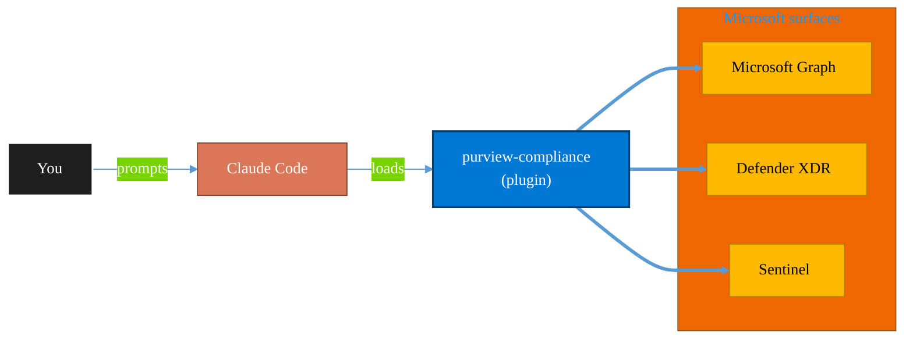

<!-- claude-m:premium-header:start -->
<div align="center">

<a id="top"></a>

# purview-compliance

### Microsoft Purview compliance workflows — DLP review, retention planning, sensitivity labels, eDiscovery readiness, and guided compliance playbooks with audit-ready change logs

<sub>Protect identity, endpoints, data, and information.</sub>

<br />

<table align="center">
<tr>
<td align="center"><b>Category</b><br /><code>Security</code></td>
<td align="center"><b>Surfaces</b><br /><sub>Microsoft Graph · Defender · Sentinel · Purview · Entra</sub></td>
<td align="center"><b>Version</b><br /><code>1.0.0</code></td>
<td align="center"><b>Marketplace</b><br /><code>claude-m-microsoft-marketplace</code></td>
</tr>
</table>

<sub><code>microsoft</code> &nbsp;·&nbsp; <code>purview</code> &nbsp;·&nbsp; <code>compliance</code> &nbsp;·&nbsp; <code>dlp</code> &nbsp;·&nbsp; <code>retention</code> &nbsp;·&nbsp; <code>ediscovery</code></sub>

<a href="#install"><b>Install</b></a> &nbsp;·&nbsp;
<a href="#overview"><b>Overview</b></a> &nbsp;·&nbsp;
<a href="#architecture"><b>Architecture</b></a> &nbsp;·&nbsp;
<a href="#related-plugins"><b>Related plugins</b></a> &nbsp;·&nbsp;
<a href="../README.md"><b>Marketplace</b></a>

</div>

---

> [!TIP]
> **One-line install** — `/plugin install purview-compliance@claude-m-microsoft-marketplace`


## Overview

> Microsoft Purview compliance workflows — DLP review, retention planning, sensitivity labels, eDiscovery readiness, and guided compliance playbooks with audit-ready change logs

<details>
<summary><b>What ships in this plugin</b> (commands, agents, skills)</summary>

| Component | Items |
|---|---|
| **Commands** | `/compliance-playbook` · `/dlp-review` · `/ediscovery-plan` · `/purview-setup` · `/retention-review` |
| **Agents** | `compliance-reviewer` |
| **Skills** | `purview-compliance` |

</details>


<details>
<summary><b>Quick example</b></summary>

```text
Use purview-compliance to investigate, contain, and harden against threats.
```

</details>

<a id="architecture"></a>

## Architecture



<a id="install"></a>

## Install

```bash
/plugin marketplace add markus41/Claude-m
/plugin install purview-compliance@claude-m-microsoft-marketplace
```

> [!IMPORTANT]
> This plugin operates against **Microsoft Graph · Defender · Sentinel · Purview · Entra**. Configure credentials via environment variables — never commit secrets.

[Back to top](#top)

---

<!-- claude-m:premium-header:end -->

Compliance workflow guidance for Microsoft Purview — DLP, retention, sensitivity labels, eDiscovery, and guided compliance playbooks.

## What this plugin helps with
- DLP policy review and gap analysis
- Retention and records policy planning
- Sensitivity labeling strategy checks
- eDiscovery case workflow preparation
- **Guided compliance playbooks** with audit-ready change logs and owner sign-off

## Integration Context Contract
- Canonical contract: [`docs/integration-context.md`](../docs/integration-context.md)

| Command family | tenantId | subscriptionId | environmentCloud | principalType | scopesOrRoles |
|---|---|---|---|---|---|
| DLP/retention/ediscovery/playbooks | required | optional (required only for Azure-linked evidence sources) | `AzureCloud`\* | `delegated-user` | `Compliance.Read.All`, `SecurityEvents.Read.All`, `AuditLog.Read.All` |

\* Use sovereign cloud values from the contract when applicable.

Commands must validate context first and fail fast with shared error codes when prerequisites are missing.
Sample outputs must redact tenant and principal identifiers per contract.

## Included commands
- `/purview-setup` — Configure regulatory context, tenant scope, and PowerShell connectivity
- `/dlp-review` — Review DLP policy coverage and false-positive hotspots
- `/retention-review` — Evaluate retention coverage across workloads
- `/ediscovery-plan` — Create an eDiscovery readiness plan with custodians and holds
- `/compliance-playbook` — Run guided compliance automation (retention, DLP, labels, legal hold)

## Skill
- `skills/purview-compliance/SKILL.md` — Purview compliance knowledge base

## Agent
- `agents/compliance-reviewer.md` — Reviews compliance configurations for correctness and regulatory alignment
<!-- claude-m:premium-footer:start -->

---

<a id="related-plugins"></a>

## Related plugins

<table>
<tr><th>Plugin</th><th>What it does</th></tr>
<tr><td><a href="../azure-policy-security/README.md"><code>azure-policy-security</code></a></td><td>Evaluate Azure policy compliance and security posture — policy assignments, drift analysis, remediation planning, and guardrail recommendations</td></tr>
<tr><td><a href="../defender-sentinel/README.md"><code>defender-sentinel</code></a></td><td>Microsoft Sentinel SIEM/SOAR and Defender XDR — incident triage, KQL threat hunting, analytics rules, SOAR playbooks, advanced hunting, and unified security operations center workflows</td></tr>
<tr><td><a href="../fabric-security-governance/README.md"><code>fabric-security-governance</code></a></td><td>Microsoft Fabric Security Governance — workspace RBAC, RLS/OLS patterns, sensitivity labels, lineage controls, and audit readiness</td></tr>
<tr><td><a href="../graph-investigator/README.md"><code>graph-investigator</code></a></td><td>Microsoft Graph Investigator — unified user investigation, mailbox forensics, activity timelines, device correlation, and forensic reporting across all M365 services</td></tr>
<tr><td><a href="../azure-key-vault/README.md"><code>azure-key-vault</code></a></td><td>Azure Key Vault — secrets, keys, and certificates management with RBAC, rotation policies, and managed identity integration</td></tr>
<tr><td><a href="../entra-id-admin/README.md"><code>entra-id-admin</code></a></td><td>Microsoft Entra ID administration via Graph API — full user/group lifecycle, directory roles, PIM, authentication methods, admin units, B2B guest management, license assignment, named locations, and entitlement management</td></tr>
</table>


<details>
<summary><b>Composable stacks that include <code>purview-compliance</code></b></summary>

Combine with sibling plugins to build cross-surface runbooks. Browse the full [marketplace catalog](../README.md#plugin-catalog) for a tailored selection.

</details>

---

<div align="center">

<sub>Part of <a href="../README.md"><b>Claude-m</b></a> — the Microsoft plugin marketplace for Claude Code.</sub>

<sub>Licensed under <a href="../LICENSE">MIT</a>. Built for engineers, MSPs, SOC teams, and analytics leaders.</sub>

</div>

<!-- claude-m:premium-footer:end -->

