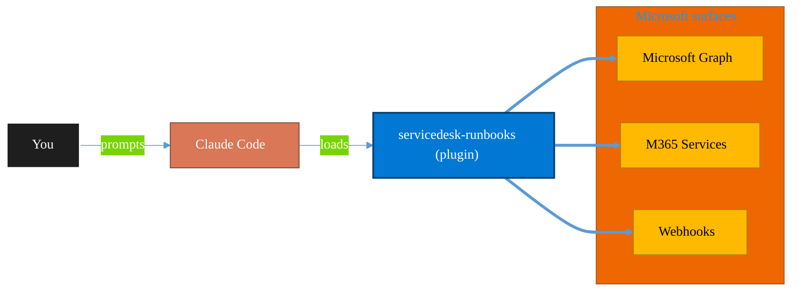

<!-- claude-m:premium-header:start -->
<div align="center">

<a id="top"></a>

# servicedesk-runbooks

### M365 service desk auto-runbooks — guided workflows for common tickets like shared mailbox access, MFA reset, file recovery, and password reset with pre-checks, approval gates, and end-user verification

<sub>Automate everyday Microsoft 365 collaboration workflows.</sub>

<br />

<table align="center">
<tr>
<td align="center"><b>Category</b><br /><code>Productivity</code></td>
<td align="center"><b>Surfaces</b><br /><sub>Microsoft Graph · M365 · Teams · Outlook · SharePoint · Loop</sub></td>
<td align="center"><b>Version</b><br /><code>1.0.0</code></td>
<td align="center"><b>Marketplace</b><br /><code>claude-m-microsoft-marketplace</code></td>
</tr>
</table>

<sub><code>microsoft</code> &nbsp;·&nbsp; <code>service-desk</code> &nbsp;·&nbsp; <code>runbooks</code> &nbsp;·&nbsp; <code>helpdesk</code> &nbsp;·&nbsp; <code>automation</code> &nbsp;·&nbsp; <code>tickets</code></sub>

<a href="#install"><b>Install</b></a> &nbsp;·&nbsp;
<a href="#overview"><b>Overview</b></a> &nbsp;·&nbsp;
<a href="#architecture"><b>Architecture</b></a> &nbsp;·&nbsp;
<a href="#related-plugins"><b>Related plugins</b></a> &nbsp;·&nbsp;
<a href="../README.md"><b>Marketplace</b></a>

</div>

---

> [!TIP]
> **One-line install** — `/plugin install servicedesk-runbooks@claude-m-microsoft-marketplace`


## Overview

> M365 service desk auto-runbooks — guided workflows for common tickets like shared mailbox access, MFA reset, file recovery, and password reset with pre-checks, approval gates, and end-user verification

<details>
<summary><b>What ships in this plugin</b> (commands, agents, skills)</summary>

| Component | Items |
|---|---|
| **Commands** | `/runbook-password-reset` · `/runbook-recover-file` · `/runbook-reset-mfa` · `/runbook-shared-mailbox` · `/servicedesk-setup` |
| **Agents** | `servicedesk-runbooks-reviewer` |
| **Skills** | `servicedesk-runbooks` |

</details>


<details>
<summary><b>Quick example</b></summary>

```text
Use servicedesk-runbooks to automate Microsoft 365 collaboration workflows.
```

</details>

<a id="architecture"></a>

## Architecture



<a id="install"></a>

## Install

```bash
/plugin marketplace add markus41/Claude-m
/plugin install servicedesk-runbooks@claude-m-microsoft-marketplace
```

> [!IMPORTANT]
> This plugin operates against **Microsoft Graph · M365 · Teams · Outlook · SharePoint · Loop**. Configure credentials via environment variables — never commit secrets.

[Back to top](#top)

---

<!-- claude-m:premium-header:end -->

Convert common IT tickets into safe, guided workflows. Includes pre-checks, approval gates, and post-action verification text for end users.

## What this plugin helps with
- "Grant shared mailbox access" — guided workflow
- "Reset MFA" — guided workflow with pre-checks
- "Recover deleted file" — OneDrive/SharePoint recycle bin recovery
- "Reset password" — with compliance checks and secure delivery

## Included commands
- `/servicedesk-setup` — Configure Graph and Exchange access for ticket workflows
- `/runbook-shared-mailbox` — Grant shared mailbox access
- `/runbook-reset-mfa` — Reset MFA for a user
- `/runbook-recover-file` — Recover deleted files from recycle bin
- `/runbook-password-reset` — Reset password with compliance checks

## Skill
- `skills/servicedesk-runbooks/SKILL.md` — Common ticket patterns and safe workflow design

## Agent
- `agents/servicedesk-runbooks-reviewer.md` — Reviews runbook actions for safety and approval gates
<!-- claude-m:premium-footer:start -->

---

<a id="related-plugins"></a>

## Related plugins

<table>
<tr><th>Plugin</th><th>What it does</th></tr>
<tr><td><a href="../excel-office-scripts/README.md"><code>excel-office-scripts</code></a></td><td>Deep knowledge of Excel Office Scripts — Microsoft's TypeScript-based automation platform for Excel on the web</td></tr>
<tr><td><a href="../power-automate/README.md"><code>power-automate</code></a></td><td>Design and troubleshoot Power Automate cloud flows — trigger/action patterns, run diagnostics, retries, and deployment-safe flow definitions</td></tr>
<tr><td><a href="../business-central/README.md"><code>business-central</code></a></td><td>Microsoft Dynamics 365 Business Central ERP — finance, supply chain, and inventory management via BC OData v4 / API v2.0 REST API</td></tr>
<tr><td><a href="../copilot-studio-bots/README.md"><code>copilot-studio-bots</code></a></td><td>Copilot Studio — design bot topics, author trigger phrases, configure generative AI orchestration, and publish chatbots</td></tr>
<tr><td><a href="../dynamics-365-crm/README.md"><code>dynamics-365-crm</code></a></td><td>Dynamics 365 Sales and Customer Service via Dataverse Web API — leads, opportunities, accounts, contacts, cases, SLAs, queues, pipeline reporting, and CRM workflow automation</td></tr>
<tr><td><a href="../dynamics-365-field-service/README.md"><code>dynamics-365-field-service</code></a></td><td>Dynamics 365 Field Service via Dataverse Web API — work orders, bookings, resource scheduling, service accounts, assets, and IoT-triggered service events</td></tr>
</table>


<details>
<summary><b>Composable stacks that include <code>servicedesk-runbooks</code></b></summary>

Combine with sibling plugins to build cross-surface runbooks. Browse the full [marketplace catalog](../README.md#plugin-catalog) for a tailored selection.

</details>

---

<div align="center">

<sub>Part of <a href="../README.md"><b>Claude-m</b></a> — the Microsoft plugin marketplace for Claude Code.</sub>

<sub>Licensed under <a href="../LICENSE">MIT</a>. Built for engineers, MSPs, SOC teams, and analytics leaders.</sub>

</div>

<!-- claude-m:premium-footer:end -->

