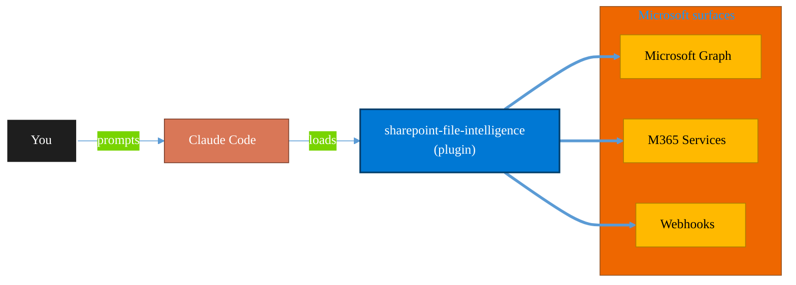

<!-- claude-m:premium-header:start -->
<div align="center">

<a id="top"></a>

# sharepoint-file-intelligence

### Scan, categorize, deduplicate, and organize SharePoint and OneDrive files at scale using Microsoft Graph.

<sub>Automate everyday Microsoft 365 collaboration workflows.</sub>

<br />

<table align="center">
<tr>
<td align="center"><b>Category</b><br /><code>Productivity</code></td>
<td align="center"><b>Surfaces</b><br /><sub>Microsoft Graph · M365 · Teams · Outlook · SharePoint · Loop</sub></td>
<td align="center"><b>Version</b><br /><code>1.0.0</code></td>
<td align="center"><b>Marketplace</b><br /><code>claude-m-microsoft-marketplace</code></td>
</tr>
</table>

<sub><code>microsoft</code> &nbsp;·&nbsp; <code>sharepoint</code> &nbsp;·&nbsp; <code>onedrive</code> &nbsp;·&nbsp; <code>file-management</code> &nbsp;·&nbsp; <code>governance</code> &nbsp;·&nbsp; <code>deduplication</code></sub>

<a href="#install"><b>Install</b></a> &nbsp;·&nbsp;
<a href="#overview"><b>Overview</b></a> &nbsp;·&nbsp;
<a href="#architecture"><b>Architecture</b></a> &nbsp;·&nbsp;
<a href="#related-plugins"><b>Related plugins</b></a> &nbsp;·&nbsp;
<a href="../README.md"><b>Marketplace</b></a>

</div>

---

> [!TIP]
> **One-line install** — `/plugin install sharepoint-file-intelligence@claude-m-microsoft-marketplace`


## Overview

> Scan, categorize, deduplicate, and organize SharePoint and OneDrive files at scale using Microsoft Graph.

<details>
<summary><b>What ships in this plugin</b> (commands, agents, skills)</summary>

| Component | Items |
|---|---|
| **Commands** | `/apply-categories` · `/consolidate-files` · `/find-duplicates` · `/scan-inventory` · `/sfi-setup` |
| **Agents** | `file-analyst` |
| **Skills** | `sharepoint-file-intelligence` |

</details>


<details>
<summary><b>Quick example</b></summary>

```text
Use sharepoint-file-intelligence to automate Microsoft 365 collaboration workflows.
```

</details>

<a id="architecture"></a>

## Architecture



<a id="install"></a>

## Install

```bash
/plugin marketplace add markus41/Claude-m
/plugin install sharepoint-file-intelligence@claude-m-microsoft-marketplace
```

> [!IMPORTANT]
> This plugin operates against **Microsoft Graph · M365 · Teams · Outlook · SharePoint · Loop**. Configure credentials via environment variables — never commit secrets.

[Back to top](#top)

---

<!-- claude-m:premium-header:end -->

Scan, categorize, deduplicate, and organize SharePoint and OneDrive files at scale using
Microsoft Graph.

## What This Plugin Does

This plugin provides end-to-end file intelligence for SharePoint and OneDrive for Business:

1. **Inventory** — enumerate every file across a site or drive with full metadata
2. **Deduplicate** — find exact and near-duplicate files; estimate space savings
3. **Categorize** — apply metadata columns and content types via pattern rules
4. **Consolidate** — move files to target folders with dry-run preview and rollback support
5. **Analyze** — AI-powered analysis agent produces a ranked governance action plan

## Install

```bash
/plugin install sharepoint-file-intelligence@claude-m-microsoft-marketplace
```

## Quick Start

```bash
# 1. Inventory a SharePoint site
/sharepoint-file-intelligence:scan-inventory https://contoso.sharepoint.com/sites/finance

# 2. Find duplicates
/sharepoint-file-intelligence:find-duplicates

# 3. Analyze and get a governance plan
"analyze my SharePoint inventory and give me a cleanup plan"

# 4. Apply metadata categories
/sharepoint-file-intelligence:apply-categories --rules-file ./sp-categories.yaml --dry-run

# 5. Move files per a mapping
/sharepoint-file-intelligence:consolidate-files --mapping-file ./sp-move-mapping.yaml
```

## Commands

| Command | Description |
|---------|-------------|
| `scan-inventory` | Enumerate all files; produce CSV/JSON report |
| `find-duplicates` | Detect exact and near-duplicate files |
| `apply-categories` | Batch-apply metadata and content types via rules |
| `consolidate-files` | Move files to target folders with rollback |

## Agent

**`file-analyst`** — triggered by phrases like "analyze my SharePoint inventory" or "what files
can I delete?" Reads an inventory report and produces a structured markdown report with:
- Duplicate summary and space savings
- Stale file analysis
- Categorization recommendations with starter YAML
- Proposed folder structure
- Ranked P1/P2/P3 action plan

## Settings

Create `.claude/sharepoint-file-intelligence.local.md` to configure defaults:

```yaml
---
site_url: https://contoso.sharepoint.com/sites/finance
tenant_id: ""
client_id: ""
scan_scope: site          # site | drive | tenant
max_depth: 10
output_dir: ./sp-reports
naming_convention: kebab  # kebab | camel | original
stale_days: 180
---
```

## Authentication

All commands require a Microsoft Graph API access token with appropriate scopes:

| Operation | Required Scopes |
|-----------|----------------|
| Scan (read-only) | `Sites.Read.All`, `Files.Read.All` |
| Apply metadata | `Sites.ReadWrite.All` |
| Move / consolidate | `Sites.ReadWrite.All`, `Files.ReadWrite.All` |

Set via environment variable:
```bash
export MICROSOFT_ACCESS_TOKEN="eyJ0..."
```

Or use the MSAL device-code flow described in
`skills/sharepoint-file-intelligence/references/graph-api-patterns.md`.

## Related Plugins

- `microsoft-sharepoint-mcp` — basic SharePoint file browsing and transfer via MCP
- `sharing-auditor` — audit external sharing links and guest access
- `purview-compliance` — apply DLP policies, retention labels, and sensitivity labels
- `onedrive` — OneDrive personal drive management

## Plugin Structure

```
sharepoint-file-intelligence/
├── .claude-plugin/plugin.json
├── skills/sharepoint-file-intelligence/
│   ├── SKILL.md
│   └── references/
│       ├── graph-api-patterns.md
│       ├── duplicate-detection.md
│       ├── metadata-content-types.md
│       └── folder-governance.md
├── commands/
│   ├── scan-inventory.md
│   ├── find-duplicates.md
│   ├── apply-categories.md
│   └── consolidate-files.md
├── agents/
│   └── file-analyst.md
└── README.md
```
<!-- claude-m:premium-footer:start -->

---

<a id="related-plugins"></a>

## Related plugins

<table>
<tr><th>Plugin</th><th>What it does</th></tr>
<tr><td><a href="../microsoft-lists-tracker/README.md"><code>microsoft-lists-tracker</code></a></td><td>Microsoft Lists — create and manage lists for process tracking, issue logs, and project trackers via Graph API</td></tr>
<tr><td><a href="../plugins/sharepoint/README.md"><code>microsoft-sharepoint-mcp</code></a></td><td>Browse and transfer SharePoint files through MCP tools.</td></tr>
<tr><td><a href="../onedrive/README.md"><code>onedrive</code></a></td><td>OneDrive file management via Microsoft Graph — upload, download, share, search, and manage files and folders</td></tr>
<tr><td><a href="../teams-lifecycle/README.md"><code>teams-lifecycle</code></a></td><td>Teams lifecycle management — create and archive teams with templates, enforce naming and ownership, apply sensitivity labels, and run expiration reviews using non-technical 'project start/end' language</td></tr>
<tr><td><a href="../business-central/README.md"><code>business-central</code></a></td><td>Microsoft Dynamics 365 Business Central ERP — finance, supply chain, and inventory management via BC OData v4 / API v2.0 REST API</td></tr>
<tr><td><a href="../copilot-studio-bots/README.md"><code>copilot-studio-bots</code></a></td><td>Copilot Studio — design bot topics, author trigger phrases, configure generative AI orchestration, and publish chatbots</td></tr>
</table>


<details>
<summary><b>Composable stacks that include <code>sharepoint-file-intelligence</code></b></summary>

Combine with sibling plugins to build cross-surface runbooks. Browse the full [marketplace catalog](../README.md#plugin-catalog) for a tailored selection.

</details>

---

<div align="center">

<sub>Part of <a href="../README.md"><b>Claude-m</b></a> — the Microsoft plugin marketplace for Claude Code.</sub>

<sub>Licensed under <a href="../LICENSE">MIT</a>. Built for engineers, MSPs, SOC teams, and analytics leaders.</sub>

</div>

<!-- claude-m:premium-footer:end -->

