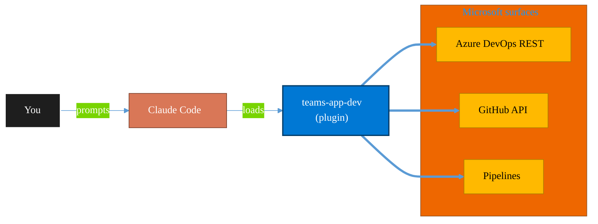

<!-- claude-m:premium-header:start -->
<div align="center">

<a id="top"></a>

# teams-app-dev

### Custom Teams app development — manifest v1.25, M365 Agents Toolkit, Adaptive Cards, message extensions, meeting apps, Custom Engine Agents, Agent 365 blueprints, workflow bots, notification hubs, Copilot plugins, Teams SDK migration, and advanced meeting experiences with Live Share

<sub>Ship reliably with first-class CI/CD and ALM.</sub>

<br />

<table align="center">
<tr>
<td align="center"><b>Category</b><br /><code>DevOps</code></td>
<td align="center"><b>Surfaces</b><br /><sub>Azure DevOps · GitHub · Pipelines · ALM · IaC</sub></td>
<td align="center"><b>Version</b><br /><code>3.0.0</code></td>
<td align="center"><b>Marketplace</b><br /><code>claude-m-microsoft-marketplace</code></td>
</tr>
</table>

<sub><code>microsoft</code> &nbsp;·&nbsp; <code>teams</code> &nbsp;·&nbsp; <code>teams-toolkit</code> &nbsp;·&nbsp; <code>adaptive-cards</code> &nbsp;·&nbsp; <code>bot-framework</code> &nbsp;·&nbsp; <code>message-extensions</code></sub>

<a href="#install"><b>Install</b></a> &nbsp;·&nbsp;
<a href="#overview"><b>Overview</b></a> &nbsp;·&nbsp;
<a href="#architecture"><b>Architecture</b></a> &nbsp;·&nbsp;
<a href="#related-plugins"><b>Related plugins</b></a> &nbsp;·&nbsp;
<a href="../README.md"><b>Marketplace</b></a>

</div>

---

> [!TIP]
> **One-line install** — `/plugin install teams-app-dev@claude-m-microsoft-marketplace`


## Overview

> Custom Teams app development — manifest v1.25, M365 Agents Toolkit, Adaptive Cards, message extensions, meeting apps, Custom Engine Agents, Agent 365 blueprints, workflow bots, notification hubs, Copilot plugins, Teams SDK migration, and advanced meeting experiences with Live Share

<details>
<summary><b>What ships in this plugin</b> (commands, agents, skills)</summary>

| Component | Items |
|---|---|
| **Commands** | `/teams-adaptive-card` · `/teams-agent` · `/teams-agent365` · `/teams-app-setup` · `/teams-bot-handler` · `/teams-copilot-plugin` · `/teams-dialog` · `/teams-manifest` · `/teams-meeting-app` · `/teams-message-extension` · `/teams-migrate` · `/teams-notification-hub` · `/teams-scaffold` · `/teams-sideload` · `/teams-workflow-bot` |
| **Agents** | `teams-app-reviewer` · `teams-bot-debugger` |
| **Skills** | `teams-app-dev` |

</details>


<details>
<summary><b>Quick example</b></summary>

```text
Use teams-app-dev to ship work through pipelines with full ALM.
```

</details>

<a id="architecture"></a>

## Architecture



<a id="install"></a>

## Install

```bash
/plugin marketplace add markus41/Claude-m
/plugin install teams-app-dev@claude-m-microsoft-marketplace
```

> [!IMPORTANT]
> This plugin operates against **Azure DevOps · GitHub · Pipelines · ALM · IaC**. Configure credentials via environment variables — never commit secrets.

[Back to top](#top)

---

<!-- claude-m:premium-header:end -->

Custom Microsoft Teams app development for the 2026 platform — manifest v1.25, M365 Agents Toolkit CLI, Adaptive Cards (with mobile profiles), message extensions (bot-based and API-based), meeting apps (side panel, stage, content bubble), Custom Engine Agents, Agent 365 blueprints, Nested App Authentication (NAA), dialog namespace, and single-tenant bot registration.

## What This Plugin Provides

This is a **knowledge plugin** — it gives Claude deep expertise in modern Teams app development so it can scaffold projects, generate Adaptive Cards, write bot handlers, create message extensions (including meeting-aware), author v1.25 manifests, build meeting apps, scaffold Custom Engine Agents and Agent 365 blueprints, and guide migration from legacy Teams Toolkit. It does not contain runtime code, MCP servers, or executable scripts.

## Setup

Run `/setup` to install M365 Agents Toolkit CLI and configure Azure Bot credentials:

```
/setup              # Full guided setup (single-tenant bot)
/setup --minimal    # Dependencies only
```

Requires an Azure Bot registration (single-tenant) with Microsoft App ID, Client Secret, and Tenant ID.

## Commands

| Command | Description |
|---------|-------------|
| `/setup` | Install M365 Agents Toolkit CLI, register Azure Bot (single-tenant), configure environment |
| `/teams-scaffold` | Scaffold a Teams app project (bot, tab, message-extension, meeting-app, or custom-engine-agent) |
| `/teams-adaptive-card` | Generate Adaptive Card JSON with optional meeting optimization and mobile profile |
| `/teams-message-extension` | Scaffold a message extension (search, action, link unfurl, or meeting-aware) |
| `/teams-manifest` | Generate or validate a Teams app manifest v1.25 |
| `/teams-sideload` | Package and sideload the app, or test with Agents Playground |
| `/teams-bot-handler` | Generate a TeamsActivityHandler with state, dialogs, proactive messaging, and meeting support |
| `/teams-agent` | Scaffold a Custom Engine Agent with AI capabilities and tool calling |
| `/teams-dialog` | Generate dialog orchestration code (replaces deprecated task modules) |
| `/teams-agent365` | Create an Agent 365 blueprint with declarative manifest, identity, and MCP tools |
| `/teams-migrate` | Migration guide from Teams Toolkit (TeamsFx) to M365 Agents Toolkit |

## Agent

| Agent | Description |
|-------|-------------|
| **Teams App Reviewer** | Reviews Teams app projects for manifest v1.25 correctness, single-tenant config, Adaptive Card schema (including mobile), bot patterns, message extension completeness, meeting app surfaces, auth/dialog patterns, and security |

## Key Platform Changes (2026)

- **Manifest**: v1.25 schema with `supportsChannelFeatures`, `nestedAppAuthInfo`, `backgroundLoadConfiguration`, `agenticUserTemplates`
- **Tooling**: M365 Agents Toolkit CLI (`m365agents`) replaces Teams Toolkit CLI (`teamsapp`). Config: `m365agents.yml`
- **Auth**: Single-tenant bot registration enforced (multi-tenant creation blocked since July 2025). NAA for pop-up-free tab SSO.
- **Dialog namespace**: `dialog.url.open()` / `dialog.adaptiveCard.open()` replace deprecated `tasks.startTask()`
- **TeamsJS**: v2.19.0+ required for submissions. v1 is blocked.
- **Bot Framework SDK**: Archived December 2025. Use Teams SDK or Agents SDK for new projects.
- **TeamsFx**: Deprecated (community-only until September 2026). Do not use for new projects.
- **LUIS**: Fully retired March 31, 2026. Do not use.
- **Adaptive Cards mobile**: v1.2 max on iOS/Android. Desktop/web supports v1.6.
- **Message extensions**: Bot-based and API-based (OpenAPI, no bot needed) tracks available.
- **Local testing**: Agents Playground (no bot registration or tunnel needed)
- **SDK decision**: Teams SDK (Teams-only), Agents SDK (multi-channel), Agent 365 (enterprise governance overlay with JS/Python/.NET packages)

## Trigger Keywords

The skill activates automatically when conversations mention: `teams app`, `m365 agents toolkit`, `adaptive card`, `message extension`, `bot framework`, `teams bot`, `teams tab`, `teams manifest`, `sideload`, `teams sso`, `link unfurling`, `dialog`, `meeting app`, `meeting extension`, `custom engine agent`, `agent 365`, `agents playground`, `nested app auth`, `naa`.

## Author

Markus Ahling
<!-- claude-m:premium-footer:start -->

---

<a id="related-plugins"></a>

## Related plugins

<table>
<tr><th>Plugin</th><th>What it does</th></tr>
<tr><td><a href="../fluent-ui-design/README.md"><code>fluent-ui-design</code></a></td><td>Microsoft Fluent 2 design system mastery — design tokens, color system, typography, layout, components, Teams theming, advanced UI patterns, Griffel styling, accessibility, responsive design, and Figma design kits</td></tr>
<tr><td><a href="../azure-devops/README.md"><code>azure-devops</code></a></td><td>Comprehensive Azure DevOps expertise — Git repos with passwordless auth (GCM, WIF, SSH), YAML and Classic pipelines, deployment environments, agent pools, work items, boards, sprints, test plans, security namespaces, dashboards, wikis, service hooks, Analytics OData, CLI, and extensions</td></tr>
<tr><td><a href="../azure-devops-orchestrator/README.md"><code>azure-devops-orchestrator</code></a></td><td>Intelligent orchestration for Azure DevOps — ship work items with Claude Code, triage backlogs, plan sprints, coordinate releases, monitor pipelines, and balance workloads across projects. Integrates with microsoft-teams-mcp and microsoft-outlook-mcp when installed.</td></tr>
<tr><td><a href="../azure-dotnet-webapp/README.md"><code>azure-dotnet-webapp</code></a></td><td>Scaffold and build ASP.NET Core Web API and Blazor apps on Azure — Minimal API, controllers, Microsoft.Identity.Web, EF Core, SignalR, OpenAPI, App Service deployment, and Graph API integration patterns.</td></tr>
<tr><td><a href="../azure-graph-dotnet/README.md"><code>azure-graph-dotnet</code></a></td><td>Scaffold and build Microsoft Graph C# / .NET solutions on Azure — Functions, Container Jobs, Azure Identity, Polly resilience, and SharePoint file intelligence implementations.</td></tr>
<tr><td><a href="../fabric-developer-runtime/README.md"><code>fabric-developer-runtime</code></a></td><td>Microsoft Fabric developer runtime operations - GraphQL API, environments, user data functions, and variable library governance.</td></tr>
</table>


<details>
<summary><b>Composable stacks that include <code>teams-app-dev</code></b></summary>

Combine with sibling plugins to build cross-surface runbooks. Browse the full [marketplace catalog](../README.md#plugin-catalog) for a tailored selection.

</details>

---

<div align="center">

<sub>Part of <a href="../README.md"><b>Claude-m</b></a> — the Microsoft plugin marketplace for Claude Code.</sub>

<sub>Licensed under <a href="../LICENSE">MIT</a>. Built for engineers, MSPs, SOC teams, and analytics leaders.</sub>

</div>

<!-- claude-m:premium-footer:end -->

