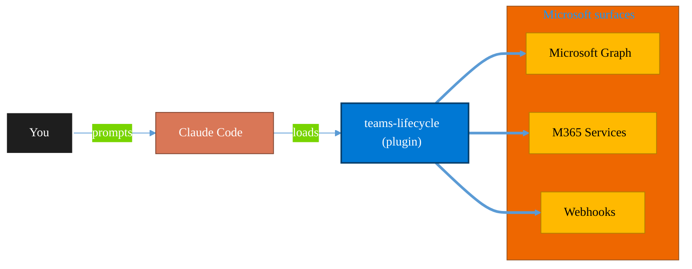

<!-- claude-m:premium-header:start -->
<div align="center">

<a id="top"></a>

# teams-lifecycle

### Teams lifecycle management — create and archive teams with templates, enforce naming and ownership, apply sensitivity labels, and run expiration reviews using non-technical 'project start/end' language

<sub>Automate everyday Microsoft 365 collaboration workflows.</sub>

<br />

<table align="center">
<tr>
<td align="center"><b>Category</b><br /><code>Productivity</code></td>
<td align="center"><b>Surfaces</b><br /><sub>Microsoft Graph · M365 · Teams · Outlook · SharePoint · Loop</sub></td>
<td align="center"><b>Version</b><br /><code>1.0.0</code></td>
<td align="center"><b>Marketplace</b><br /><code>claude-m-microsoft-marketplace</code></td>
</tr>
</table>

<sub><code>microsoft</code> &nbsp;·&nbsp; <code>teams</code> &nbsp;·&nbsp; <code>lifecycle</code> &nbsp;·&nbsp; <code>templates</code> &nbsp;·&nbsp; <code>governance</code> &nbsp;·&nbsp; <code>archival</code></sub>

<a href="#install"><b>Install</b></a> &nbsp;·&nbsp;
<a href="#overview"><b>Overview</b></a> &nbsp;·&nbsp;
<a href="#architecture"><b>Architecture</b></a> &nbsp;·&nbsp;
<a href="#related-plugins"><b>Related plugins</b></a> &nbsp;·&nbsp;
<a href="../README.md"><b>Marketplace</b></a>

</div>

---

> [!TIP]
> **One-line install** — `/plugin install teams-lifecycle@claude-m-microsoft-marketplace`


## Overview

> Teams lifecycle management — create and archive teams with templates, enforce naming and ownership, apply sensitivity labels, and run expiration reviews using non-technical 'project start/end' language

<details>
<summary><b>What ships in this plugin</b> (commands, agents, skills)</summary>

| Component | Items |
|---|---|
| **Commands** | `/teams-lifecycle-setup` · `/teams-project-end` · `/teams-project-start` · `/teams-review` |
| **Agents** | `teams-lifecycle-reviewer` |
| **Skills** | `teams-lifecycle` |

</details>


<details>
<summary><b>Quick example</b></summary>

```text
Use teams-lifecycle to automate Microsoft 365 collaboration workflows.
```

</details>

<a id="architecture"></a>

## Architecture



<a id="install"></a>

## Install

```bash
/plugin marketplace add markus41/Claude-m
/plugin install teams-lifecycle@claude-m-microsoft-marketplace
```

> [!IMPORTANT]
> This plugin operates against **Microsoft Graph · M365 · Teams · Outlook · SharePoint · Loop**. Configure credentials via environment variables — never commit secrets.

[Back to top](#top)

---

<!-- claude-m:premium-header:end -->

Create and archive teams with templates, enforce naming and ownership policies, apply sensitivity labels, and run expiration reviews. Uses non-technical "project start/end" language.

## What this plugin helps with
- Create teams from templates with enforced naming and ownership ("Start a project")
- Archive teams with expiration review and content preservation ("End a project")
- Audit teams for ownership, activity, and policy compliance
- Apply sensitivity labels and governance controls

## Included commands
- `/teams-lifecycle-setup` — Configure Teams admin access and templates
- `/teams-project-start` — Create a team from a template ("Start a project")
- `/teams-project-end` — Archive a team with expiration review ("End a project")
- `/teams-review` — Audit teams for governance compliance

## Skill
- `skills/teams-lifecycle/SKILL.md` — Teams templates, governance, and lifecycle patterns

## Agent
- `agents/teams-lifecycle-reviewer.md` — Reviews team governance configurations
<!-- claude-m:premium-footer:start -->

---

<a id="related-plugins"></a>

## Related plugins

<table>
<tr><th>Plugin</th><th>What it does</th></tr>
<tr><td><a href="../plugins/teams/README.md"><code>microsoft-teams-mcp</code></a></td><td>Send messages, create meetings, and manage Teams channels via MCP.</td></tr>
<tr><td><a href="../planner-orchestrator/README.md"><code>planner-orchestrator</code></a></td><td>Intelligent orchestration for Microsoft Planner — ship tasks with Claude Code, triage backlogs, plan sprint buckets, monitor deadlines, and balance workloads across plans. Integrates with microsoft-teams-mcp, microsoft-outlook-mcp, and powerbi-fabric when installed.</td></tr>
<tr><td><a href="../sharepoint-file-intelligence/README.md"><code>sharepoint-file-intelligence</code></a></td><td>Scan, categorize, deduplicate, and organize SharePoint and OneDrive files at scale using Microsoft Graph.</td></tr>
<tr><td><a href="../business-central/README.md"><code>business-central</code></a></td><td>Microsoft Dynamics 365 Business Central ERP — finance, supply chain, and inventory management via BC OData v4 / API v2.0 REST API</td></tr>
<tr><td><a href="../copilot-studio-bots/README.md"><code>copilot-studio-bots</code></a></td><td>Copilot Studio — design bot topics, author trigger phrases, configure generative AI orchestration, and publish chatbots</td></tr>
<tr><td><a href="../dynamics-365-crm/README.md"><code>dynamics-365-crm</code></a></td><td>Dynamics 365 Sales and Customer Service via Dataverse Web API — leads, opportunities, accounts, contacts, cases, SLAs, queues, pipeline reporting, and CRM workflow automation</td></tr>
</table>


<details>
<summary><b>Composable stacks that include <code>teams-lifecycle</code></b></summary>

Combine with sibling plugins to build cross-surface runbooks. Browse the full [marketplace catalog](../README.md#plugin-catalog) for a tailored selection.

</details>

---

<div align="center">

<sub>Part of <a href="../README.md"><b>Claude-m</b></a> — the Microsoft plugin marketplace for Claude Code.</sub>

<sub>Licensed under <a href="../LICENSE">MIT</a>. Built for engineers, MSPs, SOC teams, and analytics leaders.</sub>

</div>

<!-- claude-m:premium-footer:end -->

